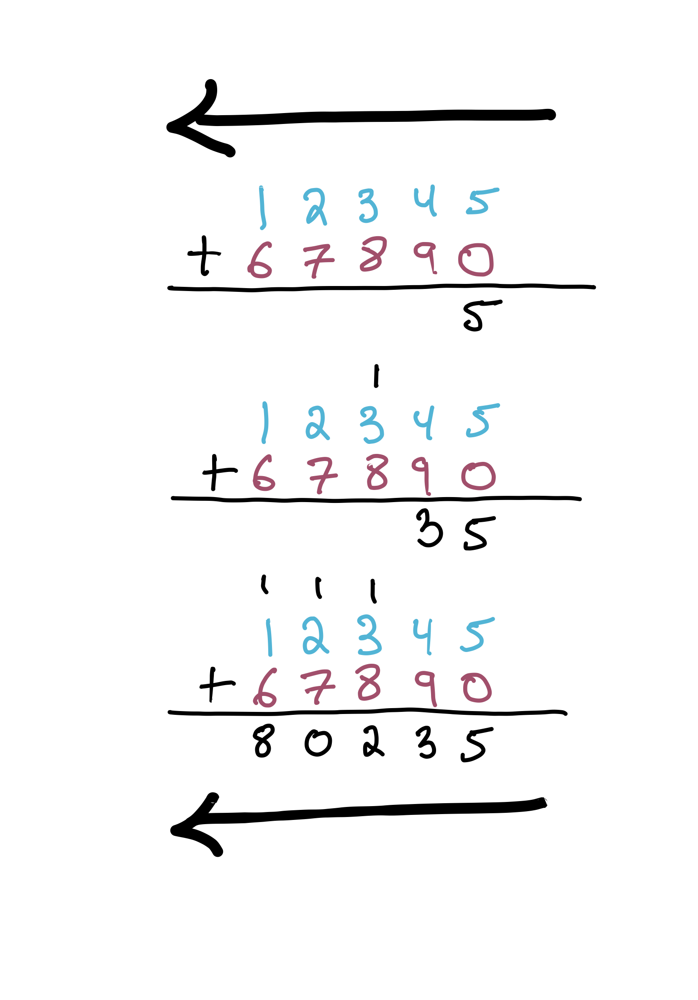
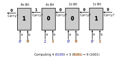

# Ripple-Carry Adder 

Let's model a third system in Froglet. We'll focus on something even more concrete, something that is implemented in _hardware_: a circuit for adding together two numbers called a _ripple-carry adder_ (RCA). Along the way, even though the adder doesn't "change", we'll still learn a useful technique for modeling systems that change over time. 

To understand an RCA, let's first think about adding together a pair of one-bit numbers. We might draw a table with four rows to represent this:

| Input Bit A | Input Bit B | Result Bit |
| ----------- | ----------- | ---------- | 
|           0 |           0 |          0 |          
|           0 |           1 |          1 |          
|           1 |           0 |          1 |          
|           1 |           1 |          2 |          

But, wait a moment. If we're building this into a circuit, and these inputs and outputs are single bits, we can't return `2` as the result. Similarly to how we might manually add `12345` and `67890` on paper, carrying a `1` in a few places...

<center></center>


Notice how, on paper, we sweep from right to left. That is, we handle the least-significant digits first. 

**Exercise:** Why is that? (Your first answer may be: "Because that's how you do it." But hold yourself to a higher standard. Was there a good reason to start on the right, and move left, rather than the other way around?)

<details>
<summary>Think, then click!</summary>

Carrying! If we started to the left, we'd give answers for those digits prematurely. (To see this, try doing the above arithmetic by hand again, but starting on the left and moving right. You'll need to carry, as before, but it will be _too late!_)

</details>

---

We need to carry a bit with value `1` in the `2s` place.

| Input Bit A | Input Bit B | Result Bit | Carry Bit (double value!) | 
| ----------- | ----------- | ---------- | ------------------------- |
|           0 |           0 |          0 |                         0 |
|           0 |           1 |          1 |                         0 |
|           1 |           0 |          1 |                         0 |
|           1 |           1 |          0 |                         1 |

Suppose we've built a circuit like the above; this is called a _full adder_ (FullAdder).

~~~admonish note title="Building circuits"
Exactly how we build that circuit is outside the scope of this example. Generally, we build them with logic gates: tiny devices that implement boolean operators like "and", "not", etc. 
~~~

Now the question is: how do we build an adder that can handle numbers of the sizes that real computers use: 8-bit, 32-bit, or even 64-bit values? The answer is that we'll chain together multiple adder circuits like the above, letting the carry bits "ripple" forward as an extra, 3rd input to all the adders except the first one. E.g., if we were adding together a pair of 4-bit numbers&mdash;4 and 5, say&mdash;we'd chain together 4 adders like so:

<center></center>

Notice that each full adder accepts _3_ input bits, just like in the above table: 
- a bit from the first number;
- a bit from the second number; and
- a carry bit.

Each full adder has _2_ output bits:
- the value at this bit (1s place, 2s place, etc.); and 
- the carry bit, if applicable.

Our task here is to model this circuit in Forge, and confirm that it actually works correctly. 

~~~admonish note title="Circuits aren't easy"
This might look "obvious", but there are things that can go wrong even at this level. 

If you've studied physics or electrical engineering, you might also see that this model won't match reality: it takes _time_ for the signals to propagate between adders, and this delay can cause serious problems if the chain of adders is too long. We'll address that with a new, more sophisticated model, later. 
~~~

## Datatypes

We'll start by defining a data type&mdash;`Digit`&mdash;for the wire values, which can be either `T` or `F` (short for "true" and "false"; you can also think of these as representing "1" and "0" or "high" and "low").

```forge,editable
abstract sig Digit {}
one sig T, F extends Digit {}
```

Then we'll define a `sig` for full adders, which will be chained together to form the ripple-carry adder. We'll give each full adder fields representing its input bits and output bits:

```forge,editable
sig FullAdder { 
  -- input value bits 
  a_in, b_in: one Digit,  
  -- input carry bit
  carry_in: one Digit,
  -- output (sum) value
  sum_out: one Digit,
  -- output carry bit 
  carry_out: one Digit
}
```

~~~admonish warning title="`Digit` is not the same as boolean!"
Beware confusing the `Digit` sig we created, and the `T` and `F` values in it, with the result of evaluating Forge constraints. Forge doesn't "know" anything special about `T` or `F`; `Digit` is just another datatype. **If we write something like `(some FullAdder) = T`, Forge will give an error message.** This is because, to Forge, `T` is just another value we defined in the model. Instead, we write just `(some FullAdder)` to say "there is some full adder in the instance". 

This will come up again as we continue to develop the model. 
~~~

Finally, we'll define the ripple-carry adder chain:

~~~forge,editable
one sig RCA {
  -- the first full adder in the chain
  firstAdder: one FullAdder,
  -- the next full adder in the chain (if any)
  nextAdder: pfunc FullAdder -> FullAdder
}
~~~

~~~admonish note title="Reminder"
Recall that a `pfunc` field is a partial function, sort of like a dictionary: every input is mapped to at most one output. 
~~~

Notice that there is only ever one ripple-carry adder in an instance, and that it has fields that define which full adder comes first (i.e., operates on the `1`s place), and what the succession is. We will probably need to enforce what these mean once we start defining wellformedness. 

## Wellformedness

What do we need to encode in a `wellformed` predicate? Right now, it seems that nothing has told Forge that `firstAdder` should really _be_ the first adder, nor that `nextAdder` defines a linear path through all the full adders. So we should probably start with those two facts. 

```forge,editable
pred wellformed {
  -- The RCA's firstAdder is "upstream" from all other FullAdders
  all fa: FullAdder | (fa != RCA.firstAdder) implies reachable[fa, RCA.firstAdder, RCA.nextAdder]
  -- there are no cycles in the nextAdder function.
  all fa: FullAdder | not reachable[fa, fa, RCA.nextAdder]  
}
```

Notice that we've used `implies` to limit the power of the `all` quantifier: it doesn't impose the reachability condition on _all_ `FullAdder`s, but rather than all of them except for `RCA.firstAdder`. This is a common pattern when you want to assert something is true, but only contingently. 

~~~admonish tip title="Case sensitivity and variable names"
In our model so far, `FullAdder` is the name of a datatype. When writing the constraints above, I said: "for every full adder..." and named this arbitrary adder `fa`. These two, `FullAdder` and `fa` are different. For a start, `FullAdder` is defined within the entire model, but `fa` is only defined within the scope of the `all` quantifier. 
~~~

We've used the `reachable` helper before, but it's worth mentioning again: `A` is reachable from `B` via _one or more applications_ of `f` if and only if `reachable[A, B, f]` is true. That "one or more applications" is important, and is why we needed to add the `(fa != RCA.firstAdder) implies` portion of the first constraint: `RCA.firstAdder` shouldn't be the successor of any full adder, and if it were its own successor, that would be a cycle in the line of adders. If we had left out the implication, and written just `all fa: FullAdder | reachable[fa, RCA.firstAdder, RCA.nextAdder]`, `RCA.firstAdder` would need to have a predecessor, which would contradict the second constraint.

## More Predicates

Before we write some examples for `wellformed`, let's also try to model how each adder should behave, given that it's wired up to other adders in this specific order. Let's write a couple of helpers first, and then combine them to describe the behavior of each adder, given its place in the sequence.

### When is an adder's output bit set to true? 

Just like `pred`icates can be used as boolean-valued helpers, `fun`ctions can act as helpers for arbitrary return types. Let's try to write one that says what the _output_ bit should be for a specific full adder, given its input bits. 

```forge
// Helper function: what is the output sum bit for this full adder?
fun adder_S_RCA[f: one FullAdder]: one Digit  {
  // Our job is to fill this in with an expression for the output sum bit
} 
```

Looking at the table above, the adder's output value is true if and only if an odd number of its 3 inputs is true. That gives us 4 combinations:
* `A`, `B`, and `CIN` (all 3 are true);
* `A` only (1 is true); 
* `B` only (1 is true); or
* `CIN` only (1 is true). 

This is where we need to remember that the sig `T` is not a Forge formula yet; to make it into one, we need to explicitly test whether each value is equal to `T`. We'll use two new Forge constructs to write the function body:
* The `let` construct makes it easier to write the value for each of these wires. A `let` looks similar to a quantifier, but it only introduces some local helper syntax. If I write `let A = (f.a_in = T) | ...`, I can then use `A` in place of the tedious `(f.a_in = T)`. 
* Expression if-then-else lets us produce a value based on a condition, sort of like the `C ? X : Y` operator in languages like JavaScript. If I write something like `(A and B and C) => T else F` this evaluates to `T` whenever `A`, `B`, and `C` are all true, and `F` otherwise.

Now we can write:

```forge
// Helper function: what is the output bit for this full adder?
fun adder_S_RCA[f: one FullAdder]: one Digit  {
  // "T" and "F" are values, we cannot use them as Forge formulas. 
  let A = (f.a_in = T), B = (f.b_in = T), CIN = (f.carry_in = T) |
   -- Expression if-then-else: if any of these conditions holds...
	 ((     A  and      B  and      CIN)  or 
    (     A  and (not B) and (not CIN)) or 
    ((not A) and      B  and (not CIN)) or 
    ((not A) and (not B) and      CIN))
      -- ...then T...
	 	  =>   T
      -- ...otherwise F.
      else F
} 
```

~~~admonish tip title="Couldn't we have just used a `pred` here?"
It might be a bit strange to write a helper function that returns a `Digit`, rather than a predicate directly. We could make a `pred` work, but we'd still have to eventually use `T` and `F` somewhere, since they are the values that the output bits can take on. 
~~~

~~~admonish note title="Is the blank space in that example significant?"
Nope. I added it for clarity, because it's much harder to read without the extra space to make it apparent where the `not`s are applied. Likewise, you don't need to wrap a negation in parentheses; I just think `(not A)` is clearer than `not A` in this sort of big expression.
~~~

~~~admonish tip title="Implies and expression if-then-else"
You can also write `implies` as `=>`. Indeed, the two keywords (`=>` and `implies`) are interchangeable in Forge! To avoid confusion, always ask yourself whether you are trying to identify a _thing_ in an instance, like a full-adder atom or an integer, or write a _constraint_ which may or may not be true in an instance.  
~~~

### When is an adder's carry bit set to true? 

This one is quite similar. The carry bit is set to true if and only if 2 or 3 of the adder's inputs are true:
* `B` and `CIN` (2 are true);
* `A` and `CIN` (2 are true); 
* `C` and `CIN` (2 are true); or
* `A`, `B`, and `CIN` (all 3 are true). 
As before, we'll use `let` and expression if-then-else, and add (decorative) blank space to make the function more readable.

```forge
// Helper function: what is the output carry bit for this full adder?
fun adder_cout_RCA[f: one FullAdder]: one Digit {
 let A = (f.a_in = T), B = (f.b_in = T), CIN = (f.carry_in = T) |
     (((not A) and      B  and      CIN) or 
      (     A  and (not B) and      CIN) or 
      (     A  and      B  and (not CIN)) or 
      (     A  and      B  and      CIN)) 
	      =>   T
        else F
} 
```

### Adder Behavior

Finally, what ought an adder's behavior to be? Well, we need to specify its output bits in terms of its input bits. We'll also add a constraint that says the full adders are connected in a line. More concretely, if there _is_ a successor, its input carry bit is equal to the current adder's output carry bit. Here's a picture of what we want to say:

**TODO: fill picture**

And here's the Forge predicate:

```forge
pred fullAdderBehavior[f: FullAdder] {
  -- Each full adder's outputs are as expected
  f.sum_out = adder_S_RCA[f]
  f.carry_out = adder_cout_RCA[f]
  -- Full adders are chained appropriately
  (some RCA.nextAdder[f]) implies (RCA.nextAdder[f]).carry_in = f.carry_out 
}
```

~~~admonish note title="Wouldn't it be better to put the carry-bit connection in `wellformed`, or somewhere else?" 
That's a good point. The values of `f.sum_out` and `f.carry_out` are part of the full adder's behavior, but the way the wires are connected in `RCA.nextAdder` is not. 

If I were going to re-write this model, I would probably move that line into somewhere that is responsible for _connecting_ the adders: perhaps a predicate for the ripple-carry adder. But I haven't done that&mdash;hoping to provoke just this question!

The general design principle here is to think about _compositionality and reuse_: we'd like to be able to use the same predicates to reason about full adders by themselves, or what would happen if we connected them differently. As written, the `fullAdderBehavior` predicate doesn't allow for that; we'd have to refactor it. But I'll leave that as an exercise for now. 
~~~

Finally, we'll make a predicate that describes the behavior of the overall ripple-carry adder: 

```
// Top-level system specification: compose preds above
pred rca {  
  wellformed
  all f: FullAdder | fullAdderBehavior[f] 
}
```

~~~admonish note title="Notice what we've done."
Here's something to keep in mind for when we start the next chapter. By wiring together full adders into a sequence via the `rca` predicate, we are now implicitly hinting at time in our model: signal flows through each adder, in order, over time. We'll re-use this same technique in the next chapter to combine different system states into a succession of them that represents a complete run of the system.
~~~

Now we're ready to write some examples. We'll make a pair of examples for `wellformed` and an overall example for the full system. In practice, we'd probably want to write a couple of examples for `fullAdderBehavior` as well, but we'll leave those out for brevity. 

## Examples

Always try to write at least some positive _and_ negative examples.

### Positive Example

```forge
example twoAddersLinear is {wellformed} for {
  RCA = `RCA0 
  FullAdder = `FullAdder0 + `FullAdder1
  -- Remember the back-tick mark here! These lines say that, e.g., for the atom `RCA0, 
  -- its firstAdder field contains `FullAdder0. And so on.
  `RCA0.firstAdder = `FullAdder0
  `RCA0.nextAdder = `FullAdder0 -> `FullAdder1
}
```

~~~admonish tip title="Notice that this example is limited."
Because we are testing `wellformed`, we left out fields that didn't matter to that predicate. Forge will feel free to adjust them as needed. When a field is left unspecified, the example is said to be *partial*, and it becomes a check for consistency. E.g., in this case, the example passes because the partial instance given *can* satisfy `wellformed`&mdash;not that it must satisfy `wellformed`&mdash;although in this case the difference is immaterial because `wellformed` really doesn't care about any of the other fields. 
~~~

### Negative Example

```forge
example twoAddersLoop is {not wellformed} for {
  RCA = `RCA0 
  FullAdder = `FullAdder0 + `FullAdder1
  `RCA0.firstAdder = `FullAdder0
  `RCA0.nextAdder = `FullAdder0 -> `FullAdder1 + `FullAdder1 -> `FullAdder0
}
```

## Run 

Let's have a look at a ripple-carry adder in action. We'll pick a reasonably small number of bits: 4. 

```forge
run {rca} for exactly 4 FullAdder
```

**(FILL: screenshot)**


## Verification

Ok, we've looked at some of the model's output, and it seems right. But how can we be really confident that the ripple-carry adder _works_? Can we use our model to _verify_ the adder? Yes, but we'll need to do a bit more modeling. 

**Exercise:** What does it mean for the adder to "work"? 

<details>
<summary>Think, then click!</summary>

For one thing, it had better produce a series of boolean outputs that correspond to the output we'd get if we just did the addition. That is, if we add together the numbers `2` (`10`) and `3` (`11`) we should expect to get `5`&mdash;which should be `101` in binary, provided we always set the bit-width high enough to match the number of bits we're adding together. 

Let's augment our model to check this. We'll ask Forge for an instance where the ripple-carry adder produces a different result (taken as the sum of the outputs of each full adder) than the expected (produced via Forge's `add` function). 

</details>

---

When I'm expanding a model in this way, I like to augment instances with extra fields that exist _just for verification_, and which aren't part of the system we're modeling. Here, we'll keep track of the place-values of each full adder, which we can then use to compute the "true" value of its input or output. E.g., the first full adder would have place-value 1, and its successors would have place-value 2, then 4, etc. 

~~~admonish note title="Helper values"
Sometimes you'll hear this sort of new field or value referred to as a "ghost": it isn't real; it doesn't exist in the actual system.
~~~

We could store this field in the `FullAdder` sig, but let's keep the original unmodified, and instead add a `Helper` sig. This keeps the for-verification-only fields separate from the model of the system:

```forge
one sig Helper {
  place: func FullAdder -> Int
}
```

The ripple-carry adder gives us the context we need to speak of the place value each full adder ought to have. We can write this for the first adder easily:

```forge
-- The "places" helper value should agree with the ordering that the RCA establishes.
pred assignPlaces {
  -- The least-significant bit is 2^0
  Helper.place[RCA.firstAdder] = 1
  -- ...
}
```

Now we need to, in effect, write a for-loop or a recursive function that constrains `places` for all the other adders. But Forge has no recursion or loops! Fortunately, it does have the `all` quantifier, which lets us define every other adder's `place` value in terms of its predecessor:

```forge
-- The "places" helper value should agree with the ordering that the RCA establishes.
pred assignPlaces {
  -- The least-significant bit is 2^0
  Helper.place[RCA.firstAdder] = 1
  -- Other bits are worth 2^(i+1), where the predecessor is worth 2^i.
  all fa: FullAdder | some RCA.nextAdder[fa] => {    
    Helper.place[RCA.nextAdder[fa]] = multiply[Helper.place[fa], 2]
  }
}
```

When you have quantification and helper fields, you can often avoid needing real iteration or recursion.

We'll add a helper function for convenience later:

```forge
fun actualValue[b: Digit, placeValue: Int]: one Int {
  (b = T) => placeValue else 0
}
```

### The Requirement

Let's try to express our requirement that the adder is correct. Again, we'll phrase this as: for every full adder, the true value of its output is the sum of the true values of its inputs (where "true value" means the value of the boolean, taking into account its position). We might produce something like this:

```forge
pred req_adderCorrect_wrong {
  (rca and assignPlaces) implies {
    all fa: FullAdder | { 
        actualValue[fa.sum_out, Helper.place[fa]] = add[actualValue[fa.a_in, Helper.place[fa]], 
                                                  actualValue[fa.b_in, Helper.place[fa]]]
    }
  }
}
```

And then we'll use it in a test. It's vital that we have a high-enough bitwidth, so that Forge can count up to the actual expected result, without overflowing. Forge `int`s are signed, so we actually need a bigger bit-width than the number of full adders. If we have, say, 6 full adders, we might end up producing a 7-bit output (with carrying). A 7-bit value can conservatively hold up to $2^7 - 1 = 127$. To count up to that high, we need to use _8_ bits in Forge, giving the solver all the numbers between $-128$ and $127$, inclusive.

~~~admonish tip title="Directly testing satisfiability"
So far, we've only seen `example`s and `assert`ions. Both of these are built using Forge's basic satisfiability checking. We can access this directly using the `test expect` feature. You can write that a run:
* should have instances (i.e., be satisfiable): `is sat`;
* should not have instances (i.e., be unsatisfiable, within the bounds given): `is unsat`; or
* should have no counterexample instances (within the bounds given): `is theorem`.
~~~

```forge
-- Ask Forge to check the satisfiability of something...
test expect {  
  -- Is it _always_ true, up to these bounds, that `req_adderCorrect` always holds?
  r_adderCorrect: {req_adderCorrect} for 6 FullAdder, 1 RCA, 8 Int is theorem
}
```

However, this requirement fails&mdash;Forge finds a counterexample. 

**Exercise:** What's wrong? Is the adder broken, or might our property be stated incorrectly?

<details>
<summary>Think, then click!</summary>

We forgot to take carrying into account! Any time a full adder carries a bit, it's dropped by the left-hand side of the above equation. 

Notice how even if the model (or system) is correct, sometimes the property itself is wrong. Always be skeptical about your properties, just like you're skeptical about your model.
</details>

---

Here's another attempt:

```forge
pred req_adderCorrect {
  (rca and assignPlaces) implies {
    all fa: FullAdder | { 
        -- Include carrying, both for input and output. The _total_ output's true value is equal to
        -- the the sum of the total input's true value.

        -- output value bit + output carry bits; note carry value is *2 (and there may not be a "next adder")
        add[actualValue[fa.sum_out, Helper.place[fa]], 
            multiply[actualValue[fa.carry_out, Helper.place[fa]], 2]] 
        = 
        -- input a bit + input b bit + input carry bit
        add[actualValue[fa.a_in, Helper.place[fa]],     
            actualValue[fa.b_in, Helper.place[fa]],    
            actualValue[fa.carry_in, Helper.place[fa]]]  
    }
  }
}
```

Now when we run the check, it passes. There's just one problem&mdash;it only passes _eventually_. The verification step took over a minute on my laptop! That's rather slow for a model this size. 

### Optimizing Verification

When this sort of unexpected slowdown happens, it's often because we've given the solver too much freedom, causing it to explore a much larger search space than it should have to. This is especially pronounced when we expect an "unsatisfiable" result&mdash;then, the solver really does need to explore _everything_ before concluding that no, there are no solutions. We're in that situation here, since we're hoping there are no counter-examples to correctness. 

**Exercise:** What did we leave the solver to figure out on its own, that we maybe could give it some help with?

<details>
<summary>Think, then click!</summary>

There are at least two things. 
* First, the exact ordering of full adders isn't something we provided. We just said "create up to 6 of them, and wire them together in a line". Considering just the 6-adder case (and not the 5-adder case, 4-adder case, etc.), how many ways are there to arrange the adders? $6! = 720$. Unless the solver can detect and eliminate these symmetries, it's doing a _lot_ more work than it needs to. 
* Second, we said that `Helper.place` mapped full adders to integers. But does the solver need to consider _all_ integers? No! Just `1`, `2`, `4`, `8`, and so on. The vast majority of integers in the scope we provided cannot be used&mdash;and the solver will have to discover that on its own.

</details>

---

These both present opportunities for optimization! For now, let's just tackle the first one: we need to somehow give Forge a specific ordering on the adders, rather than letting the solver explore all possible orderings. E.g., maybe we want a series of atoms `FullAdder0`, `FullAdder1`, ..., `FullAdder5`, which ordering `RCA.nextAdder` respects. 

We could try to express this as a constraint: 

```forge
pred orderingOnAdders {
  some disj fa0, fa1, fa2, fa3, fa4, fa5: FullAdder | {
    RCA.firstAdder = fa0
    RCA.nextAdder[fa0] = fa1 
    RCA.nextAdder[fa1] = fa2
    RCA.nextAdder[fa2] = fa3 
    RCA.nextAdder[fa3] = fa4 
    RCA.nextAdder[fa4] = fa5 
  }
}
```

However, this won't be very effective. 

**Exercise:** Why won't adding `orderingOnAdders` to our set of constraints actually help much, if at all? 

<details>
<summary>Think, then click!</summary>

Because all of that is already implied by the other constraints we have. It's true that sometimes rephrasing a constraint like this can have a big impact on performance if the solver can figure out how to use it well, but in this case the problem is one of symmetries; the solver would _just keep checking all possibilities_ for the `fa0`, `fa1`, etc. variables anyway. 

Fortunately, there's a much better option. 

</details>

---

Recall that Forge works by searching for satisfying instances within some large possibility space, and that this space is restricted by the bounds given. The search process is run by a sophisticated solver, but the problem that the solver itself gets looks nothing like Forge. The process of solving a Forge problem thus has three separate stages: 
* express the solution space in a form the solver understands, which is usually a large set of boolean variables; 
* convert the constraints into a form the solver understands, which needs to be in terms of the converted solution-space variables; and only then
* invoke the solver on the converted problem.

Adding constraints will affect the later steps, but we'd love to give hints to the translator even earlier in the process. We'll talk more about exactly how this works later, but for now, we'll add a _bounds annotation_ to our run: that the `nextAdder` field is _partial-linear_, or `nextAdder is plinear`. Linearity means that the atoms which `nextAdder` maps should be pre-arranged in a fixed order before they get to the solver at all. Partial linearity means that the ordering may not use all of the potential atoms. 

```forge
test expect {  
  r_adderCorrect: {req_adderCorrect} for 6 FullAdder, 1 RCA, 8 Int for {nextAdder is plinear} is theorem
}
```

This wasn't hard to add: it's just another `{}`-delimited instruction that you can add to any `run`, `test`, etc. command. Now Forge finishes the check in under a second on my laptop. Eliminating symmetries can make a huge difference! 

~~~admonish warning title="Bounds vs. Constraints"
Notice that the bounds annotation is grouped after the numeric bounds, _not_ with the constraints. This is because the two are separate. If we had tried to put `nextAdder is plinear` in as a constraint in our predicate, we would have gotten an error, because Forge doesn't know how to interpret it as a constraint, only how to use it to shape the solution space passed to the solver.
~~~
