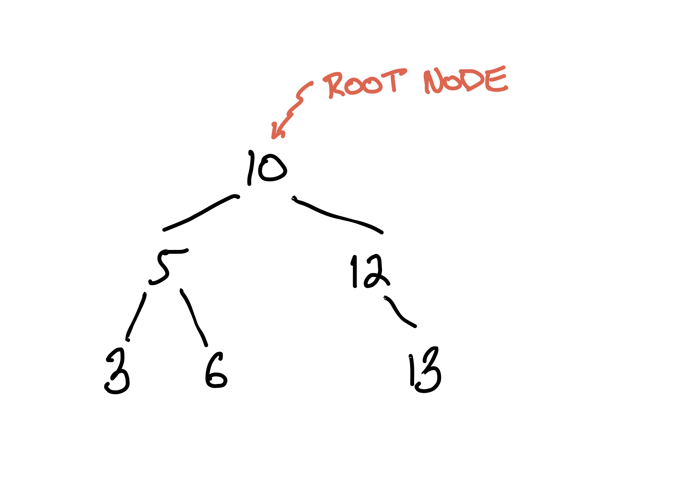
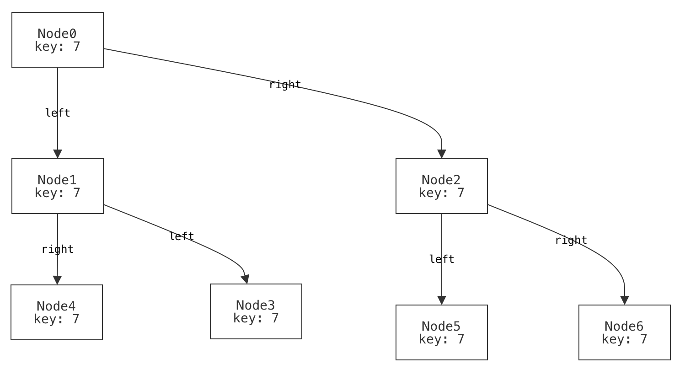
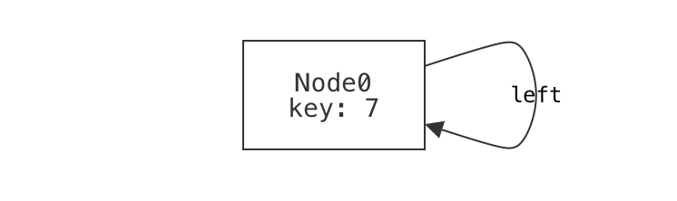
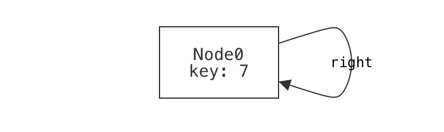
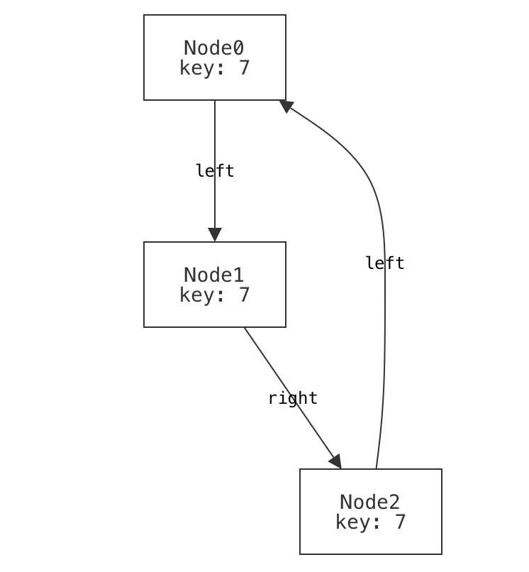
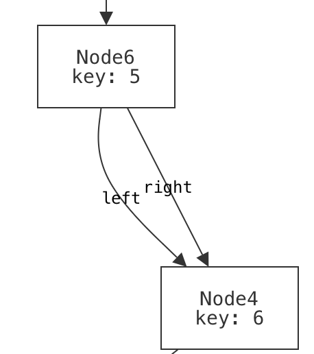

# Intro to Modeling Systems (Part 2: BSTs)

Now that we've written our first model&mdash;tic-tac-toe boards&mdash;let's switch to something a bit more serious: binary search trees. A binary search tree (BST) is a binary tree with an added property about its structure that allows it to efficiently answer many search queries related to the values it stores. Here's an example, drawn by hand:

<!-- sips -s format png Bintree.pdf --out BinTree.png  -->

<center>

</center>

Each node of the tree holds some value that the tree supports searching for. We'll call this value the search key, or just the _key_ for each node. The common ancestor of every node in the tree is called the _root_. 

This is obviously a _binary tree_, since it is a tree where every node has *at most* 2 children. What makes it a binary _search_ tree is the invariant that every node $N$ obeys: 
* all left-descendants of $N$ have a key less than $N$'s key; and 
* all right-descendants of $N$ have a key greater than or equal to $N$'s key.

~~~admonish warning title="A common mistake" 
When you're first learning about binary search trees, it's easy to phrase the invariant wrong: 
* the left child of $N$ (if any) has a key less than $N$'s key; and 
* the right child of $N$ (if any) has a key greater than or equal to $N$'s key.
With experience, it's straightforward to see that this is too weak; search will break. But at first that isn't so obvious. It would be interesting if we could use Forge to help us understand the difference and its impact on searching the tree.
~~~

Let's start modeling. As with programming, it's a good idea to start simple, and add complexity and optimization after. So we'll start with plain binary trees, and then add the invariant.

~~~admonish tip title="the recipe"
Like with tic-tac-toe, we'll follow this rough 5-step progression:
  - define the pertinent datatypes and fields;
  - define a well-formedness predicate;
  - write some examples;
  - run and exercise the base model; 
  - write domain predicates. 
Keep in mind that this isn't a strict "waterfall" style progression; we may return to previous steps if we discover it's necessary. 
~~~

## Datatypes 

A binary tree is made up of nodes. Each node in the tree has at most one left child and at most one right child. While nodes in the tree can hold values of most any type, for simplicity we'll stick to integers. 

Unlike in tic-tac-toe, this definition is recursive:
  
```forge,runnable
#lang forge/froglet
sig Node {
  key: one Int,     -- every node has some key 
  left: lone Node,  -- every node has at most one left-child
  right: lone Node  -- every node has at most one right-child
}
```

~~~admonish note title="Teminology Reminder" 
Recall that a `sig` is a datatype, each of which may have a set of _fields_. Here, we're saying that there is a datatype called `Node`, and that every `Node` has a `key`, `left`, and `right` field.
~~~

## Wellformedness for Binary Trees

What makes a binary tree a binary tree? We might start by saying that: 
* it's _single-tree-shaped_: there are no cycles and all nodes have at most one parent node; and 
* it's _connected_: all non-root nodes have a common ancestor. 

It's sometimes useful to write domain predicates early, and then use them to define wellformedness more clearly. For example, it might be useful to write a helper that describes what it means for a node to be a _root_ node, i.e., the common ancestor of every node in the tree:

```forge,runnable
~#lang forge/froglet
~sig Node {
~  key: one Int,     -- every node has some key 
~  left: lone Node,  -- every node has at most one left-child
~  right: lone Node  -- every node has at most one right-child
~}
~
pred isRoot[n: Node] {
  -- a node is a root if it has no ancestor
  no n2: Node | n = n2.left or n = n2.right
}
```

Then we'll use the `isRoot` helper in our `wellformed` predicate. But to write this predicate, there's a new challenge. We'll need to express constraints like "no node can reach itself via `left` or `right` fields". So far we've only spoken of a node's _immediate left or right child_. Instead, we now need a way to talk about _reachability_ over any number of `left` or `right` fields. Forge provides a helper, `reachable`, that makes this straightforward.

~~~admonish tip title="The `reachable` built-in" 
The built-in `reachable` predicate returns true if and only if its first argument is reachable from its second argument, via all of the remaining arguments. Thus, `reachable[n1, anc, left, right]` means: "`anc` can reach `n1` via some sequence of `left` and `right` fields."

For reasons we'll explore later, `reachable` can be subtle; if you're curious now, see the [Static Models Q&A](../qna/static.md) for a discussion of this. 
~~~

Using `reachable`, we can now write:

```forge,editable
pred wellformed {
  -- no cycles: no node can reach itself via a succession of left and right fields
  all n: Node | not reachable[n, n, left, right] 
  
  -- all non-root nodes have a common ancestor from which both are reachable
  -- the "disj" keyword means that n1 and n2 must be _different_
  all disj n1, n2: Node | (not isRoot[n1] and not isRoot[n2]) implies {
    some anc: Node | reachable[n1, anc, left, right] and 
                     reachable[n2, anc, left, right] }

  -- nodes have a unique parent (if any)
  all disj n1, n2, n3: Node | 
    not ((n1.left = n3 or n1.right = n3) and (n2.left = n3 or n2.right = n3))
}
```

## Write an example or two

Let's write a few examples of well-formed and non-well-formed trees. I've listed some possibilities below.

~~~admonish note title="Are these examples enough?"
Just like with testing a program, it's not always immediately clear when to _stop_ testing a model. 
Fortunately, Forge gives us the ability to explore and exercise the model more thoroughly than just 
running a program does. So, while we're not completely out of danger, we do have new tools to protect
ourselves with.
~~~

### Positive examples

#### A binary tree with no nodes should be considered well-formed.

```forge,editable
example p_no_nodes is wellformed for {
  no Node  -- there are no nodes in the tree; it is empty
}
```

Drawing this one wouldn't be very interesting.

#### A binary tree with a single node should be considered well-formed. 

```forge,editable
example p_one_nodes is wellformed for {
  Node = `Node0 -- there is exactly one node in the tree, named "Node0".
  no left       -- there are no left-children
  no right      -- there are no right-children
}
```

If we were going to draw the single-node example, we might draw it something like this:


In fact, this is what Forge's default visualizer can generate. Notice that the node has:
- a _name_ or identity, which we supplied when we named it `Node0` in the example; and 
- a value for its `key` field, which we did not supply (and so Forge filled in). 
Be careful not to confuse these! There's a rough analogy to programming: it's very possible that (especially if we have a buggy program or model) there might be different nodes with the same key value.

**(TODO: decide: discussion of partial vs. total examples goes where?)**

#### A binary tree with more than one row should be considered well-formed. 

```forge,editable
example p_multi_row is wellformed for {
  Node = `Node0 +                               -- row 0
         `Node1 + `Node2 +                      -- row 1
         `Node3 + `Node4 + `Node5 + `Node6      -- row 2
  
  -- Define the child relationships (and lack thereof, for leaves)
  -- This is a bit verbose; we'll learn more concise syntax for this soon!
  `Node0.left = `Node1 
  `Node0.right = `Node2
  `Node1.left = `Node3
  `Node1.right = `Node4
  `Node2.left = `Node5
  `Node2.right = `Node6
  no `Node3.left  no `Node3.right 
  no `Node4.left  no `Node4.right 
  no `Node5.left  no `Node5.right 
  no `Node6.left  no `Node6.right 
}
```

<center>

</center>

Wait a moment; there's something strange here. What do you notice about the way we've visualized this tree? 

<details> 
<summary>Think, then click!</summary>

That visualization is not how we'd choose to draw the tree: it has the `left` field to the right and the `right` field to the left! This is because we used Forge's default visualizer. By default, Forge has no way to understand what "left" and "right" mean. We'll come back to this problem soon. 
</details>

#### An unbalanced binary tree is still well-formed.

When we draw binary trees, often we draw them in a _balanced_ way: nice and "bushy", with roughly even distribution of nodes to the left and right. But an unbalanced tree is still a tree, and we should make sure it counts as one.

```forge,editable
example p_unbalanced_chain is wellformed for {
  Node = `Node0 + `Node1 + `Node2 + `Node3
  
  -- Form a long chain; it is still a binary tree.
  `Node0.left = `Node1 
  no `Node0.right 
  `Node1.left = `Node2
  no `Node1.right
  `Node2.left = `Node3
  no `Node2.right 
  
  no `Node3.left  no `Node3.right 
}
```

<center>

</center>

### Negative examples 

It's best to write some positive _and_ negative examples. Why? Well, suppose you needed to test a method or function that returned a boolean, like checking whether an integer is even. Here's an example in Python:

```python
def is_even(x: int) -> bool: return x % 2 == 0
```

What's wrong with this test suite? 

```python
assert is_even(0) == True 
assert is_even(2) == True 
assert is_even(10000) == True 
assert is_even(-10000) == True 
```

The problem isn't only the _size_ of the suite! By testing only values for which we expect `True` to be returned, we're neglecting half the problem. We'd never catch buggy implementations like this one:

```python
def is_even(x: int) -> bool: return True
```

Forge predicates are very like boolean-valued functions, so it's important to exercise them in both directions. Here are some negative examples:

#### A single node that is its own left-child is not well-formed. 

```forge,editable
example n_own_left is {not wellformed} for {
  Node = `Node0 
  `Node0.left = `Node0
  no `Node0.right
}
```



#### A single node that is its own right-child is not well-formed. 

```forge,editable
example n_own_right is {not wellformed} for {
  Node = `Node0 
  no `Node0.left
  `Node0.right = `Node0
}
```



#### A single node that's reachable via a longer cycle using both left- and right-children is not well-formed. 

```forge,editable
example n_mixed_cycle is {not wellformed} for {
  Node = `Node0 + `Node1 + `Node2
  
  `Node0.left = `Node1 
  no `Node0.right 
  no `Node1.left
  `Node1.right = `Node2
  
  `Node2.left = `Node0
  no `Node2.right 
}
```



#### A "forest" of multiple, disconnected trees is not well-formed. 

```forge,editable
example n_forest is {not wellformed} for {
  Node = `Node0 + `Node1
  no `Node0.left
  no `Node0.right 
  no `Node1.left 
  no `Node1.right 
}
```


~~~admonish note title="Sometimes it helps to _start_ with an example."
We wouldn't normally be able to _check_ these examples until we'd finished writing the `wellformed` predicate, but it can still be useful to create a few examples first, to help guide the constraints you write. Binary trees are a quite simple domain; imagine modeling something like the Java class system. Things can get tricky fast, and it's good to have a few concrete cases in mind. 
~~~


### Run the examples 

Click the run button, and Forge will check that all of the examples satisfy (or dissatisfy) the `wellformed` predicate. One fails, but why? Notice two things:
  * The failing example is a _negative_ one. We expected this instance to be ruled out by `wellformed`, but it was not. This points to a potential _under_-constraint bug in `wellformed`. 
  * We intended the example to fail because it contains separate, disconnected trees. This gives us a hint about the nature of the missing constraint. Except...

We already added a constraint that forces connectivity. Didn't we? 

```forge,editable
  all disj n1, n2: Node | (not isRoot[n1] and not isRoot[n2]) implies {
    some anc: Node | reachable[n1, anc, left, right] and 
                     reachable[n2, anc, left, right] }
```

So what's the problem? 

<details>
<summary>Think, then click!</summary>

This constraint only applies for pairs of _non-root_ nodes. That is, any two non-root nodes must have a common parent. So we ruled out forests of separate, bushy _trees_, but we neglected to exclude isolated roots!

</details>

---

In modeling, it's common for there to be a few ways to fix problems like this. We could go back and edit the constraint we wrote before, or we could write a new constraint to handle roots. In _this_ case, let's edit the original. We said that any two non-roots have a common ancestor. Why did we say "non-root"? Because if one of the nodes happened to be a root, it would have no such ancestors. 

What if we allowed the node itself to count as the common ancestor? Then we would have two obligations (as before), but each would have another way to become true. 

```forge,editable
  -- for _any_ pair of nodes, there is some ancestor node, such that...
  all disj n1, n2: Node | {
    some anc: Node | { 
      -- either n1 is the ancestor itself, or the ancestor reaches n1...
      ((n1 = anc) or reachable[n1, anc, left, right])
      -- ...and either n2 is the ancestor itself, or the ancestor reaches n2
      ((n2 = anc) or reachable[n2, anc, left, right]) 
    } }
```

Now all of our examples pass. While that doesn't mean the constraints are exactly right yet, it does increase our confidence in them. 

## View some instances

Before we move on, let's at least look at some new instances of `wellformed`, as generated by Forge. By viewing a few of these, we can often spot issues in the initial stages of a model. 

```
-- View a tree or two
run {wellformed} for exactly 8 Node
```

<!-- Note: custom visualization is _bad_ for this, because it may hide the problem due to 
     structural assumptions it makes. -->

The `run` command searches for instances that satisfy the constraints it is given, and then automatically opens the visualizer to explore those instances. 

~~~admonish tip title="Visualization"
By default, the visualizer will show nearly all relationships as arcs; e.g., the `key` field of each node will be shown as an arc from the node to the (numeric) key. If you want, you can clean this up a bit by opening the `Theme` drawer, selecting the `key` field, and checking to view the field as an attribute. 
~~~

Here's something you might see in one of the instances:



This doesn't look right, does it? We have a node whose left and right child are the same; that's not tree-like. Again, we have an _under_-constraint bug: there's some instance(s) that are permitted by `wellformed`, but shouldn't be. In fact, we completely forgot to add a constraint like:

```forge,editable
  -- left+right differ (unless both are empty)
  all n: Node | some n.left => n.left != n.right 
```

With that constraint added to `wellformed`, we don't see any more wrong-looking binary trees.

## Validation

So far we've tested our model in two ways:
* checking that specific instances satisfy, or don't satisfy, a Forge predicate; and 
* manually viewing generated instances. 
In Forge, we have recourse to more powerful techniques. 

Notice that, when we were writing `binary_tree`, we never said explicitly that there must be a single unique root in the instance. It should be true, of course, that such a root exists and is unique. But that is (or should be!) a _consequence_ of what we wrote. In Forge, this is easy to test:

```forge,editable
-- Run a test: our predicate enforces a unique root exists (if any node exists)
pred unique_root {   
  no Node or {
    one root: Node | 
      all other: Node-root | other in descendantsOf[root]}}
assert binary_tree is sufficient for unique_root for 5 Node  
```

This passes; there is no counterexample using fewer than than 6 Nodes. Our confidence increases.

~~~admonish note title="Different ways of writing predicates" 
You might be thinking that we could have just added the unique-root property as a constraint to `wellformed` directly! That's a reasonable thought, and it's true that we could have. I left it out deliberately here, for a few reasons:
* It's usually a good idea to not overload predicates with constraints that are really unnecessary. There's some wiggle room here in the service of making your model robust, but if we had added every possible property we could think of for a tree to have, the predicate would have become quite unwieldy, harder to understand, and (vitally) harder to debug. 
* When we start modeling, we often don't know exactly what we want. Sure, we might be able to describe it in broad terms, but 
and, of course...
* it allowed demonstration of this general technique: checking that one predicate enforces another. 
~~~


Now our model is looking pretty good, although we haven't yet added the "search" part of "binary search tree".

## More Domain Predicates: Search Invariants 

Let's express our two alternative BST invariants. As a reminder, they were: 

**Version 1** For all nodes $N$:
* all left-descendants of $N$ have a key less than $N$'s key; and 
* all right-descendants of $N$ have a key greater than or equal to $N$'s key.

**Version 2** For all nodes $N$:
* the left child of $N$ (if any) has a key less than $N$'s key; and 
* the right child of $N$ (if any) has a key greater than or equal to $N$'s key.

Notice that both are phrased in terms of single nodes, and should apply to all nodes. For convenience, we'll split these up into 2 predicates each: one to represent the per-node requirement, and another to represent the global requirement. 

```forge,editable
pred invariant_v1[n: Node] {
  -- "Every node's left-descendants..." (if any)
  some n.left => {
    n.left.key < n.key
    all d: Node | reachable[d, n.left, left, right] => d.key < n.key
  }
  -- "Every node's right-descendants..." (if any)
  some n.right => {
    n.right.key < n.key
    all d: Node | reachable[d, n.right, left, right] => d.key > n.key
  }
}
pred binary_search_tree_v1 {
  binary_tree  -- a binary tree, with an added invariant
  all n: Node | invariant_v1[n]  
}
```

Here's the same pair of predicates for the second (_wrong_) invariant:

```forge,editable
pred invariant_v2[n: Node] {
  -- "Every node's immediate children..."
  some n.left implies n.left.key < n.key
  some n.right implies n.right.key > n.key
}
pred binary_search_tree_v2 {
  binary_tree  -- a binary tree, with an added invariant
  all n: Node | invariant_v2[n]
}
```

### Semantic Differencing

Forge supports a useful trick: comparing the _meaning_ of two different predicates. What do we mean by "meaning"? Suppose that we ran `diff` on the two versions above. We'd get a report of where the _text_ of the two differed. But that isn't very informative; we'd really like to know _which actual binary trees_ the two disagree on. That's a better way of understanding how the meaning of the two might differ, and start to grasp the consequences. 

```forge,editable
-- Get examples of the difference between the two. Here we name the run "bstdiff".
bstdiff: run {not { binary_search_tree_v1 iff binary_search_tree_v2}} for 5 Node 
-- But how do they differ? We'd expect the first invariant to be _stronger_ than the second:
v1_is_stronger: assert binary_search_tree_v1 is sufficient for binary_search_tree_v2 for 5 Node 
```

The `v1_is_strong` test passes. The `run` command produces an instance (actually many) where the two invariants disagree. The test, however, passes, indicating that version 1 is strictly more selective than version 2: no matter how many times we clicked "Next", we'd only see trees where `binary_search_tree_v2` is satisfied but `binary_search_tree_v1` isn't.

~~~admonish tip title="Differencing for Debugging"
This simple technique really is powerful. You might use it to check whether two versions of the same constraint are equivalent when debugging or optimizing your model. **We'll use this idea in a few examples later, too.**
~~~

We'll return to binary search trees soon, to model how the recursive descent search works. That will let us see how the different invariants impact the correctness of search. But first, let's get a bit more experience with Forge.