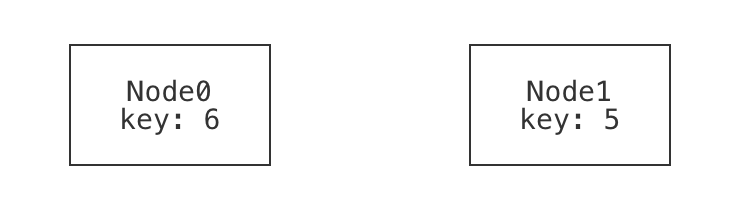

# Intro to Modeling Systems (Part 2: BSTs)

Now that we've written our first model&mdash;tic-tac-toe boards&mdash;let's switch to something a bit more serious: binary search trees. A binary search tree (BST) is a binary tree with an added property about its structure. Let's start modeling. As before, we'll follow this rough 5-step progression:
  - define the pertinent datatypes and fields;
  - define a well-formedness predicate;
  - write some examples;
  - run and exercise the base model; 
  - write domain predicates.
Keep in mind that this isn't a strict "waterfall" style progression; we may return to previous steps if we discover it's necessary. 

## Datatypes 

A binary tree is made up of nodes. Each node in the tree has at most one left child and at most one right child. Unlike in tic-tac-toe, this definition is recursive:

```forge,editable
#lang forge/froglet
sig Node {
  key: one Int,     -- every node has some key 
  left: lone Node,  -- every node has at most one left-child
  right: lone Node  -- every node has at most one right-child
}
```

## Wellformedness

What makes a binary tree a binary tree? We might start by saying that: 
* it's _tree-shaped_: there are no cycles and nodes have at most one parent node; and 
* it's _connected_: all non-root nodes have a common ancestor. 

It's sometimes useful to write domain predicates early, and then use them to define wellformedness more clearly. For example, let's encode what it means for a node to be a root node:

```forge,editable
pred isRoot[n: Node] {
  -- a node is a root if it has no ancestor
  no n2: Node | n = n2.left or n = n2.right
}
```

```forge,editable
pred wellformed {
  -- no cycles: no node can reach itself via a succession of left and right fields
  all n: Node | not reachable[n, n, left, right] 
  
  -- all non-root nodes have a common ancestor from which both are reachable
  -- the "disj" keyword means that n1 and n2 must be _different_
  all disj n1, n2: Node | (not isRoot[n1] and not isRoot[n2]) implies {
    some anc: Node | reachable[n1, anc, left, right] and 
                     reachable[n2, anc, left, right] }

  -- nodes have a unique parent (if any)
  all disj n1, n2, n3: Node | 
    not ((n1.left = n3 or n1.right = n3) and (n2.left = n3 or n2.right = n3))
}
```

## Write an example or two

**[FILL: example trees: singleton, empty, unbalanced...]**

Now we'll write a few examples of well-formed and non-well-formed trees. I've listed some possibilities below.

~~~admonish note title="Are these examples enough?"
Just like with testing a program, it's not always immediately clear when to _stop_ testing a model. 
Fortunately, Forge gives us the ability to explore and exercise the model more thoroughly than just 
running a program does. So, while we're not completely out of danger, we do have new tools to protect
ourselves with.
~~~

### Positive examples

#### A binary tree with no nodes should be considered well-formed.

```forge,editable
example p_no_nodes is wellformed for {
  no Node  -- there are no nodes in the tree; it is empty
}
```

#### A binary tree with a single node should be considered well-formed. 

```forge,editable
example p_one_nodes is wellformed for {
  Node = `Node0 -- there is exactly one node in the tree, named "Node0".
  no left       -- there are no left-children
  no right      -- there are no right-children
}
```

If we were going to draw the single-node example, we might draw it something like this:


In fact, this is what Forge's default visualizer can generate. Notice that the node has:
- a _name_ or identity, which we supplied when we named it `Node0` in the example; and 
- a value for its `key` field, which we did not supply (and so Forge filled in). 

**(TODO: discussion of partial vs. total examples goes where?)**

#### A binary tree with more than one rank should be considered well-formed. 

```forge,editable
example p_multi_rank is wellformed for {
  Node = `Node0 +                               -- rank 0
         `Node1 + `Node2 +                      -- rank 1
         `Node3 + `Node4 + `Node5 + `Node6      -- rank 2
  
  -- Define the child relationships (and lack thereof, for leaves)
  -- This is a bit verbose; we'll learn more concise syntax for this soon!
  `Node0.left = `Node1 
  `Node0.right = `Node2
  `Node1.left = `Node3
  `Node1.right = `Node4
  `Node2.left = `Node5
  `Node2.right = `Node6
  no `Node3.left  no `Node3.right 
  no `Node4.left  no `Node4.right 
  no `Node5.left  no `Node5.right 
  no `Node6.left  no `Node6.right 
}
```

<center>

</center>

Wait a moment; there's something strange here. What do you notice about the way we've visualized this tree? 

<details> 
<summary>Think, then click!</summary>

That visualization is not how we'd choose to draw the tree: it has the `left` field to the right and the `right` field to the left! This is because we used Forge's default visualizer, and by default, Forge has no way to understand what "left" and "right" mean. We'll come back to this problem soon. 
</details>

#### An unbalanced binary tree is still well-formed.

```forge,editable
example p_unbalanced_chain is wellformed for {
  Node = `Node0 + `Node1 + `Node2 + `Node3
  
  -- Form a long chain; it is still a binary tree.
  `Node0.left = `Node1 
  no `Node0.right 
  `Node1.left = `Node2
  no `Node1.right
  `Node2.left = `Node3
  no `Node2.right 
  
  no `Node3.left  no `Node3.right 
}
```

<center>

</center>

### Negative examples 

It's best to write some positive _and_ negative examples. Why? Well, suppose you needed to test a method or function that returned a boolean, like checking whether an integer is even. Here's an example in Python:

```python
def is_even(x: int) -> bool: return x % 2 == 0
```

What's wrong with this test suite? 

```python
assert is_even(0) == True 
assert is_even(2) == True 
assert is_even(10000) == True 
assert is_even(-10000) == True 
```

The problem isn't only the _size_ of the suite! By testing only values for which we expect `True` to be returned, we're neglecting half the problem. We'd never catch buggy implementations like this one:

```python
def is_even(x: int) -> bool: return True
```

Forge predicates are very like boolean-valued functions, so it's important to exercise them in both directions. Here are some negative examples:

#### A single node that is its own left-child is not well-formed. 

```forge,editable
example n_own_left is {not wellformed} for {
  Node = `Node0 
  `Node0.left = `Node0
  no `Node0.right
}
```


#### A single node that is its own right-child is not well-formed. 

```forge,editable
example n_own_right is {not wellformed} for {
  Node = `Node0 
  no `Node0.left
  `Node0.right = `Node0
}
```


#### A single node that's reachable via a longer cycle using both left- and right-children is not well-formed. 

```forge,editable
example n_mixed_cycle is {not wellformed} for {
  Node = `Node0 + `Node1 + `Node2
  
  `Node0.left = `Node1 
  no `Node0.right 
  no `Node1.left
  `Node1.right = `Node2
  
  `Node2.left = `Node0
  no `Node2.right 
}
```


#### A "forest" of multiple, disconnected trees is not well-formed. 

```forge,editable
example n_forest is {not wellformed} for {
  Node = `Node0 + `Node1
  no `Node0.left
  no `Node0.right 
  no `Node1.left 
  no `Node1.right 
}
```




~~~admonish note title="Sometimes it helps to _start_ with an example."
We wouldn't normally be able to _check_ these examples until we'd finished writing the `wellformed` predicate, but it can still be useful to create a few examples first, to help guide the constraints you write. Binary trees are a _very_ simple domain; imagine modeling something like the Java class system. Things can get tricky fast, and it's good to have a few concrete exemplars in mind. 
~~~


### Run the examples 

Click the run button, and Forge will check that all of the examples satisfy (or dissatisfy) the `wellformed` predicate. One fails, but why? Notice two things:
  * The failing example is a _negative_ one. We expected this instance to be ruled out by `wellformed`, but it was not. This points to a potential _under_-constraint bug in `wellformed`. 
  * We intended the example to fail because it contains separate, disconnected trees. This points to the nature of the missing constraint. 

But we already added a constraint that forces connectivity, didn't we? We have this: 
```forge,editable
  all disj n1, n2: Node | (not isRoot[n1] and not isRoot[n2]) implies {
    some anc: Node | reachable[n1, anc, left, right] and 
                     reachable[n2, anc, left, right] }
```

What's the problem? 

<details>
<summary>Think, then click!</summary>

This constraint only applies for pairs of _non-root_ nodes. That is, any two non-root nodes must have a common parent. So we ruled out forests of separate, bushy _trees_, but we neglected to exclude isolated roots!

</details>

In modeling, it's common for there to be a few ways to fix problems like this. We could go back and edit the constraint we wrote before, or we could write a new constraint to handle roots. In _this_ case, let's edit the original. We said that any two non-roots have a common ancestor. Why did we say "non-root"? Because if one of the nodes happened to be a root, it would have no such ancestors. 

What if we allowed the node itself to count as the common ancestor? Then we would have two obligations (as before), but each would have another way to become true. 

```forge,editable
  -- for _any_ pair of nodes, there is some ancestor node, such that...
  all disj n1, n2: Node | {
    some anc: Node | { 
      -- either n1 is the ancestor itself, or the ancestor reaches n1...
      ((n1 = anc) or reachable[n1, anc, left, right])
      -- ...and either n2 is the ancestor itself, or the ancestor reaches n2
      ((n2 = anc) or reachable[n2, anc, left, right]) 
    } }
```

Now all of our examples pass. While that doesn't mean the constraints are exactly right yet, it does increase our confidence in them. 

## View some instances

Before we move on, let's at least look at some new instances of `wellformed`, as generated by Forge. By viewing a few of these, we can often spot issues in the initial stages of a model. 

```
-- View a tree or two
run {wellformed} for exactly 8 Node
```

<!-- Note: custom visualization is _bad_ for this, because it may hide the problem due to 
     structural assumptions it makes. -->

[TODO: describe visualizer opening, theming]

**[FILL: Oops, not quite right, we were missing a constraint; underconstraint bug -- fix it]**


Missing:  
```
  -- left+right differ (unless both are empty)
  all n: Node | some n.left => n.left != n.right 
```

**FILL: and iterate.**

## Going further

```
-- Run a test: our predicate enforces a unique root exists (if any node exists)
pred req_unique_root {   
  no Node or {
    one root: Node | 
      all other: Node-root | other in descendantsOf[root]}}
assert binary_tree is sufficient for req_unique_root for 5 Node  
```


