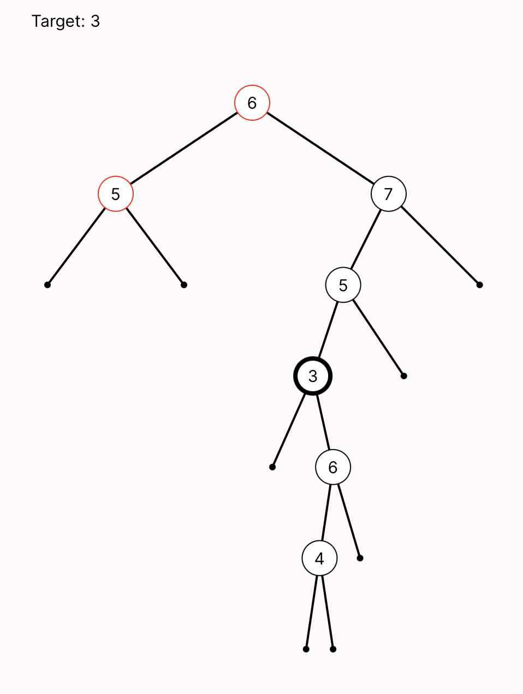

# BSTs: Recursive Descent

When we last modeled [binary search trees](../bst/bst.md), we defined what it meant to be a binary tree, and had two different candidates for the BST invariant. Now we'll return to BSTs and model the classic recursive _BST search_ algorithm. Just like games of tic-tac-toe, a BST search can be represented as a sequence of states that evolve as the algorithm advances. 

As a reminder, we had defined binary-tree nodes like this:

```forge
sig Node {
  key: one Int,     -- every node has some key 
  left: lone Node,  -- every node has at most one left-child
  right: lone Node  -- every node has at most one right-child
}
```

Just like in the last example, we'll start by adding a sig for the state of the system. The "system" here is the recursive search, so it should have fields that are used in that context. Really, the only thing that changes during the recursive descent is the node currently being visited:

```forge
-- Since a BST descent doesn't need to backtrack, the state can be fairly simple.
sig SearchState {
    current: lone Node -- the node currently being visited
}
```

Then we'll define a `one` sig for the overall search. As with tic-tac-toe, Forge will find instances that represent a single search, embodied by the `Search` atom and its fields:

```forge
one sig Search {
    target: one Int, -- the target of the search (never changes)
    -- The first state and successor-state function for this trace
    initialState: one SearchState,
    nextState: pfunc SearchState -> SearchState
}
```

What does an initial state of the search look like? We'd better be at the root of the tree! 

```forge
pred init[s: SearchState] {    
    isRoot[s.current]
}
```

Now for the more complicated part. How does a step of the recursive descent work? At any given node:
* First, it checks whether `current.key = target`. If yes, it's done.
* It checks whether `current.key < target`. If yes, it moves to the left child if it exists, and returns failure otherwise.
* It checks whether `current.key > target`. If yes, it moves to the right child if it exists, and returns failure otherwise.

That's not so bad, but it feels like there are two different kinds of transition that our system might take. Let's give each of them their own predicates, just to avoid them getting tangled with each other: 
* `descendLeft` will apply if the target is to the left.
* `descendRight` will apply if the target is to the right.
If neither can apply, the algorithm is done: either the target has been found, or the search has "hit bottom" without finding the target.

Let's start writing them, beginning with `descendLeft`. We'll follow the discipline of separating the _guard_ and _action_ of each transition `pred`:

```forge
pred descendLeft[pre, post: SearchState] {
  -- GUARD 
  Search.target < pre.current.key
  some pre.current.left
  -- ACTION
  post.current = pre.current.left
}
```

Because only the current node is a component of the search state, we only need to define the new current node in the action.

**Exercise:** Write `descendRight` yourself. The structure should be very similar to `descendLeft`. 

<details>
<summary>Think, then click!</summary>

You might write something like this:

```forge
pred descendRight[pre, post: SearchState] {
  -- GUARD 
  Search.target > pre.current.key
  some pre.current.right
  -- ACTION
  post.current = pre.current.right
}
```
</details>

---

Let's do some basic validation:

```forge
test expect {
    -- let's check that these two transitions are mutually-exclusive
    r_l_together: {some s: SearchState | {descendLeft[s] and descendRight[s]}} for 7 Node is unsat
    -- let's check that transitions are all possible to execute
    r_sat: {some s: SearchState | descendRight[s]} for 7 Node is sat
    l_sat: {some s: SearchState | descendLeft[s]} for 7 Node is sat
    -- initial state is satisfiable
    init_sat: {some s: SearchState | init[s]} for 7 Node is sat
}
```

---

Now we'll combine these predicates into one that defines the entire recursive descent. The shape of this predicate is somewhat boilerplate; soon we'll see how to get rid of it entirely. For now, we'll just copy from the tic-tac-toe example and make small, local changes. Namely:
* we called the trace sig `Search`, not `Game`;
* we called the state sig `SearchState`, not `Board`; and 
* we have two different transition predicates to include.

```forge
pred traces {
    -- the graph is well-formed to begin with
    binary_tree
    -- The trace starts with an initial state
    init[Search.initialState]
    no sprev: SearchState | Search.nextState[sprev] = Search.initialState
    -- Every transition is a valid move
    all s: SearchState | some Search.nextState[s] implies {
        descendLeft [s, Search.nextState[s]] or 
        descendRight[s, Search.nextState[s]]
    }
}
```

Let's run it!

```forge
run {traces} for exactly 7 Node, 5 SearchState for {nextState is plinear}
```

The output may initially be overwhelming: by default, it will show _all_ the atoms in the world and their relationships, including each `SearchState`. You could stay in the default visualizer and mitigate the problem a _little_ by clicking on "Theme" and then "Add Projection" for `SearchState`. The problem is that this hides the `current` node indicator for the current state, since the current state becomes implicit. 

Instead, let's use a custom visualization. There are multiple options included with this book:
* [`bst.js`](./bst.js), which visualizes the tree itself, without any regard to the descent. This is useful for debugging the basic tree model and the invariants themselves.
* [`bst_descent.js`](./bst_descent.js), which visualizes the _descent_ in one picture. 
* (Don't run this yet!) `bst_temporal.js`, which visualizes a Temporal Forge version of the model, which we'll get to soon.

If we run `bst_descent.js` for this instance, it will draw the tree and highlight the path taken in the recursive descent. A node with the target key will have a thick border. A node that's visited in the descent will have a red border. So a correct descent should never show a node with a thick border that isn't red. 

**TODO fill: how to run? Did we describe this already?**

This is easier to read, but also a little worrying: we see two nodes visited, and they aren't directly connected! 

**Exercise:** What's going on? (Hint: examine the table view. How many search states are there? Are they all in the trace?)

<details>
<summary>Think, then click!</summary>

The problem is that we allowed `SearchState` atoms to exist without being used in the trace. The visualizer script is highlighting a node that _any_ `SearchState` uses. So we have two options: 
* change the visualizer script to only look at states reachable from the first one; or
* add a constraint that forces all `SearchState` atoms to be used. 

We'll go for the second fix, adding this line to the `traces` predicate:

```forge
-- All SearchStates are used
all s: SearchState | { 
  s = Search.initialState or 
  reachable[s, Search.initialState, Search.nextState]
}
```

</details>

Ok, that's better, but we still aren't seeing a _complete_ descent. To fix that, we'll say that, eventually, the descent either reaches bottom or a node with the target value:

```alloy
run {
  binary_tree 
  traces
  some s: SearchState | s.current.key = Search.target or (no s.current.left and no s.current.right)
} for exactly 7 Node, 5 SearchState for {nextState is plinear}
```

That's more like it. But what about the invariants? We only said `binary_tree` had to hold, which means that the tree being searched isn't necessarily a binary _search_ tree yet.

### Trying Different Invariants 

In our [original BST model](./bst.md), we'd sketched two different invariants:

**Version 1** (`invariant_v1`): For all nodes $N$:
* all left-descendants of $N$ have a key less than $N$'s key; and 
* all right-descendants of $N$ have a key greater than or equal to $N$'s key.

**Version 2** (`invariant_v2`): For all nodes $N$:
* the left child of $N$ (if any) has a key less than $N$'s key; and 
* the right child of $N$ (if any) has a key greater than or equal to $N$'s key.

We were able to look at trees that met one invariant but not another, but now we can do something much more powerful: we can ask Forge to show us how the differing invariants affect the recursive descent on the tree! If an invariant is "wrong", surely it will cause the descent to fail in some way. Since we've already modeled the descent, this should be easy. Let's try it for `invariant_v2`:

```forge
run {
  binary_tree     -- it must be a binary tree
  all n: Node | invariant_v2[n]    -- additionally, the tree satisfies invariant version 1
  some n: Node | n.key = Search.target -- the target is present
  traces          -- do a search descent
  -- Finally, the trace finishes the search
  some s: SearchState | s.current.key = Search.target or no (s.current.left + s.current.right)
} for exactly 7 Node, 5 SearchState for {nextState is plinear}
```

This will show us instances of a descent for a tree following `invariant_v2`. To see descents for trees following the other invariant, just change `invariant_v2` to `invariant_v1`. If you look at a few instances for `invariant_v2`, you should notice that one of the invariants can make the descent fail: the tree contains the target, but it's never found. You'll see something like this: 



### Verifying BSTs

Notice what just happened. We built up our structural model to contain a collection of related features, such as:
* binary trees with numeric node values; 
* multiple possible invariants for these trees to follow; and 
* a recursive-descent algorithm on those binary trees.

Before, we could only ask Forge to show us that the invariants were different, which wasn't very useful&mdash;at least not immediately. Then, in this section, we added a discrete event model of BST search atop the original, which gave us something more powerful: representations of how the different invariants might _impact_ the search algorithm. We can even verify that `invariant_v1` is correct (for reasonably-sized example trees). 

**Exercise:** Do this now! Write either a `run` or `test expect` confirming that if `invariant_v1` holds for all nodes, then the recursive descent will be successful at finding a present target value. 

<details>
<summary>Think, then click!</summary>

I'll write my version as a `run`, so we can better match the one above. 

```forge
run {
  binary_tree    
  all n: Node | invariant_v1[n]   
  some n: Node | n.key = Search.target -- the target is present
  traces     
  -- The trace finishes the search without finding the target
  some s: SearchState | no (s.current.left + s.current.right)
  no s: SearchState   | s.current.key = Search.target
} for exactly 7 Node, 5 SearchState for {nextState is plinear}
```

</details>

**Bonus Exercise:** Do the numeric bounds in the commands above seem OK to you? Is there any situation you might be worried about, beyond example trees that are bigger than 7 nodes?

<details>
<summary>Think, then click!</summary>

Trees aren't always balanced. It's possible that there could be `7` nodes arranged like a linear list, with the target value at the bottom-most node. In this case, `5` states wouldn't be enough; Forge wouldn't ever even look for such a situation, because we said that the descent ended when it reached the bottom of the tree, and we lack the states to get there.

This is a great example of how carefully considering bounds and exploring the structural model before doing more complex verification is vital. To really be complete for 7-node trees, we would need up to 7 `SearchState` atoms as well.

</details>

### Looking Ahead

Of course, this is still a very simple model. Binary Search Trees are much less complicated than many other data structures, and even complex data structures are only part of a larger system. 

