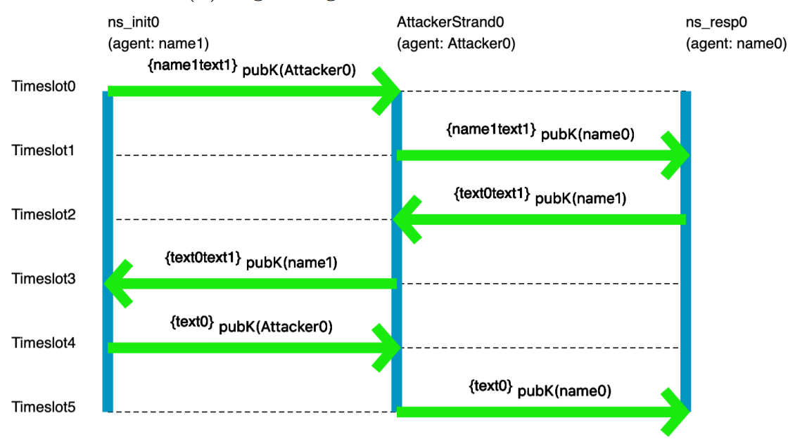

# Logic for Systems

## Setting the Stage

If you're reading this book, you've probably had to complete some programming assignments—or at least written some small program for a course or an online tutorial. Take a moment to list a handful of such assignments: what did you have to build? 

Now ask yourself:
* How did you know what behavior to implement?
* How did you know which data structures or algorithms were the right ones to use?
* How did you know your program "worked", in the end?

In the context of assignments, there are expected answers to these questions. For instance, you might say you know your code worked because you tested it (*very* thoroughly, I'm sure)! But is that really the truth? In terms of consequences, the true bar for excellence in a programming class is the grade you got. That is:
  - You knew what to do because _you were told what to do_.  
  - You probably knew which algorithms to use because they'd _just been taught to you_.
  - You were confident that your programs worked because _you were told by an authority figure_.

But outside that context, as (say) a professional engineer, you lose the safety net. You might be working on a program that controls the fate of billions of dollars, tempers geopolitical strife, or controls a patient's insulin pump. Even if you had a TA, would you trust them to tell you that those programs worked? Would you trust your boss to understand _exactly_ what needed to happen, and tell you _exactly_ how to do it? Probably not! Instead, you need to think carefully about what you want, how to build it, and how to evaluate what you and others have built. 

~~~admonish warning title="Don't let the perfect be the enemy of the good."
As engineers, we strive for perfection. But perfection is an ideal; it's not obtainable. Why? First: we're human. Even if we could read our customers' minds, that's no guarantee that *they* know what they really need. And even if we can prove our code is correct, we might be checking for the wrong things. Second: our environment is hostile. Computers break. Patches to dependencies introduce errors. Cosmic radiation can flip bits in memory. 100% reliability is hopeless. Anyone who tells you differently is trying to sell you something. 

But that doesn't mean we should give up. It just means that we should moderate our expectations. Instead of focusing on perfect correctness, instead try to _increase your confidence_ in correctness.
~~~

## Unit Testing

Hopefully we all agree that unit testing with concrete input-output pairs has its virtues and that we should keep doing it. But let's investigate what it does and doesn't do well. 
  
**Exercise:** Make two lists: What does unit testing do well? What doesn't it do well? (Hint: Why do we test? What could go wrong, and how can the sort of testing you've done in other classes let us down?)

Think, then click!

You might have observed that (for most interesting programs, anyway) tests cannot be exhaustive because there are infinitely many possible inputs. And since we're forced to test non-exhaustively, we have to hope we pick good tests---tests that not only focus on our own implementation, but on others (like the implementation that replaces yours eventually) too.

Worse, we can't test the things we don't think of, or don't know about; we're vulnerable to our limited knowledge, the availability heuristic, confirmation bias, and so on. In fact, we humans are generally ill equipped for logical reasoning, even if trained. 

 

## Humans and Reasoning

### A Toy Example

Suppose we're thinking about the workings of a small company. We're given some facts about the company, and have to answer a question based on those facts. Here's an example. We know that:

* Alice directly supervises Bob.
* Bob directly supervises Charlie.
* Alice graduated Brown.
* Charlie graduated Harvale.

To keep things simple, we'll assume that all three people graduated some university.

**Exercise:** Does someone who graduated from Brown directly supervise someone who graduated from another University?

Think, then click.

Yes! Regardless of whether Bob graduated from Brown, _some_ Brown graduate supervises _some_ non-Brown graduate. Reasoning by hypotheticals, there is one fact we don't know: where Bob graduated. In case he graduated Brown, he supervises Charlie, a non-Brown graduate. In case he graduated from another school, he's supervised by Alice, a Brown graduate.
    
Humans tend to be very bad at reasoning by hypotheticals. There's a temptation to think that this puzzle isn't solvable because we don't know where Bob graduated from. Even Tim thought this at first after seeing the puzzle&mdash;in grad school! For logic!    

---

Now imagine a puzzle with a thousand of these unknowns. A thousand boolean variables means $2^{1000}$ cases to reason through. Want to use a computer yet?

<!-- ### Reasoning about knowledge

There is a prison in a magical world where an evil wizard holds a family of four gnomes. Every day, the wizard forces the gnomes to play a game for their freedom: he lines them up, single-file, in one or more rooms, facing the wall. The gnomes cannot move or communicate with each other; they can only look straight ahead. The wizard then pulls out four hats: two orange and two blue, and magics one onto each gnome's head.

The wizard then walks the line, asking each gnome: "What is your hat color?" They may try to answer, or remain silent for 10 seconds (and then the wizard moves on). If a gnome guesses correctly, they all immediately go free. But if one guesses incorrectly, they become the wizard's magical servants forever. So it's in their best interest to not answer unless they are absolutely convinced that they have guessed correctly.

Neither the wizard nor the gnomes can cheat. It's against magical law. The gnomes are, however, very intelligent. Smarter than the wizard for sure: they're perfect logical reasoners.

Here's an example configuration of the puzzle room:

|  |
|:--:| 
|  *(Why are they smiling?)* |

**Exercise:** In this configuration, can the gnomes escape? If so, why?

    
Think, then click.

Yes! The gnomes can escape, because they're able to use the knowledge of other gnomes _without explicit communication_. When the wizard asks Gnome #2 what color their hat is, Gnome #2 can conclude nothing, and is silent. Gnome #3 can then reason that his hat, and the hat of Gnome #4, must be different colors. Only two colors are possible. And so the wizard is thwarted.

To solve this puzzle, you need to reason about what the other agents know, and what we expect them to do with that knowledge. These sorts of epistemic statements can be useful in practice. -->

**This isn't really about logic puzzles.**

### A Real Scenario

There's a real cryptographic protocol called the Needham-Schroeder public-key protocol. You can read about it [here](https://en.wikipedia.org/wiki/Needham–Schroeder_protocol#The_public-key_protocol). Unfortunately the protocol has a bug: it's vulnerable to attack if one of the principles can be fooled into starting an exchange with a badly-behaved or compromised agent. We won't go into specifics. Instead, let's focus on the fact that it's quite easy to get things like protocols wrong, and sometimes challenging for us humans to completely explore all possible behaviors -- especially since there might be behaviors we'd never even considered! It sure would be nice if we could get a computer to help out with that.

A pair of former 1710 students did an [ISP on modeling crypto protocols](http://cs.brown.edu/~tbn/publications/ssdnk-fest21-forge.pdf), using the tools you'll learn in class. Here's an example picture, generated by their model, of the flaw in the Needham-Schroeder protocol:

You don't need to understand the specifics of the visualization; the point is that someone who has studied crypto protocols **would**. And this really does show the classic attack on Needham-Schroeder. You may not be a crypto-protocol person, but you probably are an expert in something subtle that you'd like to model, reason about, and understand better. 

~~~admonish warning title="Brown CSCI 1710"
In fact, if you're reading this as part of your coursework for CSCI 1710, you will be _expected_ to select, research, and model something yourself based on your interests. This is one of our main end-goals for the course.
~~~

## Automated Reasoning as an Assistive Device

The human species has been so successful, in part, because of our ability to use assistive devices&mdash;tools! Eyeglasses, bicycles, hammers, bridges: all devices that assist us in navigating the world in our fragile meat-bodies. One of our oldest inventions, writing, is an assistive device that increases our long-term memory space and makes that memory _persistent_. Computers are only one in a long line of such inventions.

So, naturally, we've found ways to:
* use computers to help us test our ideas;
* use computers to exhaustively check program correctness;
* use computers to help us find gaps in our intuition about a program;
* use computers to help us explore the design space of a data structure, or algorithm, card game, or chemical reaction; 
* etc.

There's a large body of work in Computer Science that uses logic to do all those things. We tend to call it _formal methods_, especially when the focus is on reasoning about systems. It touches on topics like system modeling, constraint solving, program analysis, design exploration, and more. That's what this book is about: the foundational knowledge to engage with many different applications of these ideas, even if you don't end up working with them directly every day. 

More concretely, we'll focus on a class of techniques called _lightweight_ formal methods, which are characterized by tradeoffs that favor ease of use over strong guarantees (although we'll sometimes achieve those as well).

~~~admonish tip title="Further Reading" 
Jeanette Wing and Daniel Jackson wrote a short article coining the term "lightweight FM" in the 90's, which you can find [online](http://www.cs.cmu.edu/~wing/publications/JacksonWing96.pdf).
~~~

~~~admonish warning title="What is a system?"
When we say "systems" in this book we don't necessarily mean the kind of systems you see in a class on networks, hardware architecture, or operating systems. You can apply the techniques in this book to those subjects quite naturally, but you can also apply it to user interfaces, type systems in programming, hardware, version control systems like Git, web security, cryptographic protocols, robotics, puzzles, sports and games, and much more. So we construe the word "system" very broadly.

Here are some examples of "systems" that students have modeled in Forge: lifetimes in Rust, network reachability, and poker!

  

    

    

      
Rust Lifetimes and Borrowing

      
Thomas Castleman and Ria Rajesh

      
Course Project

    

  

  

    

    

      
Network Reachability

      
Tim Nelson and Pamela Zave

      
<a href="https://fm.csl.sri.com/SSFT23/">(link to lab)</a>

    

  

  

    

    

      
Texas Hold 'Em

      
Matthew Boranian and Austin Lang

      
Course Project

    

  

~~~

## The Future of Computing

For better or worse, The shape of engineering is changing. Lots of people are excited, scared, or both about large language models like ChatGPT. This book won't teach you how to use generative AI, so it's reasonable to wonder: _why learn from this book, instead of reading yet another book on another (deservedly) hot topic, like machine learning?_

There are two questions that will never go out of style, and won't be answered by AI (at least, not in our lifetimes):
* **What do you want to build?** What does your customer really need? Answering this requires talking to them and other stakeholders, watching their processes, seeking their feedback, and adjusting your design based on it. And no matter who (or what) is writing the actual code, you need to be able to express all this precisely enough that they (or it) can succeed at the implementation.  
* **How will you evaluate what you get?** No matter who (or what) is building the system, verification is needed before the system can be trusted.

Even setting aside the customer-facing aspects, we'll still need to think critically about what it is we want and how to evaluate whether we're getting it. The skills you learn here will remain useful (or become even more so) as engineering evolves. In the next chapter, we'll try to convince you that these skills will be useful for more than just code.

## "Formal Methods"

_Formal methods_ (FM) are ways to help you think carefully about a domain, process, or system. They use math-based techniques (which are usually implemented in tools) to help. They aren't an academic exercise; they are used widely in industry and have likely saved billions of dollars and thousands of lives.

Some industrial examples I'm fond of include:
* [Amazon Web Services' Zelkova](https://aws.amazon.com/blogs/security/protect-sensitive-data-in-the-cloud-with-automated-reasoning-zelkova/), which helps administrators author better security policies for their services. This book will give you the tools to build a policy-analysis system like Zelkova yourself. 
* [Microsoft's static driver verifier](https://www.microsoft.com/en-us/research/publication/thorough-static-analysis-of-device-drivers/), which helps increase the reliability of low-level device drivers in Windows. While this book doesn't cover the techniques they used, I love to showcase this work (which helped Microsoft ship more stable drivers and, at this point, is now decades old).
* [MongoDB's work on modeling replication](https://github.com/visualzhou/mongo-repl-tla), which found a real bug in their code. Quoting the linked page: "We've never encountered this issue in testing or in the field and only found it by reasoning about the edge cases. This shows writing and model checking ... specs is an excellent alternative way to find and verify edge cases." (Ellipsis mine.) We won't use this exact _tool_, but we'll cover other model checkers in this book.

We can find real applications for FM outside Computer Science too---even the law. [Here's an article](https://roundtablelaw.medium.com/utterly-unpersuasive-formal-methods-and-law-bb8ecf048374) about the value of modeling _legal concepts_ to find loopholes in the law. This is the sort of FM we'll be learning how to do in 1710.

[This Github repository](https://github.com/ligurio/practical-fm) keeps a (reasonably up to date, but not exhaustive!) list of other industrial applications of formal methods. Check it out! 

### Exercise

Can you think of one or two domains, systems, or processes that especially interest you? Think about the kinds of "system" you interact with regularly or have learned about in your life. What would you like to understand better about those systems? 

Remember that we construe the word _system_ broadly. A cryptographic protocol is a system, but so is the game of baseball. A data structure is a system, but so are chemical reactions. 

## Looking Ahead: Tools 

The main tool we'll use in this book is [Forge](http://forge-fm.org), a tool for modeling systems. In the course of the book, we'll be progressing through three _language levels_ in Forge:
* **Froglet**, which restricts the set of operations so that we can jump right in more easily. If you have intuitions about object-oriented programming, those intuitions will be useful in Froglet, although there are a few important differences that we'll talk about.
* **Relational Forge**, which expands the set of operations available to include sets, relations, and relational operators. These are useful for reasoning about complex relationships between objects and for representing certain domains, like databases or graphs.
* **Temporal Forge**, which helps us cleanly model how a system's state evolves over time. Temporal Forge is based on the industry-standard specification language LTL&mdash;Linear Temporal Logic.

We'll also use some other tools, like:
* [Hypothesis](https://hypothesis.readthedocs.io/en/latest/), a testing library for Python; and
* [Z3](https://github.com/Z3Prover/z3), an SMT solver library. 
