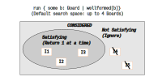

# Anticipated Questions: Static Models

### What Happens When Forge Searches? 

Our first `run` command in Forge was from [tic-tac-toe](../ttt/ttt.md): `run { some b: Board | wellformed[b]}`.

How did Forge actually run the search? Surely it isn't checking all possible boards _one at a time_; that wouldn't scale at all, and we need to scale in order to model and reason about real systems. No; Forge can efficiently search much larger problem spaces than this.  

Let's step through _how_ Forge solves a problem. First, there's a space of potential solutions that it considers. Using the default engine, this space is finite&mdash;although possibly enormous. There are $3^9 = 19683$ 3-by-3 tic-tac-toe boards, which isn't too bad. But a 4-by-4 board would have $3^{16} = 430,467,213$ possibilities, and real systems might have more possible states than electrons in the observable universe. So we'd better be doing something smarter than checking one instance at a time.

The bounds of the space to search is set by the `run` command. In this case, no bounds were given, so defaults were used: instances may contain *up to 4 atoms of each top-level `sig` type*, and the integers $-8$ through $7$ (inclusive) but no more. We can adjust that bound by adding instructions, e.g., `run { some b: Board | wellformed[b]} for exactly 2 Board` will only seek instances where there are 2 `Board` atoms. 

The bounds describe the search space. This space is populated with instances, some of which satisfy the constraints being run and some of which don't. In principle, there exist other instances too&mdash;entirely outside the space being searched! E.g., if we said to search up to 4 `Board` atoms, an instance with 100 such atoms might (or might not) satisfy our constraints, but wouldn't be considered in the search:

<center></center>

Once this space is defined, **and only then**, a sophisticated constraint-solving engine&mdash;a boolean "SAT" or "SMT" solver&mdash;takes charge. The engine uses techniques like backtracking and heuristics to try to avoid unnecessary work in solving the problem. This divides the search space into "satisfying" and "not satisfying" areas. The solver returns the satisfying instances in some order:

<center></center>


~~~admonish note title="CSCI 1710"
If you're in CSCI 1710, one of your assignments will be to _build_ such a constraint solver, and even to see how it performs "plugged in" to Forge and solving real `run` commands you write. 
~~~


<!--  -->

#### Performance Implications

As you may have seen in the ripple-carry adder section, these two phases of solving work very differently, and  letting the solver infer constraints is often less efficient than giving it tighter bounds, because the latter restricts the overall space to be searched beforehand. Some optimization techniques in Forge need to be explicitly applied in the first phase, because the solver engine itself splits the two phases apart. For more on this, read [the upcoming Q&A section for traces and events](../qna/events.md).

<!-- ### How does `reachable` work? 

We prototyped some confidence tests about the `reachable` predicate ([livecode file](./testing_reachable.frg)). -->


### "Nulls" in Forge

In Forge, there is a special value called `none`. It's analogous (but not exactly the same!) to a `None` in languages like Python.

Suppose I add this predicate to our `run` command in the tic-tac-toe model:

```alloy
pred myIdea {
    -- no 2 locations can share the same mark
    all rowA, colA, rowB, colB: Int | 
        (rowA != rowB or colA != colB) implies
            Board.board[rowA][colA] != 
            Board.board[rowB][colB]
}
```

I'm trying to express that every entry in the board is different. This should easily be true about, e.g., the initial board, as there are no pieces there at all. But **do you think the empty board satisfies this predicate?**

<details>
<summary>Think (or try it in Forge) then click!</summary>

It's very likely this predicate would _not_ be satisfied by the empty board. Why?
    
*Because `none` equals itself*, and it's the value in each location of the board before `X` or `O` move there. 
    
Thus, when you're writing constraints like the above, you need to watch out for `none`: the value for _every_ cell in the initial board is equal to the value for _every_ other cell!
</details>


~~~admonish tip title="Reachability and none"
The `none` value in Forge has at least one more subtlety: `none` is "reachable" from everything if you're using the built-in `reachable` helper predicate. That has an impact even if we don't use `none` explicitly. If I write something like: `reachable[p.spouse, Nim, parent1, parent2]` I'm asking whether, for some person `p`, their spouse is an ancestor of `Nim`. If `p` doesn't have a spouse, then `p.spouse` is `none`, and so this predicate would yield true for `p`.

This is why it's often advisible to qualify your use of `reachable`. E.g., I could write `some p.spouse and reachable[p.spouse, Nim, parent1, parent2]`.
~~~

### Some as a Quantifier Versus Some as a Multiplicity

The keyword `some` is used in 2 different ways in Forge:
* it's a _quantifier_, as in `some b: Board, p: Player | winner[s, p]`, which says that somebody has won in some board (and gives us a name for that board, and also for the winner); and
* it's a _multiplicity operator_, as in `some Board.board[1][1]`, which says only that the middle cell of the board is populated (recall that the board indexes are `0`, `1`, and `2`).

Don't be afraid to use both; they're both quite useful! But remember the difference. 

### Guarding Quantifiers; Implies vs. "Such That"

You can read `some row : Int | ...` as "There exists some integer `row` such that ...". The transliteration isn't quite as nice for `all`; it's better to read `all row : Int | ...` as "In all integer `row`s, it holds that ...". 

If you want to _further restrict_ the values used in an `all`, you'd use `implies`. But if you want to _add additional requirements_ for a `some`, you'd use `and`.  Here are 2 examples:
* **All**: "Everybody who has a `parent1` doesn't also have that person as their `parent2`": `all p: Person | some p.parent1 implies p.parent1 != p.parent2`.
* **Some**: "There exists someone who has a `parent1` and a `spouse`": `some p: Person | some p.parent1 and some p.spouse`.

**Technical aside:** The type designation on the variable can be interpreted as having a character similar to these add-ons: `and` (for `some`) and `implies` (for `all`). E.g., "there exists some `row` such that `row` is an integer and ...", or "In all `row`s, if `row` is an integer, it holds that...".

### There Exists `some` *Atom* vs. Some *Instance*

Forge searches for instances that satisfy the constraints you give it. Every `run` in Forge is about _satisfiability_; answering the question "Does there exist an instance, such that...". 

Crucially, **you cannot write a Forge constraint that quantifies over _instances_ themselves**. You can ask Forge "does there exist an instance such that...", which is pretty flexible on its own. E.g., if you want to check that something holds of _all_ instances, you can ask Forge to find counterexamples. This exactly what `assert ... is necessary for ...` does; it searches for counterexample instances.

### Tip: Testing Predicate Equivalence

Checking whether or not two predicates are _equivalent_ is the core of quite a few Forge applications---and a great debugging technique sometimes. (We saw this very briefly for binary trees, but it's worth repeating.)

How do you check for predicate equivalence? Well, suppose we tried to write a predicate in two different ways, like this:

```alloy
pred myPred1 {
    some i1, i2: Int | i1 = i2
}
pred myPred2 {
    not all ii, i2: Int | i1 != i2
}
assert myPred1 is necessary for myPred2
assert myPred2 is necessary for myPred1
```

These `assert` statements will pass, because the two predicates _are_ logically equivalent. But if we had written (forgetting the `not`):

```alloy
pred myPred2 {
    all ii, i2: Int | i1 != i2
}
```

One of the assertions would fail, yielding an instance in Sterling you could use the evaluator with. If you get an instance where the two predicates aren't equivalent, you can use the Sterling evaluator to find out **why**. Try different subexpressions, discover which is producing an unexpected result! 

### One Versus Some

Classical logic provides the `some` and `all` quantifiers, but Forge also gives you `no`, `one` and `lone`. The `no` quantifier is fairly straightforward: if I write `no row, col: Int | Board.board[row][col] = X`, it's equivalent to `all row, col: Int | Board.board[row][col] != X`. That is, `X` hasn't yet put a mark on the board. 

The `one` quantifier is for saying "there exists a UNIQUE ...". As a result, there are hidden constraints embedded into its use. `one row: Int | Board.board[row][0] = X` really means, roughly, `some row: Int | { Board.board[row][0] = X and all row2: Int | { row2 != row implies Board.board[row][0] != X}}`: there is _some_ row where `X` has moved in the first column, but _only one such row_. The `lone` quantifier is similar, except that instead of saying "exactly one", it says "either one or none". 

This means that interleaving `one` or `lone` with other quantifiers can be subtle. Consider what happens if I write `one row, col: Int | Board.board[row][col] = X`. This means that there is exactly one square on the board where `X` has moved. But what about `one row: Int | one col: Int | Board.board[row][col] = X`? 

**Exercise:** Test this out using Forge! Try running: 

```
run { not { 
      (one row, col: Int | Board.board[row][col] = X) iff
      (one row: Int | one col: Int | Board.board[row][col] = X)
}}
```
You'll get an instance showing you that the two aren't equivalent. What's the problem?

<details>
<summary>Think, then click!</summary>

The problem is that `one row, col: Int | ...` says that there exists one unique _pair_ of indexes, but `one row: Int | one col: Int | ...` says that there exists one unique _index_ such that there exists one unique _index_... These are not the same.

</details>

Because thinking through `one` and `lone` quantifiers can be subtle, we strongly suggest _not_ using them except for very simple constraints. (Using them as a multiplicity, like saying `one Tim.office` is fine.) 

#### Satisfiability Testing and a Pitfall

The `test expect` syntax lets you check for satisfiability directly. This is quite powerful, and lets us illustrate a fairly common mistake. Here is a test block with 2 tests in it. Both of them may look like they are comparing `myPred1` and `myPred2` for equivalence:

```alloy
test expect {
    -- correct: "no counterexample exists"
    -- Forge tries to find an instance where myPred1 and myPred2 disagree
    p1eqp2_A: {
        not (myPred1 iff myPred2)        
    } is unsat

    -- incorrect: "it's possible to satisfy what i think always holds"
    -- Forge tries to find an instance where myPred1 and myPred2 happen to agree
    p1eqp2_B: {
        myPred1 iff myPred2
    } is sat
}
```

These two tests do not express the same thing! One asks Forge to find an instance where the predicates are not equivalent. If it can find such an instance, we know the predicates are not equivalent, and can see why by viewing the intance. The other test asks Forge to find an arbitrary instance where they _are_ equivalent. But that needn't be true in _all_ instances, just the one that Forge finds. 

### Quantifiers and Performance

Forge works by converting your model into a boolean satisfiability problem. That is, it builds a boolean circuit where inputs making the circuit true satisfy your model. But boolean circuits don't have a notion of quantifiers, so they need to be compiled out.

The compiler has a lot of clever tricks to make this fast, but if it can't apply those tricks, it uses a basic idea: an `all` is just a big `and`, and a `some` is just a big `or`. This very simple conversion process increases the size of the circuit exponentially in the depth of quantification. 

Let's look at an example of why this matters. Here is a reasonable way to approach writing a predicate for a model solving the 8-queens problem, where Forge is searching for how to place 8 queens on a chessboard such that none of them can attack the other:

```forge
pred notAttacking {
  -- For every pair of queens
  all disj q1, q2 : Queen | {
    -- There's somewhere to put them: (r1,c1) and (r2,c2)
    some r1, c1, r2, c2: Int | {
      // ... such that (r1,c1) and (r2,c2) aren't on a shared line of attack
    } } }
```

The problem is: there are 8 queens, and 16 integers. It turns out this is a pathological case for the compiler, and it runs for a really long time. In fact, it runs for a long time even if we reduce the scope to 4 queens! The default `verbosity` option shows the blowup here, in `time-ranslation, which gives the number of milliseconds used to convert the model to a boolean circuit:

```
:stats ((size-variables 410425) (size-clauses 617523) (size-primary 1028) (time-translation 18770) (time-solving 184) (time-building 40)) :metadata ())
#vars: (size-variables 410425); #primary: (size-primary 1028); #clauses: (size-clauses 617523)        
Transl (ms): (time-translation 18770); Solving (ms): (time-solving 184)
```

Ouch! To avoid this blowup, we might try a different approach that uses fewer quantifiers. In fact, *we can write the constraint without referring to specific queens at all, just 4 integers representing the positions. 

```admonish hint title="How?"
Does the identity of the queens matter at all, beyond their location?
```

If you encounter bad performance from Forge, check for this sort of unnecessary nested quantifier use. It can often be fixed by reducing quantifier nesting, or by narrowing the scope of what's being quantified over.
