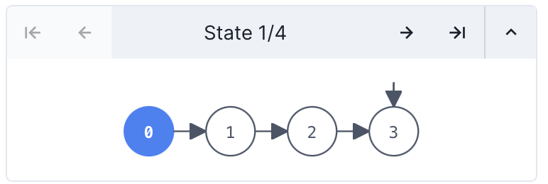
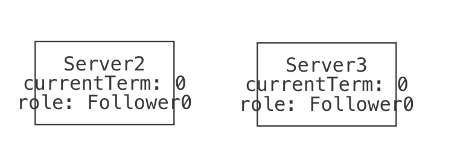
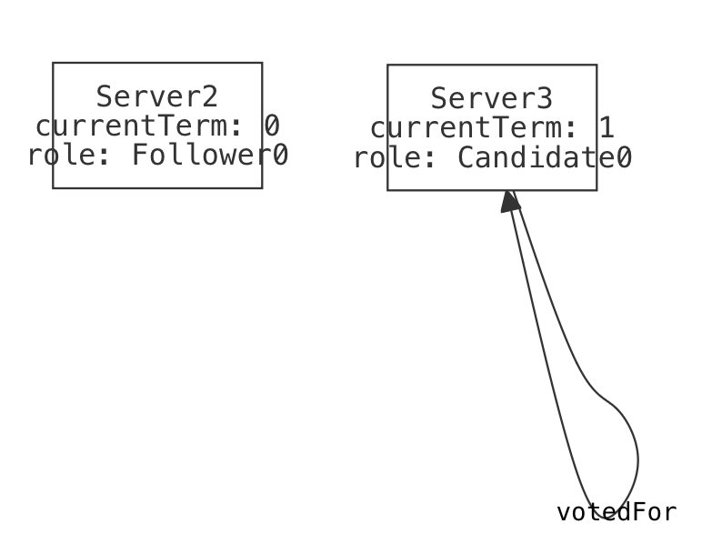
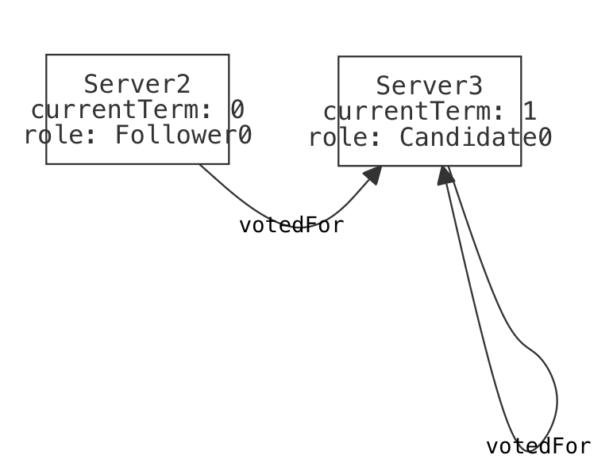
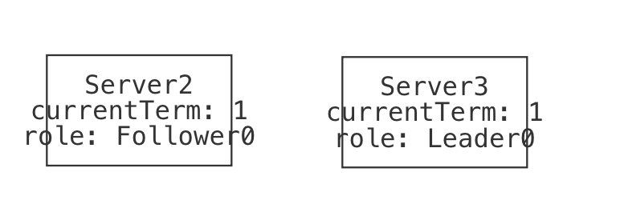

# Modeling Raft 

This case study is going to be personal. That is, I'll be modeling a protocol from scratch in the honest desire to understand it better. I'll be making false starts or modeling mistakes, and leaving all of that in as part of the story. I'll talk through recovering from my own mistakes, and in the end hopefully both understand this protocol better myself _and_ show you how you might approach modeling a larger system in Forge. 

~~~admonish note title="Instance images" 
I won't always include screenshots of the instances I see when I'm debugging. However, when I don't I'll try to explain what I see in them. 
~~~

In this section, we'll be modeling [Raft](https://raft.github.io) in **Temporal Forge**. This isn't a distributed-systems textbook, so if you're curious about more details than I cover here, you should check out the Raft Github, some of the [implementations](https://raft.github.io/#implementations) (including [the one powering etcd](https://github.com/etcd-io/raft)), or the original 2014 [Raft paper](https://raft.github.io/raft.pdf) by Ongaro and Ousterhout.

### Structure

You can follow along with livecode in these files:
* A first, abstract model of leader election: [`raft_1.frg`](./raft_1.frg);
* A basic model of messages: [`messages.frg`](./messages.frg);
* Definitions of four RPC messages (two requests, two responses): [`rpc.frg`](./rpc.frg);
* A second, message-passing version of our leader election model: [`raft_2.frg`](./raft_2.frg).

**TODO: add more as more files are created.**

## What is Raft?

Suppose you're storing multiple copies of the same data on different servers around the world. You'd really like to make sure that the data stored on each replica server is _actually the same_ data, i.e., that your replicas aren't gradually slipping out of agreement with one another. This is called _distributed consensus_. Raft is a protocol for achieving distributed consensus without anything like a shared clock or a trusted third party. 

Raft claims to be an "understandable" consensus protocol, or at least more understandable than the original, brilliant but famously difficult to understand [Paxos protocol](https://en.wikipedia.org/wiki/Paxos_(computer_science)). Since I don't understand Paxos either, I'm hoping that Raft lives up to that intention. 

~~~admonish note title="Full Disclosure" 
I _have_ seen a couple of lectures on Raft, one of which was delivered by the excellent [Doug Woos](https://www.dougwoos.com). Unfortunately, as with all such things, I've since forgotten almost everything I thought I'd learned. But I do have some pre-existing intuition, in my subconscious if nowhere else. 

Also, there does exist a formal model of Raft already, written in the TLA+ modeling language. I am deliberately *NOT* going to go looking at that model unless I really need to. Why not? Well, because Forge and TLA+ have somewhat different abstractions. But more importantly, I don't want bias how I think about Raft, especially early on. Reading others' formal models is useful, and if I were implementing Raft, I'd be referring to their model regularly. But I want to write my own, and understand the protocol better because of it. 
~~~

## Getting Started 

In a smaller system, we'd start by figuring out datatypes and writing examples. Here, though, there are many moving parts, and we can expect to iterate a few times on each, starting with a fairly abstract version. So we'll begin at a higher level, one that is more about sketching what's important than running Forge to get "results". 

What pieces does Raft have, or at least which pieces does it have that we expect we'll want to model? 
* Raft has a **leader election process**, wherein nodes that stop hearing from the current leader might be voted new leader by their peers. It's likely we'll need to model this election process, or at least some abstraction of leader replacement. (The time in which a specific node is the continuous leader is called a _term_.)
* Raft is based on a sequence of **log entries**, each of which describes a transaction which changes the underlying state. (This is where the name comes from: a raft is a sequence of logs.) We might not need to model the state itself, but we'll surely need to model log entries in order to detect whether they are being faithfully committed in the right order. 
* Raft runs on a network, and networks are imperfect. So some model of **message passing** seems reasonable. There are a few standard messages that Raft uses: update requests, vote requests, "heartbeat" messages from the leader, and so on. 

Now we should ask ourselves what we hope to get out of the model, because that will inform how we approach the above. Yes, I said my goal was the "understand Raft" but that's a little vague, isn't it? So let's ask a different question. What would it mean for Raft to "work"? Figure 3 of [the Raft paper](https://raft.github.io/raft.pdf) enumerates these, and I'll quote each verbatim here with my comments below each: 
* **Election Safety**: at most one leader can be elected in a given term. 
    * This seems simple enough to check. We'll just have a notion of roles for every node, and make sure that the leader role is always either empty or singleton.
* **Leader Append-Only**: a leader never overwrites or deletes entries in its log; it only appends new entries. 
    * This seems subtle to guarantee, since (it seems to me at first anyway!) network faults could cause a new leader to have bugs in its log that need resolving. But perhaps the election protocol is meant to prevent that. Anyway, this sounds like a place we can apply invariant-checking techniques we already know.
* **Log Matching**: if two logs contain an entry with the same index and term, then the logs are identical in all entries up through the given index. 
    * Ok, this seems to be saying that if two nodes think the same transaction appears in the same place under the same "reign", they can't disagree on anything beforehand. At first glance this seems like another inductive property, or at least a safety property we can check with Forge. But if we want to phrase the property identically to the paper, we'll want to model logs as indexed sequences (like arrays), not chains (like linked lists).
* **Leader Completeness**: if a log entry is committed in a given term, then that entry will be present in the logs of the leaders for all higher-numbered terms.
    * So there's some guarantee that the commitments of prior administrations will be respected by later leaders. Makes sense. Sounds like this is something else that the election protocol needs to guarantee; I'm getting a feeling that modeling leader election will be _essential_. Maybe we'll start there. 
* **State Machine Safety**: if a server has applied a log entry at a given index to its state machine, no other server will ever apply a different log entry for the same index. 
    * Like the previous property, this also sounds like it's about the distinction between the log and _committing_ entries in the log. We'll need some way to distinguish the two ideas eventually, although I'm not sure if we'll need to model the state machine fully. Let's wait to make that decision, and explore the protocol elsewhere first. 

~~~admonish warning title="Are these the right properties? We won't care right now." 
In a different setting, I'd ask you to consider whether these properties are the right ones. Although it's still a good idea to spend a minute considering that, I won't belabor the point here. Our goal is to understand the protocol, not critique it&mdash;at least not yet! So these are the properties we'll run with.
~~~

## Leader Election, Abstractly

Notice how thinking a little bit about the pieces of the system and the properties led to some idea of what's most important. The leader election seems vital to almost everything, and it's part of the protocol (as opposed to message passing, which may be vital but isn't about the protocol itself, but the network it runs on). So let's begin there. 

### Number of Servers

In Raft, every node knows how many total servers there are in the cluster. This is part of the configuration before startup, so we will assume that every server has, and agrees on, the correct cluster size. We won't create a field for this anywhere, we'll just feel free to use `#Server`&mdash;and make sure we don't allow the set of servers to vary! 

### Roles

A server can have one of three different roles. These are called "states" in the paper, but I find that a confusing term given just how many kinds of state there are here:

```forge
#lang forge/temporal 

abstract sig Role {}
one sig Follower, Candidate, Leader extends Role {}
```

Every `Server` has exactly one role at any time. All servers begin as `Follower`s at startup. We'll express these facts as a `sig` definition and an initial-state `pred`, and add to both as we continue.

```forge
sig Server {
    var role: one Role
}
/** The initial startup state for the cluster */
pred init {
    all s: Server | { 
        s.role = Follower
    } 
}
```

### Leader Election

If a `Follower` hasn't heard from the leader recently (either via a state-update message or a heartbeat message), it will become a `Candidate`. In an actual implementation, "recently" would be concretely defined by a timeout value, but we'll try to avoid that here. The paper says: 

> To begin an election, a follower increments its current term and transitions to candidate state. It then votes for itself and issues RequestVote RPCs in parallel to each of the other servers in the cluster. A candidate continues in this state until one of three things happens: (a) it wins the election, (b) another server establishes itself as leader, or (c) a period of time goes by with no winner. 

And from Section 5.4.1,

> the voter denies its vote if its own log is more up-to-date than that of the candidate.

So we'll need to keep track of a server's current vote and enable it to send requests for votes. We'll also need to recognize the end of the election in these three different ways&mdash;we might start with just a single transition that incorporates all three, and expand it only if we need to. We'll omit modeling logs for the moment, but leave in a note so we don't forget. 

~~~admonish tip title="Be guided by the writeup!" 
I'll be guided by Figure 2 in the Raft paper, which gives field names and initial values for variables. E.g., it says that every server has a `votedFor` variable which starts out `null`. 
~~~

```forge
sig Server {
    var role: one Role,
    var votedFor: lone Server, -- NEW
    var currentTerm: one Int -- NEW
}
/** The initial startup state for the cluster */
pred init {
    all s: Server | { 
        s.role = Follower
        no s.votedFor -- NEW
        s.currentTerm = 0 -- NEW
    } 
}
```

Now let's create some abstract transitions.

#### Starting an Election

A `Follower` runs for leader if it hasn't heard from `Leader` node in some time. We haven't yet modeled message passing, and we really hope not to have to model time. But we can at least require the server be a `Follower` when it begins. 

```forge
/** Server `s` runs for election. */
pred startElection[s: Server] {
    s.role = Follower -- GUARD 
    s.role' = Candidate -- ACTION: in candidate role now
    s.votedFor' = s -- ACTION: votes for itself 
    s.currentTerm' = add[s.currentTerm, 1] -- ACTION: increments term
    -- ACTION: issues RequestVote calls
    -- ... we can't model this yet: no message passing
    
    -- FRAME: role, currentTerm, votedFor for all other servers
    all other: Server - s | {
        other.votedFor' = other.votedFor
        other.currentTerm' = other.currentTerm
        other.role' = other.role
    }
}```

Ok, so should we immediately rush off to model message passing? I don't think so, we'd like to focus on the essence of leader election. So, instead, we'll have a transition that represents another server receiving that voting request, but guard it differently:

```forge
/** A server can vote for another server on request, 
    "on a first-come-first-served basis". */
pred makeVote[voter: Server, c: Server] {
    no voter.votedFor -- GUARD: has not yet voted
    c.role = Candidate -- GUARD: election is running 
    noLessUpToDateThan[c, voter] -- GUARD: candidate is no less updated

    voter.votedFor' = c -- ACTION: vote for c
    -- FRAME role, currentTerm for voter
    -- FRAME: role, currentTerm, votedFor for all others
    all s: Server | {
        s.role' = s.role
        s.currentTerm' = s.currentTerm
        (s != voter) => (s.votedFor' = s.votedFor)
    }
}

/** Does the first server have a log that is no less up-to-date than
    the second server? 
*/
pred noLessUpToDateThan[moreOrSame: Server, baseline: Server] { 
    -- true (for now)
    -- TODO: once we model logs, the paper describes this relation as:
    --   the log with the later term is more up-to-date.
    --   if the logs end with the same term, then the longer log is more up-to-date.
}
```

~~~admonish warning title="Leaders shouldn't be able to vote." 
Oops. I forgot a guard constraint that seems important: I'll just add: `voter in Follower + Candidate` in order to allow the vote to occur only if the voter is not a `Leader` already. 
~~~

#### Ending an Election

> A candidate wins an election if it receives votes from a majority of the servers in the full cluster for the same term. 

> Once a candidate wins an election, it becomes leader. It then sends heartbeat messages to all of the other servers to establish its authority and prevent new elections.

```forge
/** Server `s` is supported by a majority of the cluster.*/
pred majorityVotes[s: Server] {
    #{voter: Server | voter.votedFor = s} > divide[#Server, 2]
}
/** Server `s` wins the election. */
pred winElection[s: Server] {
    -- GUARD: won the majority
    majorityVotes[s]
    -- ACTION: become leader, send heartbeat messages
    s.role' = Leader 
    s.currentTerm' = s.currentTerm
    no s.votedFor' 

    -- TODO: heartbeats
    -- For now, we'll just advance their terms and cancel votes
    -- directly as a FRAME, rather than using the network
    all f: Server - s | {
        f.role' = Follower
        no f.votedFor'
        f.currentTerm' = add[f.currentTerm, 1] 
    }
}
```

> if many followers become candidates at the same time, votes could be split so that no candidate obtains a majority. When this happens, each candidate will time out and start a new election by incrementing its term and initiating another round of RequestVote RPCs.

~~~admonish warning title="Random timeouts" 
Raft uses random timeouts to reduce the chances of a failed election. If elections fail over and over again, the cluster is stalled. We won't model this, but may have to add some assumptions later on.
~~~

```forge
/** Nobody has won the election after some time. */
pred haltElection {
    -- GUARD: there is some Candidate -- i.e., there is an election running
    some s: Server | s.role = Candidate
    -- GUARD: no server with the Candidate role has received a majority vote.
    --   (There is no requirement that everyone has voted; indeed, that wouldn't 
    --    work since the network might be broken, etc.)
    no s: Server | s.role = Candidate and majorityVotes[s]
    
    -- ACTION: each Candidate (not each server, necessarily) will increment their term
    --    and clear their vote.
    all c: Server | { 
        c.role = Candidate => c.currentTerm' = add[c.currentTerm, 1]
                         else c.currentTerm' = c.currentTerm
        no c.votedFor'
    }
    -- ACTION: initiating another round of RequestVote
    -- ... we can't model this yet: no message passing

    -- FRAME: nobody's role changes
    all c: Server | c.role' = c.role
}
```

Whew! That's a lot of constraints without ever running the model. We should do that next. 

#### Running the Model

First, let's check in. What have we even accomplished? 
  * We've forced ourselves to enumerate the sentences from the paper "in our own words" (and better, in less ambiguous language); 
  * We've probably prompted ourselves to ask questions that we wouldn't just from reading the paper. For example, when I went through the predicates above, I had originally read the paper as saying "each server will time out and start a new election", not "each _candidate_". Writing it down made me notice my misunderstanding. 
  * We've made a start at our formal model, and we can even run it. That we haven't modeled the "whole protocol" is not a concern at this point. We make incremental progress, which is the only way to make progress on a large model. 

Because this is only one part of the overall model we want to build, we'll allow unguarded no-op transitions in our trace predicate. This will make it easier to spot some classes of bugs, and (soon) help compose different modules as we write them.

```forge
/** Guardless no-op */
pred election_doNothing {
    -- ACTION: no change
    role' = role
    votedFor' = votedFor
    currentTerm' = currentTerm
}

/** Allow arbitrary no-op ("stutter") transitions, a la TLA+. We'll either 
    assert fairness, or use some other means to avoid useless traces. */ 
pred electionSystemTrace {
    init 
    always { 
        (some s: Server | startElection[s])
        or
        (some s, c: Server | makeVote[s, c])
        or 
        (some s: Server | winElection[s])
        or
        (haltElection)
        or 
        (election_doNothing)
    }
}

run { 
    electionSystemTrace 
    eventually {some s: Server | winElection[s]}
    #Server > 1
}
```

Let's see what we get. The minimap shows a lasso trace of 4 states:

<center>

</center>

Here's what we see in the default visualization:

<table>

<tr>
  <td>State0</td>
  <td>The initial state: both servers are followers with current term 0.</td>
  <td></td>
</tr>
<tr>
  <td>State1</td>
  <td>One server initiates an election, voting for themselves and advancing their term.</td>
  <td></td>
</tr>
<tr>
  <td>State2</td>
  <td>The other server votes for the candidate.</td>
  <td></td>
</tr>
<tr>
  <td>State3</td>
  <td>The candidate wins the election, and is now cluster leader. Both servers now agree on the term.</td>
  <td></td>
</tr>
</table>

This looks more or less like what we'd expect. Let's finish this stage of the model by doing a little validation. We'll try to validate in a way that will still be useful after we add more features to the model. 

#### Validation

What's important here? Well, there's the set of standard transition-system properties we'd like to check. E.g., 
* All of these transitions (except the no-op) should be mututally exclusive. 
* It should be possible to execute all the transitions.
But we also have some domain-specific properties:
* No server should ever transition directly from `Leader` to `Candidate`. 
* It should be possible to witness two elections in a row.
* It should be possible for two different servers to win elections in the same trace. 
* It should be invariant that there is only ever at most one `Leader`. 

We could go on, but let's stop with these, since we're still working at a fairly high level. 

##### Problem: Prefix Unsatisfiable 

I wrote a test like this: 

```forge
sat_start_make_win: {
    (some s: Server | startElection[s])
    next_state (some s1, s2: Server | makeVote[s1, s2])
    next_state next_state (some s: Server | winElection[s])
  } is sat 
```

This is a useful pattern because it only requires a _prefix_. So if it's unsatisfiable (and it is, oops!) we can comment out the transitions in reverse order to easily discover where the problem lies. At the moment, I need to comment out _both_ the `makeVote` and `winElection` transitions to make this satisfiable, which means there's probably some sort of issue with `makeVote`. 

~~~admonish note title="Initial-state" 
I've left out the `init` predicate from the above test, although once we fix the issue we should add it back in. This way we've learned about the problem without `init` being involved at all.
~~~

In these situations, I like to try unsat cores. If the core is small, we might learn something quickly. 

```forge
option solver MiniSatProver
option logtranslation 1
option coregranularity 1
option core_minimization rce
```

The core I get only highlights one line, which would seem to indicate that the `makeVote` transition just can't fire from the second state:

```forge
next_state (some s1, s2: Server | makeVote[s1, s2])
```

Let's see if it can _ever_ fire:

```forge
eventually (some s1, s2: Server | makeVote[s1, s2])
```

Indeed, this is unsatisfiable by itself. So what's wrong with `makeVote`? Notice that there's no constraint at all on what happened _before_ the transition in this `run`; whatever is wrong has a very strong effect. Let's first check whether the guard of `makeVote` can be satisfied:

```forge
    some voter, c: Server | {
      no voter.votedFor -- GUARD: has not yet voted
      voter in Follower -- GUARD: avoid Leaders voting
      c.role = Candidate -- GUARD: election is running 
      noLessUpToDateThan[c, voter] -- GUARD: candidate is no less updated
    }
```

Still unsatisfiable! What in the world is wrong? I increase the core granularity and translation log settings from `1` to `2`; this is expensive, and sometimes leads to confusing output, but can give a finer-grained core. Now Forge blames two things:
* the fact that `voter` is a `Server`; and 
* `voter in Follower + Candidate`.

At this point, it's clear what the problem is. I made a terrible typo in my model. `Follower` and `Candidate` are`Role`s, and so `voter` can never be in them; I should have written `voter.role in Follower + Candidate` instead. 

~~~admonish warning title="Error?"
I worked on this model during the summer of 2024, during which I was also cleaning up Forge's error-handling code. So I was both annoyed and pleased to encounter this problem&mdash;this should have given me an error, telling me that `voter` and `Follower+Candidate` were necessarily disjoint!

Even if this specific issue doesn't happen to you, I'm leaving the debugging process in. Hopefully it's useful.
~~~

I'll remove the unsat-core options now, since they reduce performance.

##### Another Problem: Only One Election 

Our test for "It should be possible to witness two elections in a row." has failed. In retrospect, this isn't surprising: there is no transition that models a `Leader` _stopping_ its leadership. I neglected to add a transition for this sentence in the paper: 

> If a candidate or leader discovers that its term is out of date, it immediately reverts to follower state. 

We'll add that now as a `stepDown` transition, and add it to the overall trace predicate: 

```forge
/** If a candidate or leader discovers that its term is out of date, it immediately reverts to follower state. 
    If the leader’s term (included in its RPC) is at least as large as the candidate’s current term, then the 
    candidate recognizes the leader as legitimate and returns to follower state. 
*/
pred stepDown[s: Server] {
    -- Two guard cases
    {
        -- GUARD: is leader, someone has a higher term (abstracted out message)
        s.role in Leader
        and
        (some s2: Server-s | s2.currentTerm > s.currentTerm)
    } or {
        -- GUARD: is candidate, someone claims to be leader and has term no smaller
        s.role in Candidate 
        and 
        (some s2: Server-s | s2.role = Leader and s2.currentTerm >= s.currentTerm)
    }

    -- ACTION: step down
    s.role' = Follower
    
    -- FRAME: all others equal; s same currentTerm and votedfor.
    all x: Server | {
        x.currentTerm' = x.currentTerm
        x.votedFor' = x.votedFor 
        (x != s) => x.role' = x.role
    }
}
```

Unfortunately, there are two problems still:
* Adding this transition isn't enough. It can't actually fire, because we have no way for a higher term number to be seen. Even though we abstracted out the network and just let the servers see each others' terms directly, there is not yet anything that might cause one server's term to exceed another's. This tells me that maybe it's almost time to actually model the network, or add some other component we're currently missing. 
* What I said above wasn't actually clear, was it? We still have the `startElection` transition, which (at the moment) allows any `Follower` to become a candidate, and then servers can vote for them. If they win, they'd become `Leader`. So why can't we see this? 

Let's resolve the second issue first. We'll use a telescoping prefix run to debug this. At first, we'll just add one more transition to our existing test. Can we even _start_ a second election?

```forge
  -- Start -> Vote -> Win -> Start
  run {
    (some s: Server | startElection[s])
    next_state (some s1, s2: Server | makeVote[s1, s2])
    next_state next_state (some s: Server | winElection[s])
    next_state next_state next_state (some s: Server | startElection[s])
  } 
```

Yes! Ok, good. Let's add the next step: we should be able to see someone vote for that server. So we can reference the second `Candidate`, we'll combine the two transitions like this:

```forge
    next_state next_state next_state { some s: Server | {
        startElection[s]
        next_state (some s2: Server | makeVote[s2, s])
    }}
```

This is now unsatisfiable. So the problem may be in that second vote being made. Let's back up to what we had before and run it, then check what the final state can look like, after the second election begins. If we're _looking at_ a trace prefix, we should add `init` to the beginning of the `run`, to make sure we don't get confused (unhelpfully!) by a garbage start state. 

The first instance I see contains 2 `Server`s. We see that the original `Leader` still has that role, and the new contender has the `Candidate` role (as we would expect). But now nobody can vote at all, because the only non-`Leader` has already voted (for themselves). What about a _larger_ instance? 
* Adding `for exactly 4 Server` to the `run` leads to unsat. (Oh, no! We should consider why in a minute.)
* Adding `for exactly 3 Server` to the `run` is satisfiable. (Whew.) Now there _is_ a `Follower`, and we can see that their term has been cleared in the last state. So *why can't they vote*? Time to re-enable unsat cores. This time the core is bigger. I'll put what it blames inside a spoiler tag; read if you're curious. 

<details>
<summary>Unsat core result</summary>

* `init`
* When `s` wins an election, `s.role' = Leader`
* Three lines in `makeVote`: 
    * `no voter.votedFor`; 
    * `voter.votedFor' = c`; and 
    * `all s: Server | (s.role' = s.role and s.currentTerm' = s.currentTerm)` (Notice that this actually omits one of the constraints inside the `all`; this is one of the benefits of increasing the core granularity. However, there's a consequence: these kinds of "partial" quantified formulas don't always highlight well in VSCode. As a backup, you can always look at the console output to see a readout of the formulas in the core.)
* Three lines in `startElection`: 
    * `s.role = Follower`;
    * `s.role' = Candidate`; and 
    * A piece of the `all`-quantified frame condition again, this time: `(all other : Server - s | other.votedFor' = other.votedFor && other.currentTerm' = other.currentTerm)`.
* The uniqueness of roles, shown as a highlight on the field declaration: `var role: one Role`. 

Whew, that's more than we'd ideally have to look through! And it's incredibly confusing, because it still looks as if we ought to be able to take the `makeVote` transition with the 3rd `Server`. 


</details>

The problem is simple, and the core doesn't really help us find it. **We're still using the default trace length maximum: 5 states.** Count how many I'm asking for: 
* initial state; 
* election 1 has just started; 
* someone has voted; 
* someone has won the election; 
* election 2 has just started; and 
* someone has voted. 
This is too many states! We'll fix the problem by saying `option max_tracelength 10`. 

This fixes one problem, but I'm still curious why `for 4 Server` was unsatisfiable. It still is, even at the longer maximum trace length. So I start collapsing the trace: no 2nd vote, no 2nd election, ... In the end, this is where it becomes satisfiable: 

```forge
init
(some s: Server | startElection[s])
next_state (some s1, s2: Server | makeVote[s1, s2])
```
So in a 4-server cluster, nobody can actually win an election? That's silly. But actually it was me being silly. In order to win the election, a server needs a majority vote. If there are 4 servers, there need to be 3 votes for the new winner. But I only had one `makeVote` transition! If I make that fix to my `run`, all is well:

```forge
run {
    init
    (some s: Server | startElection[s])
    next_state (some s1, s2: Server | makeVote[s1, s2])
    next_state next_state (some s1, s2: Server | makeVote[s1, s2])
    next_state next_state next_state (some s: Server | winElection[s])
  } for exactly 4 Server
```

Importantly, after all the above fixes, _the tests all pass_. I think we're now ready to do more modeling. Because network failures are so important for understanding Raft, I think we ought to model that. We just need to choose between a couple different perspectives. E.g., we could pick one of these:
* Network _messages_. We'd have a "bag" of messages in flight, which could be received. But they could also be dropped, replayed, etc. 
* Network _connectivity_. This would be a more abstract model, and perhaps more efficient. We wouldn't be able to represent specific RPC messages, but we'd be able to tell when one server could hear another. 

I'm going to go with the first option, because if I want to understand Raft, I probably need to understand the messages that servers send one another. 

## Messages on the Network 

I'll start with this very simple model: 

```forge
#lang forge/temporal 

/*
  A simple model of message passing. To the extent possible, this model should be 
  domain-inspecific; it can be imported and its predicates called from the transitions
  of other models. 

  NOT MODELED: message replay, message alteration in transit
*/

abstract sig Message {}
one sig Network {
    var messages: set Message 
}

/** When the system starts, there are no messages "in flight". */
pred message_init { 
    no Network.messages
}

/** Add a message to the set of messages "in flight". */ 
pred send[m: Message] {
    m not in Network.messages
    Network.messages' = Network.messages + m
}

/** A message can also be received if it's "in flight". */
pred receive[m: Message] {
    m in Network.messages
    Network.messages' = Network.messages - m
}

/** A message might be dropped. On the surface, this is the same as `receive`. */
pred drop[m: Message] {
    m in Network.messages
    Network.messages' = Network.messages - m
}
```

We'll use the `drop` predicate to represent a large number of potential communication issues, all of which would prevent a server from seeing another's messages. 

Let's remember to add `message_init` to the `init` predicate of our leader-election model.

### The Raft RPC Messages

But what should those messages look like? We'll define them in yet another module. This one is a bit long, but it's mostly comments taken almost verbatim from figure 2 of the Raft paper. 

```forge
#lang forge/temporal 

/*
    Modeling (a subset of) Raft's RPC messages.
*/

open "messages.frg"

abstract sig Role {}
one sig Follower, Candidate, Leader extends Role {}

sig Server {
    var role: one Role,
    var votedFor: lone Server, 
    var currentTerm: one Int 
}

/** Now we need a notion of intended sender and receiver. */
sig RaftMessage extends Message {
    from, to: one Server
}

/** Nothing here yet. */
sig Entry {}

/**
  From figure 2:
  Arguments: 
    term  (candidate’s term)
    candidateID (candidate requesting vote)
    lastLogIndex (index of candidate’s last log entry)
    lastLogTerm (index of candidate’s last log term)
  Results:
    term: currentTerm, for candidate to update itself
    voteGranted: true means candidate received vote

Receiver implementation:
  1. Reply false if term < currentTerm (§5.1)
  2. If votedFor is null or candidateId, and candidate’s log is at
     least as up-to-date as receiver’s log, grant vote (§5.2, §5.4)
*/
sig RequestVote extends RaftMessage {
    requestTerm: one Int, 
    candidateID: one Server, 
    lastLogIndex: one Int,
    lastLogTerm: one Int
}
sig RequestVoteReply extends RaftMessage {
    replyTerm: one Int, 
    voteGranted: lone Server -- represent true boolean as non-empty
}

/**
  From figure 2:

  Arguments:
    term (leader’s term)
    leaderId (so follower can redirect clients)
    prevLogIndex (index of log entry immediately preceding new ones)
    prevLogTerm (term of prevLogIndex entry)
    entries[] (log entries to store (empty for heartbeat; may send more than one for efficiency))
    leaderCommit (leader’s commitIndex)
Results:
    term (currentTerm, for leader to update itself)
    success (true if follower contained entry matching prevLogIndex and prevLogTerm)

Receiver implementation:
  1. Reply false if term < currentTerm (§5.1)
  2. Reply false if log doesn’t contain an entry at prevLogIndex
     whose term matches prevLogTerm (§5.3)
  3. If an existing entry conflicts with a new one (same index
     but different terms), delete the existing entry and all that
     follow it (§5.3)
  4. Append any new entries not already in the log
  5. If leaderCommit > commitIndex, set commitIndex = min(leaderCommit, index of last new entry)
*/
sig AppendEntries extends RaftMessage {
    appendEntriesTerm: one Int, 
    leaderID: one Server, 
    prevLogIndex: one Int, 
    prevLogTerm: one Int, 
    entries: set Entry,
    leaderCommit: one Int
}
sig AppendEntriesReply extends RaftMessage {
    appendEntriesReplyTerm: one Int, 
    success: lone Server -- represent true boolean as non-empty
}

```

~~~admonish warning title="Notice we moved `Server` and `Role`; we added `Entry`"
Because I wanted the RPC model to refer to `Server`, I moved those basic definitions into the RPC model. The expanded leader-election model will import the RPC model. 

I also added `Entry`, because it's needed for one of the messages. But it's just an empty `sig` for the moment, because we aren't modeling that yet. 
~~~

### Sending and Receiving Messages 

Ok, great. But now we need to actually use these messages in the leader-election model. Let's take stock. We have:
* `RequestVote`: sent by a server when becoming a candidate; 
* `RequestVoteReply`: sent by a server when asked for a vote;
* `AppendEntries`: sent by the leader to request a follower update, or as a "heartbeat" message; and
* `AppendEntriesReply`: sent by a follower in reply to an update request. 
The next step is to ask how these fit into our existing model of leader election. Here's one option, and where we'll start:
* `RequestVote` is sent to all other servers as part of the `startElection` transition.
* `RequestVoteReply` is sent as part of the `makeVote` action, but (as written) only if the vote is agreed to. We don't have a transition in place to represent this message being sent when the vote is rejected&mdash;we'll add one, but only if we need to. 
* `AppendEntries` and `AppendEntriesReply` don't currently have transition representing them yet, either. They're either about actual data updates (which we haven't modeled) or preventing other servers from running for election. 

I think we should start with the two voting-related messages and then decide whether we need the data-update messages. 

### Adding `RequestVote` 

We need to expand on `startElection` to have the candidate send `RequestVote` messages to all other servers. In principle, this should be easy if we set up the other files correctly. We even left ourselves a convenient note in the Forge file: `ACTION: issues RequestVote calls`. Since Forge doesn't have a notion of manufacturing a brand new `Message` atom, we'll use `some` to say that an unused `Message` just happens to exist, then constrain its fields. Finally, we'll invoke `send` on it to make sure it's added to the "in flight" set.

```forge
/** Server `s` runs for election. */
pred startElection[s: Server] {
    s.role = Follower -- GUARD 
    s.role' = Candidate -- ACTION: in candidate role now
    s.votedFor' = s -- ACTION: votes for itself 
    s.currentTerm' = add[s.currentTerm, 1] -- ACTION: increments term
    
    -- ACTION: issues RequestVote calls (NEW)
    all other: Server - s | {
        some rv: RequestVote | {
            rv not in Network.messages -- not currently being used
            rv.from = s
            rv.to = other
            rv.requestVoteTerm = s.currentTerm
            rv.candidateID = s
            rv.lastLogIndex = -1 -- TODO: NOT MODELING YET
            rv.lastLogTerm = -1 -- TODO: NOT MODELING YET
            send[rv]
        }
    }
    
    -- FRAME: role, currentTerm, votedFor for all other servers
    all other: Server - s | {
        other.votedFor' = other.votedFor
        other.currentTerm' = other.currentTerm
        other.role' = other.role
    }
}
```

~~~admonish warning title="I'm a little worried about messages."
How many of these will we need? If every time a server becomes a candidate we use just less than `#Server` messages, I could see needing to give a very high scope, which would cause performance issues. If we hit that point, we will refactor the model&mdash;although I like the message-hierarchy style we've currently got. 

*If we _do_ run into scope limitations, we might consider making message fields `var`, but enforcing they remain constant while the message is in transit. That would allow message atoms to be re-used.*
~~~

We need to import both the messages and RPC modules to make this run. And all the tests still pass (although notice that we aren't testing the new predicates _at all_ yet). We can even run the model and get instances which now show the state of the network. Of course, we don't yet _receive_ anything. 

~~~admonish note title="The `doNothing` predicate"
Notice that the barely-constrained no-op predicate is doing more work for us. Without it, our model would have just become unsatisfiable, since we'd have no way to build the lasso-trace loopback: so far, we can only _add_ messages, but never _remove_ them. The `doNothing` option really does help when you're adding to a model.
~~~

### Receiving and Replying to `RequestVote` 

A `RequestVote` message ought to prompt votes, which in turn ought to produce a reply. It's tempting to not model replies, but I'd like to allow the "network" to break in such a way that the `Follower` believes they've voted but the `Candidate` is unaware of that fact. So we'll model both of them. 

Receiving `RequestVote` should be as easy as sending. We'll modify the `makeVote` transition, remembering to ensure that the request term isn't smaller than the voter's current term. I also notice that the RPC specification says: "If votedFor is null or candidateId, and candidate’s log is at least as up-to-date as receiver’s log, grant vote", which means I should change the first guard line to be more permissive than it was previously. Finally, we'll remove the old guard constraint that covered for the lack of messages; we now have messages, and no longer needed it. 

```forge
pred makeVote[voter: Server, c: Server] {
    -- GUARD: has not yet voted *OR* has voted for this candidate (CHANGED)
    (no voter.votedFor or voter.votedFor = c) 
    voter.role in Follower + Candidate -- GUARD: avoid Leaders voting
    -- Removed, now that we see an explicit message
    --c.role = Candidate -- GUARD: election is running (REMOVED)
    noLessUpToDateThan[c, voter] -- GUARD: candidate is no less updated

    -- ACTION/GUARD: must receive a RequestVote message (NEW)
    some rv: RequestVote | { 
        receive[rv] -- enforces message "in flight"
        rv.to = voter
        rv.from = c
        voter.currentTerm <= rv.requestVoteTerm
    }

    voter.votedFor' = c -- ACTION: vote for c
    -- FRAME role, currentTerm for voter
    -- FRAME: role, currentTerm, votedFor for all others
    all s: Server | {
        s.role' = s.role
        s.currentTerm' = s.currentTerm
        (s != voter) => (s.votedFor' = s.votedFor)
    }
}
```

All tests still pass after this change, and we can `run` to see traces. Great! Now, what about replies? We can add a `send` for some new `RequestVoteReply`, but if we do that we should add some way for that message to be `receive`d. We'll add the message first as another new block in `makeVote`, although we need access to the request message, so I'll add this _within_ the `rv` quantifier:

```forge
    -- ACTION/GUARD: must send a RequestVoteReply message (NEW)
    some rvp: RequestVoteReply | { 
        send[rvp] -- enforces message not in flight
        rvp.to = c
        rvp.from = voter
        rvp.voteGranted = c -- stand-in for boolean true
        rvp.replyRequestVoteTerm = rv.requestVoteTerm
    }
```

But this makes some `is sat` tests fail. One reason might be that there are not enough `Message` atoms: we need one for _each_ `RequestVote` message sent, and one for _each_ `RequestVoteReply`. But the default of `4` should suffice if there are only 2 `Server` atoms: one request, one reply. So we expect something else. The "telescoping prefix" method shows that the problem is with `makeVote` (not surprising), and the corresponding core is:
* the line from `send` that adds the message to the "in flight" set; 
* the line from `receive` that removes the message from the "in flight" set; 
* the fact that `rv` is a `RequestVote` and must be in the "in flight" set when received. 

What's the problem? Both `send` and `receive` have an implicit frame condition. When I write `Network.messages' = Network.messages - m`, it means that no other changes to `Network.messages` are possible on this "tick". So using `send` and `receive` in the same transition will, as written, be contradictory. Likewise, because requesting a vote happens for many servers at once, this bug would also cause problems if there were more than one `Follower`. 

To fix this, I'll add a `sendAndReceive` pred to the messages module. It will take _sets_ of messages, so that we can send and/or receive multiple messages at a time.  

```forge
/** We might need to send/receive multiple messages. Note that the way this is written, if there is any message
    in both the to_send and to_receive sets, it will remain "in flight".  */
pred sendAndReceive[to_send: set Message, to_receive: set Message] {
    no to_send & Network.messages
    to_receive in Network.messages
    Network.messages' = (Network.messages - to_receive) + to_send
}
```

Now we can edit the `startElection` and `makeVote` predicates to use this instead of just `send` and `receive`. The first is a bit challenging, because we need to build the _set_ of messages and pass it all at once. But we also need to make sure the right message atoms actually exist. So we'll split this into two parts: existence and identity. 

```forge
-- ACTION: issues RequestVote calls (MODIFIED)
    // The set of unused messages exists
    all other: Server - s | { some rv: RequestVote | { rvFor[s, other, rv] } }
    // They are all actually sent, with nothing received
    sendAndReceive[{rv: RequestVote | some other: Server | rvFor[s, other, rv]}, 
                   none & Message]
                   -- ^ Interestingly we need to do the intersection here, so the checker understands this empty set 
                   -- can't have type `Int`. 
```

What about `makeVote`? That's easier, because we have a _single_ message to receive and a different, _single_ message to send. We end up changing the message block we had before just a bit: 

```forge
    -- ACTION/GUARD: must receive a RequestVote message (NEW)
    -- ACTION/GUARD: must send a RequestVoteReply message (NEW)
    some rv: RequestVote, rvp: RequestVoteReply  | { 
        rv.to = voter
        rv.from = c
        voter.currentTerm <= rv.requestVoteTerm     
        
        rvp.to = c
        rvp.from = voter
        rvp.voteGranted = c -- stand-in for boolean true
        rvp.replyRequestVoteTerm = rv.requestVoteTerm

        sendAndReceive[rvp, rv] -- enforces message "unused"/"used" respectively
    }
```


~~~admonish warning title="Framing and composition"
As written, any transition that doesn't use one of the message predicates, or speak of `Network.messages` directly itself, will allow the message bag to change arbitrarily. E.g., our `winElection` transition doesn't yet refer to the network, and so that slice of the system's state is unconstrained on this transition. 

For now, we'll go and add the following to every transition except the two we've already changed:
```forge
    -- Frame the network state explicitly
    sendAndReceive[none & Message, none & Message]
```
~~~

### Receiving Replies 

In order to actually receive these replies, we need a new transition. Or do we? We might choose to have the `RequestVoteReply` messages get received all at once, as part of stepping down or winning the election. This isn't exactly in accordance with reality, but we're using the message buffer as a stand-in for the record of how many votes each server receives over the course of the election. This consumes less of our `max_tracelength` than receiving them all one at a time and explicitly storing votes in a `Server` field. Let's give that idea try to start with. We'll just have `receiveMajorityVotes` examine and change the currently "in flight" messages.

```forge
/** Server `s` is supported by a majority of the cluster. E.g., 
  |cluster| = 5 ---> need 5/2 + 1 = 3 votes. */
pred receiveMajorityVotes[s: Server] {
    -- This formulation identifies the set of replies destined for this server, 
    -- and evaluates to true if they get removed from the message bag and there are 
    -- a sufficient number of them granting a vote.
    let voteReplies = {m: Network.messages & RequestVoteReply | m.to = s} | {
        receive[voteReplies]
        #{m: voteReplies | some m.voteGranted} > divide[#Server, 2]
    }
}
```

As always, we'll check that we can generate a pertinent prefix. Here's what I ran:

```forge
run {
    init
    (some s: Server | startElection[s])
    next_state (some s1, s2: Server | makeVote[s1, s2])
    next_state next_state (some s1, s2: Server | makeVote[s1, s2])
    next_state next_state next_state (some s: Server | winElection[s])
} for exactly 3 Server, 10 Message
```

Unsatisfiable _again_! But this isn't unusual; often when we make a change there's some factor we forgot to account for. We'll follow the same recipe as before, removing constraints from the end of the prefix until we reach satisfiability. We don't have to do much, because only the last transition seems to cause a problem&mdash;unsurprising, since the conditions for winning are what we just changed. 

The unsat core has only 3 formulas in it. Rather than just looking at code location, let's examine what the command-line output says. I'll add newlines to make it a bit more readable:

```
Unsat core available (3 formulas):
Core(part 1/3): [/Users/tbn/repos/cs1710/newbook/book/src/chapters/raft/messages.frg:32:4 (span 40)] 
(Network.messages' = Network.messages - {m : Network.messages & RequestVoteReply | m.to = s})
Core(part 2/3): [/Users/tbn/repos/cs1710/newbook/book/src/chapters/raft/raft_2.frg:124:8 (span 59)] 
(#{m : {m : Network.messages & RequestVoteReply | m.to = s} | some m.voteGranted} > divide[#Server, 2])
Core(part 3/3): [/Users/tbn/repos/cs1710/newbook/book/src/chapters/raft/messages.frg:47:4 (span 61)] 
(Network.messages' = Network.messages - none  & Message + none  & Message)
```

The command-line core output prints core formulas _after substitution_. So, for example, `(Network.messages' = Network.messages - none  & Message + none  & Message)` is the result of applying `sendAndReceive` (defined in `messages.frg`) to the arguments `none & Message` and `none  & Message`. But that's not surprising: the `winElection` predicate actually contains the frame condition `sendAndReceive[none & Message, none & Message]`. 

No, what's far more suspicious is the apparent tangle between the frame condition and the first formula, which calls `receive`. This is how we've currently defined `receive`: 

```forge
pred receive[m: Message] {
    m in Network.messages
    Network.messages' = Network.messages - m
}
```

And there's the problem: that pesky `=`. If we call `receive` and `sendAndReceive` in the same transition, they will conflict with each other! So we need to be a bit more clever in how we write `winElection`. But it's annoying, because the call to `receive` is inside a helper predicate: `receiveMajorityVotes`. I don't want to inline the helper-predicate body, because that would clutter the transition predicate. 

But, wait. Do we _really_ need to re-frame the network state in this predicate? Probably not, since the only modification comes from `receiveMajorityVotes`. And that _already_ frames the state of the network. So we'll remove this line entirely:

```forge
sendAndReceive[none & Message, none & Message]
```

We don't need it at all! And now we're back to satisfiable, and we can view a run of the protocol. And _most_ of our validation suite passes too, which is comforting. There's just one thing that fails: 
* It should be possible for two different servers to win elections in the same trace. 

My first thought is that maybe we haven't given Forge enough states to witness this. But then I remembered that we were just making _winning_ possible again. Is it ever possible for a leader to stop being a leader in our current model? We have a passing test that looks for such a pattern, or so I thought. Here it is as a predicate:

```forge
pred two_elections_in_a_row {
  electionSystemTrace
  eventually {
    some s: Server | startElection[s] 
    next_state eventually (some s2: Server | startElection[s2])
  }
}
```

But this doesn't mean what it says. It's not _two different elections_. It's _two `startElection` actions_. This could be satisfied by two candidates running for leader in the same election cycle. So let's write a better test. As an experiment, let's write it in terms of server roles rather than transitions:

```forge
pred two_elections_in_a_row {
  electionSystemTrace
  eventually {
    -- At time t, someone is a candidate
    some s: Server | s.role = Candidate
    eventually {
      -- At time t2, nobody is a candidate
      no s: Server | s.role = Candidate
      eventually {
        -- At time t3, someone (same or different) is a candidate again
        some s: Server | s.role = Candidate
      }
    }
  }
}
```

Let's try something simpler. Can a leader ever _stop_ being a leader? 

```forge
leader_stops_leading: {
    electionSystemTrace 
    eventually {
      some s: Server | s.role = Leader 
      eventually { 
        no s: Server | s.role = Leader
      }
    }
  } is sat
```

Unsatisfiable. No. Wait&mdash;we know our `stepDown` transition can be satisfied, but maybe it's buggy. This generates a trace:

```forge
(some s: Server | startElection[s])
next_state (some s1, s2: Server | makeVote[s1, s2])
next_state next_state (some s: Server | winElection[s])
next_state next_state next_state (some s: Server | startElection[s])
next_state next_state next_state next_state (some s: Server | stepDown[s])
```

This looks like what we expected. So where's the discrepancy between this and `leader_stops_leading`? 

```
> electionSystemTrace
false
```

Uh oh. I forgot to assert that the trace starts in an initial state. Adding that makes the above unsatisfiable. But it also becomes unsatisfiable even without the `stepDown` transition. I go back to my basic tests, and realize I had forgotten to add `init` in several of them! After fixing this, one fails:

```forge
-- Start -> Vote -> Win
  sat_start_make_win: {
    init
    (some s: Server | startElection[s])
    next_state (some s1, s2: Server | makeVote[s1, s2])
    next_state next_state (some s: Server | winElection[s])
  } for 6 Message is sat 
```

~~~admonish warning title="Yes, this happens!"
Sometimes you'll be working on a model, and then realize you neglected something that might force changes throughout. You may have seen this happen when working on a program; it's the same here. I'm deliberately leaving this in rather than cleaning it up so you can see how I deal with the issue. 
~~~

If I remove the win requirement, it passes. So something still isn't right with `winElection`; possibly with message passing. The unsat core makes me also think there might be a problem with numbers of messages, because it points to this line:

```
Core(part 5/6): [/Users/tbn/repos/cs1710/newbook/book/src/chapters/raft/raft_2.frg:117:8 (span 59)] (#{m : {m : Network.messages & RequestVoteReply | m.to = s} | some m.voteGranted} > divide[#Server, 2])
```

The problem is that, before we added messages, we measured a majority vote by looking directly at everyone's `votedFor` field. The candidate votes for themself, *but doesn't send a vote reply*. So we need to look for _one less_ reply message than we expect votes for the candidate:

```forge
let voteReplies = {m: Network.messages & RequestVoteReply | m.to = s} | {
    receive[voteReplies]
    #{m: voteReplies | some m.voteGranted} > add[-1, divide[#Server, 2]]
}
```

Now we see an instance again. And, after we make one small change, all our tests pass once again (even after adding `init` where it was needed). (The small change is to require the winner of an election to actually be a `Candidate`; one of our tests was failing because a server could win without starting an election in a cluster of size `1`.) 

### Getting Our Bearings 

Where have we ended up? We have a model of leader election in Raft which has some notion of a network and the messages on it. We can see execution traces for single elections, or sequential elections. We'll add a quick test to make sure that it's possible for two servers to be candidates at the same time:

```forge
  two_simultaneous_candidates: {
    electionSystemTrace
    some disj s1, s2: Server | eventually {
        s1.role = Candidate
        s2.role = Candidate
    }
  } is sat
```

This passes. We'll look at a couple more instances, but I think we're ready to add network _failure_ to our model. After we do that, we'll be able to really see whether or not Raft _works_ under "real" conditions&mdash;where messages may be lost, for example. 

## Modeling Network Failure 

~~~admonish note title="Model 3"
At this point, I copied the entire model into a new file, so that it would be clear where we were _after_ the above section. For myself, I could use a Git commit to find the model state, but I want to share these separately. 
~~~

It would be nice to make the degree of network failure adjustable, so we can check how Raft does under certain conditions. So we'll break out the various kinds of network failure into their own predicates and then see if we can add them cleanly to our model as a new transition type. We'll want to model at least:
* messages being _dropped_ by the network, rather than delivered; and 
* messages being _duplicated_ by the network. 

We already wrote something for the message-drop case:

```forge
/** A message might be dropped. On the surface, this is the same as `receive`. This is a single-change predicate: if used, it will
    preclude other message activity within a transition. */
pred drop[m: Message] {
    m in Network.messages
    Network.messages' = Network.messages - m
}
```

Let's write something similar for duplication. It starts out quite well, but then we encounter a problem:

```forge
/** A message might be duplicated. This asserts that another Message atom exists (in flight), having 
    the same content as the other. */
pred duplicate[m1: Message] {
    m1 in Network.messages
    some m2: Network.messages - m1  | { 
        // *** THEY MUST BE THE SAME KIND OF MESSAGE, AND HAVE SAME FIELD VALUES ***
        Network.messages' = Network.messages + m2
    }
}
```

The problem is that here, in `messages.frg`, we have no information about the kinds of `Message` that will be defined. So we can't say that `m` is of the same type as `m2`, or that they have equal field values. To make this work, we'd either need Forge to support something vaguely like dynamic dispatch (perhaps via built-in helpers like `sameSig[x,y]` and `eqFields[x,y]`) or to move this predicate up into a file that has knowledge of message types: `rpc.frg`. Because I'm working with Forge today, not working _on_ Forge, we'll go with the latter option.

```forge
/** A message might be duplicated. This asserts that another Message atom exists (in flight), having 
    the same content as the other. */
pred duplicate_rv[m1: RequestVote] {
    m1 in Network.messages
    m1 in RequestVote
    some m2: Network.messages - m1 | { 
        // *** THEY MUST BE THE SAME KIND OF MESSAGE, AND HAVE SAME FIELD VALUES ***
        m2 in RequestVote
        m2.requestVoteTerm = m1.requestVoteTerm
        m2.candidateID = m1.candidateID
        m2.lastLogIndex = m1.lastLogIndex
        m2.lastLogTerm = m1.lastLogTerm
        
        Network.messages' = Network.messages + m2
    }
}
```

This isn't ideal. There's probably a better way to handle this _without_ a lot of code duplication. But for now we'll press on. 

~~~admonish warning title="Alloy"
Note to self: Do I remember that Alloy has some undocumented reflection features? TODO: look into this. 
~~~

Let's add the potential for the network to take an action to our main model, in `rpc.frg`:

```forge
/** Helper to keep a server's state constant. Useful in composition. */
pred frame_server[s: Server] {
  s.role' = s.role
  s.votedFor' = s.votedFor
  s.currentTerm' = s.currentTerm
}

/** Transition predicate: the network performs some error behavior. */
pred network_error { 
  // One of the various flavors of error occurs
  (some m: Network.messages | drop[m])
  or 
  (some rv: RequestVote | duplicate_rv[rv])

  // Server state remains the same 
  all s: Server | frame_server[s]
}
```

We'll add `network_error` as one of the possibilities in our main transition predicate, too. We're getting quite a long list of possibilities:

```forge
pred electionSystemTrace {
    init
    always { 
        (some s: Server | startElection[s])
        or
        (some s, c: Server | makeVote[s, c])
        or 
        (some s: Server | winElection[s])
        or 
        (some s: Server | stepDown[s])
        or
        (haltElection)
        or 
        (election_doNothing)
        or 
        (network_error)
    }
}
```

Having added this capability to the model, we should add tests to make sure the behavior can occur as we intended. To make this easier, I ended up refactoring some of the above. Most importantly, I changed from a per-type duplication predicate to a single `duplicate` predicate that refers to a helper `message_extensional_equality` that is true if and only if its two arguments are the same type and have the same field values. 

~~~admonish warning title="I don't like this solution!"
If I ever add a new message type, or even alter the fields of an existing type, I need to go back and edit `message_extensional_equality`. 
~~~

```forge
test expect {
  // Failure during an election
  sat_drop_during: {electionSystemTrace and eventually {
    (some c: Server | c.role = Candidate) and network_error}} is sat
  // Failure outside an election
  sat_drop_outside: {electionSystemTrace and eventually {
    (no c: Server | c.role = Candidate) and network_error}} is sat
  // Failure can involve dropping a message
  sat_failure_drop: {electionSystemTrace and eventually {
    network_error and Network.messages' in Network.messages}} is sat
  // Failure can involve duplicating a message
  sat_failure_dupe: {electionSystemTrace and eventually {
    network_error and Network.messages in Network.messages'}} is sat

  // A failure cannot occur if the network is empty (no messages to duplicate or drop)
  unsat_failure_empty: {electionSystemTrace and eventually { 
    network_error and no Network.messages
  }} is unsat

  // If there is one message in flight, a duplication followed by a drop will be idempotent
  prop_1_dupe_drop_idempotent: {
    electionSystemTrace 
    eventually {
      one Network.messages

      network_error // duplicate
      Network.messages in Network.messages'

      next_state network_error // drop
      Network.messages'' in Network.messages'

      // Seek counterexample to idempotence. Note that dropping may not drop the same _atom_, but 
      // we need to define idempotence extensionally, i.e., by the field values of the remaining message. 
      not {
        one Network.messages''
        message_extensional_equality[Network.messages, Network.messages'']
      }
    }

  } is unsat
}
```

That last test passes, but it takes about a minute to run on my laptop, which is interesting. The model is getting complex enough that yielding UNSAT is, at times, real work for the solver. And the work _is_ happening in the solver, not in translation to boolean logic:

```
#vars: (size-variables 344839); #primary: (size-primary 12820); #clauses: (size-clauses 979303)
Transl (ms): (time-translation 923); Solving (ms): (time-solving 60520) Core min (ms): (time-core 0)
```

We could probably reduce this by changing the trace length to something below 10, which is where we currently have it set. 

### What about changing message field values? 

In practice, a network can do more than duplicate or drop a packet. The network has the power to arbitrarily change the bits in a message. It might even manufacture a message on its own! For simplicity, we'll leave this out. But as a result, some of our results will be weaker than they otherwise might be: showing that Raft maintains consistency in a model that doesn't admit packet modification won't tell us anything about real-world situations where that modification happens.

Likewise, we won't be considering membership changes or log compaction. We'll follow figure 2 pretty closely, and see if we get into trouble. 

## Requesting Updates

The final major piece to build is the `AppendEntries` RPC messages, and how updates are done in response. We can add the RPC messages easily enough, using the paper's figure 2 as a guide:

```forge
appendEntriesTerm: one Int, 
    leaderID: one Server, 
    prevLogIndex: one Int, 
    prevLogTerm: one Int, 
    entries: set Entry,
    leaderCommit: one Int
}
sig AppendEntriesReply extends RaftMessage {
    appendEntriesReplyTerm: one Int, 
    success: lone Server -- represent true boolean as non-empty
}
```

Then we need to add constraints to our `message_extensional_equality` predicate that check fields of these two message types. E.g., 

```forge
m1 in AppendEntriesReply => {
    m2 in AppendEntriesReply
    m1.appendEntriesReplyTerm = m2.appendEntriesReplyTerm
    m1.success = m2.success
}
```

But we still need to add appropriate transitions for these messages, and those transitions need to encode the behavior of the system when such a message is received. Figure 2 of the paper sketches what a node does when it receives an `AppendEntries` message:

- Reply false if term < currentTerm (§5.1)
- Reply false if log doesn’t contain an entry at prevLogIndex whose term matches prevLogTerm (§5.3)
- If an existing entry conflicts with a new one (same index but different terms), delete the existing entry and all that follow it (§5.3)
- Append any new entries not already in the log
- If leaderCommit > commitIndex, set commitIndex = min(leaderCommit, index of last new entry)

I feel like we can encode these into a predicate. We'll just need to watch out to make sure our constraints match the ordering of these steps, and make sure that a reply is always sent. To keep the transition from getting tangled when we start talking about the reply, I'll actually make two transition predicates: one for false replies, and one for true replies. 

```forge
pred canReceiveAppendGood[msg: AppendEntries] {
    -- [TODO: term >= currentTerm]
    -- [TODO: there is a local log entry at (prevLogTerm, prevLogIndex)]
}

pred receiveAppendBad {
    -- GUARD 
    -- [TODO: actually can and do receive the message <msg>. similar to receiving votes.]
    not canReceiveAppendGood[msg]
    -- ACTION
    -- make no change to local log 
    -- [TODO: add a false reply to the network]
}
pred receiveAppendGood {
    -- GUARD
    -- [TODO: actually can and do receive the message <msg>. similar to receiving votes.]
    canReceiveAppendGood[msg]
    -- ACTION
    -- make a change to the local log
    -- [TODO: if there's something at this index with a different term, delete it and all following]
    -- [TODO: append new entries not already present]
    -- [TODO: If leaderCommit > commitIndex, set commitIndex = min(leaderCommit, index of last new entry)]
    -- [TODO: add a true reply to the network]
}
```

Those last few "TODO"s in `receiveAppendGood` seem like they'll interfere with each other, since Forge isn't imperative. In particular, we'll need to delete (if needed) and append (if needed) entries in the same transition. So those two will likely get combined into a single constraint. 

And we need to handle replies: 

```forge
pred receiveAppendReply {
    -- GUARD
    -- [TODO: actually can and do receive the reply <msg>. similar to receiving votes.]
    -- If this is a "true" reply, do nothing. If it's a "false" reply, we need to resend
    -- with changes: "After a rejection, the leader decrements nextIndex and retries the 
    -- AppendEntries RPC. Eventually nextIndex will reach a point where the leader and 
    -- follower logs match."
    -- [TODO: if false reply, decrement and send a new message]
}
```

~~~admonish note title="Number of messages"
I'm again starting to get a little worried about the bound on `Message` we'll give Forge. We need 2 messages every time the follower rejects an update request. We'll also need 2 state transitions, which means traces are likely to get pretty long for situations where the logs are very out of sync. 
~~~

We also need to add the log to our servers, which until now have only been concerned with voting and leadership related state. 

```forge
/** "each entry contains command for state machine, 
     and term when entry was received by leader" 
     
  We'll abstract out state-machine commands for the moment. */
sig Entry {
  termReceived: one Int
}
```

and one more field for `Server`, along with the necessary additions to helpers like `frame_server`. All servers will begin with an empty log:

```forge
sig Server {
    var role: one Role,
    var votedFor: lone Server, 
    var currentTerm: one Int,
    var log: pfunc Int -> Entry
}
```

Finally, we need a transition that represents a client request to execute a state-machine command. These requests will be managed only by the current leader (if any). Since we're interested in the replicated log, we won't model the exact command(s) requested, but rather the addition of a new `Entry` that must be replicated. We'll keep commands out of it, unless we end up needing them. 

```forge
pred processClientRequest {
    -- GUARD: this can happen at any time, provided there is a Leader
    some s: Server | s.role = Leader 
    -- ACTION: the leader updates its log and sends AppendEntries RPC requests to all Followers.
    -- TODO
}
```

## Understanding Raft: Figure 8

~~~admonish warning title="What happens when you step away?"
I've been away from this project for multiple weeks. I went to OOPSLA to give the Forge talk, and then spent the next 2 weeks playing catch-up. So I'm only now sitting down to work on this project, having again forgotten the local context!

I was about to get into a fairly complicated, inter-related set of predicates. Jumping right in would be a bad idea, so I want to start off working from a different direction.  
~~~

Let's focus on a desired _outcome_: understanding the scenario in the [Raft paper](https://raft.github.io/raft.pdf)'s figure 8, and the accompanying statement: "a leader cannot determine commitment using log entries from older terms". Let's see if we can get Forge to produce examples like this. Here's the figure, with caption, taken from the extended version of Ongaro and Ousterhout:

[Figure 8. A time sequence showing why a leader cannot determine commitment using log entries from older terms.](./img/figure_8.png) 

The caption describes the following trace of the protocol. I've highlighted the portions that we don't currently have modeled:
* In (a) S1 is leader and **partially replicates the log entry at index 2**. 
* In (b) S1 crashes; S5 is elected leader for term 3 with votes from S3, S4, and itself, and **accepts a different entry at log index 2**. 
* In (c) S5 crashes; S1 restarts, is elected leader, and **continues replication**. At this point, the log entry from term 2 has been **replicated** on a majority of the servers, but it is **not committed**. 
* If S1 crashes as in (d), S5 could be elected leader (with votes from S2, S3, and S4) and **overwrite the entry** with its own entry from term 3. 
* However, if S1 **replicates an entry** from its current term on a majority of the servers before crashing, as in (e), then **this entry is committed** (S5 cannot win an election). At this point all preceding entries in the log are **committed** as well.

These are all about the log and commits. The key question is: do we need to model which log entries _have been_ committed, or does it suffice to model only the log itself, and which entries _can_ be committed? At first glance, it seems like recording commit state might be necessary. 

~~~admonish tip title="We didn't model crashes!"
I haven't highlighted phrases like "S1 crashes" even though we don't have a `crashServer` transition. We model unreliability in the form of dropped messages (which is more general than a crashed server). There are possible risks with this modeling choice, of course: I need to be careful to make sure that dropped messages can always happen, and that the server transitions don't misbehave in the presence of dropped messages.
~~~

## "Cheating" Benevolently 

Given that we already _have_ an example trace, and we haven't written any tests recently, I think it would be a good idea to turn the figure 8 example into a test. Along the way, we'll understand the figure better and fill in placeholder predicates to represent the missing transitions. Then we can add the real transition constraints, with a test in place to make sure we aren't overconstraining it out. 

Is this "cheating"? I'd argue no. We could have manually come up with a test trace ourselves, and we're aiming to get a lot more out of this model than just echoing what's in the paper. 

### Encoding the Trace 

Let's make the figure caption a comment in a new Forge file ([raft_fig8.frg](./with_network_failure/raft_fig8.frg) and convert it to a test. As I was writing this, I worked through that section of the paper and left comments for myself explaining what I believe the situation is. Here's how those comments end: 

>     Note this subtle wording (caps mine) to motivate the second addition. "a leader knows that an entry from ITS CURRENT TERM is committed once that entry is stored on a majority of the servers." vs. "a leader cannot immediately conclude that an entry from A PREVIOUS TERM is committed once it is stored on a majority of servers"
>
>    *** TAKEAWAY ***
>    When a server crashes (or becomes inaccessible), a currently pending entry will either be considered committed or not committed after a new leader is elected, depending on whether that entry is replicated on a majority of servers _at the time of the election_.

Once we're done with this trace, we'll write an `is_committed` predicate that encodes this logic. 


```forge
test expect {

}
```


# ## Is an entry committed?


TODO
