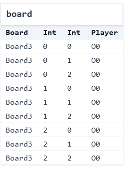
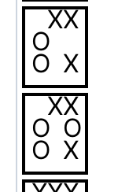

# Intro to Modeling Systems (Part 1: Tic-Tac-Toe)

## What's a Model? 

A **model** is a _representation_ of a system that faithfully includes some but not all of the system's complexity. There are many different ways to model a system, all of which have different advantages and disadvantages. Think about what a car company does before it produces a new car design. Among other things, it creates multiple models. E.g.,
* it models the car in some computer-aided design tool; and then
* creates a physical model of the car, perhaps with clay, for testing in wind tunnels etc.

There may be many different models of a system, all of them focused on something different. As the statisticians say, "all models are wrong, but some models are useful". Learning how to model a system is a key skill for engineers, not just within "formal methods". Abstraction is one of the key tools in Computer Science, and modeling lies at the heart of abstraction.

In this course, **the models we build aren't inert**; we have tools that we can use the explore and analyze them!

### Don't Be Afraid of Imperfect Representations

_We don't need to fully model a system to be able to make useful inferences_. We can simplify, omit, and abstract concepts/attributes to make models that approximate the system while preserving the fundamentals that we're interested in. 

**Exercise:** If you've studied physics, there's a great example of this in statics and dynamics. Suppose I drop a coin from the top of the science library, and ask you what its velocity will be when it hits the ground. Using the methods you learn in beginning physics, what's something you usefully _disregard_?

<details>
<summary>Think, then click!</summary>

Air resistance! Friction! We can still get a reasonable approximation for many problems without needing to include that. (And advanced physics adds even more factors that aren't worth considering at this scale.) The model without friction is often enough.

</details>

## What is a "System"? (Models vs. Implementations)

When we say "systems" in this book, we mean the term broadly. A distributed system (like [replication in MongoDB](https://github.com/visualzhou/mongo-repl-tla)) is a system, but so are user interfaces and hardware devices like CPUs and insulin pumps. Git is a system for version control. The web stack, cryptographic protocols, chemical reactions, the rules of sports and games&mdash;these are all systems too!

To help build intuition, let's work with a simple system: the game of [tic-tac-toe](https://en.wikipedia.org/wiki/Tic-tac-toe) (also called noughts and crosses). There are _many_ implementations of this game, including [this one](https://csci1710.github.io/2023/examples/ttt.py) that I wrote in Python. And, of course, these implementations often have corresponding test suites, like [this (incomplete) example](https://csci1710.github.io/2023/examples/test_ttt.py).

**Exercise**: Play a quick game of tic-tac-toe by hand. If you can, find a partner, but if not, then play by yourself.

Notice what just happened. You played the game. In doing so, you ran your own mental implementation of the rules. The result you got was one of many possible games, each with its own specific sequence of legal moves, leading to a particular ending state. Maybe someone won, or maybe the game was a tie. Either way, many different games could have ended with that same board. 

Modeling is different from programming. When you're programming traditionally, you give the computer a set of instructions and it follows them. This is true whether you're programming functionally or imperatively, with or without objects, etc. Declarative modeling languages like Forge work differently. The goal of a model isn't to _run instructions_, but rather to _describe the rules_ that govern systems. 

Here's a useful comparison to help reinforce the difference (with thanks to Daniel Jackson):
- An empty program **does nothing**.
- An empty model **allows every behavior**.

## Modeling Tic-Tac-Toe Boards

What are the essential concepts in a game of tic-tac-toe?

~~~admonish tip title="Modeling Methodology"
When we're first writing a model, we'll start with **5 steps**. For each step, I'll give examples from tic-tac-toe and also for binary search trees (which we'll start modeling soon) for contrast.

- What are the **datatypes** involved, and their **fields**? 
  - For tic-tac-toe: they might be the 3-by-3 board and the `X` and `O` marks that go in board locations. 
  - For a binary search tree: they might be the tree nodes and their left and right children. 
- What makes an instance of these datatypes **well formed**? That is, what conditions are needed for them to not be garbage? 
  - For tic-tac-toe, we might require that the indexes used are between `0` and `2`, since the board is 3-by-3. (We could just as easily use `1`, `2`, and `3`. I picked `0` as the starting point out of habit, because list indexes start from `0` in the programming languages I tend to use.)
  - For a binary search tree, we might require that every node has at most one left child, at most one right child, a unique parent, and so on.
- What's a small **example** of how these datatypes can be instantiated?
  - For tic-tac-toe, the empty board would be an example. So would the board where `X` moves first into the middle square.
  - For a binary search tree, this might be a tree with only one node, or a 3-node tree where the root's left and right children are leaves. 
- What does the model look like when **run**?
  - For tic-tac-toe, we should see a board with some number of `X` and `O` marks.
  - For a binary search tree, we should see some set of nodes that forms a single tree via left- and right-children.
- What **domain predicates** are there? Well-formedness defines conditions that are needed for an instantiation to not be "garbage". But whatever we're modeling surely has domain-specific concepts of its own, which may or may not hold. 
  - For tic-tac-toe, we care a great deal if the board is a winning board or not. Similarly, we might care if it looks like someone has cheated.
  - For a binary search tree, we care if the tree is balanced, or if it satisfies the BST invariant. 
~~~

~~~admonish warning title="Well-formedness vs. domain predicates"
Why make this distinction between well-formedness and domain predicates? Because one should always hold in any instance Forge considers, but the other may or may not hold. In fact, we might want to use Forge to _verify_ that a domain predicate always holds! And if we've told Forge that any instance that doesn't satisfy it is garbage, Forge won't find us such an instance.
~~~

### Datatypes

We might list:
- the players `X` and `O`;
- the 3-by-3 game board, where players can put their marks;
- the idea of whose turn it is at any given time; and
- the idea of who has won the game at any given time.    

Now let's add those ideas to a model in Forge! 

```forge,editable
#lang forge/froglet
```

The first line of any Forge model will be a `#lang` line, which says which Forge language the file uses. We'll start with the Froglet language for now. Everything you learn in this language will apply in other Forge languages, so I'll use "Forge" interchangeably.

Now we need a way to talk about the noughts and crosses themselves. So let's add a `sig` that represents them:


```forge,editable
#lang forge/froglet
abstract sig Player {}
one sig X, O extends Player {}
```

You can think of `sig` in Forge as declaring a kind of object. A `sig` can extend another, in which case we say that it is a _child_ of its parent, and child `sig`s cannot overlap. When a sig is `abstract`, any member must also be a member of one of that `sig`'s children; in this case, any `Player` must either be `X` or `O`. Finally, a `one` sig has exactly one member&mdash;there's only a single `X` and `O` in our model.

We also need a way to represent the game board. We have a few options here: we could create an `Index` sig, and encode an ordering on those (something like "column A, then column B, then column C"). Another is to use Forge's integer support. Both solutions have their pros and cons. Let's use integers, in part to get some practice with them.

<!-- this shows the play button if we say it is Rust. We have control over what to *do* 
with the highlighting and play button via theme/book.js, so mislead mdbook a bit...
-->
<!-- ```rust,editable -->
```forge,editable
#lang forge/froglet
abstract sig Player {}
one sig X, O extends Player {}

sig Board {
  board: pfunc Int -> Int -> Player
}
```

Every `Board` object contains a `board` field describing the moves made so far. This field is a _partial function_, or dictionary, for every `Board` that maps each (`Int`, `Int`) pair to at most one `Player`. 

<!--
a table of (`Int`, `Int`, `Player`) tuples for each `Board`. We'll see how to work with this field shortly.
-->

### Well-formedness

These definitions sketch the overall shape of a board: players, marks on the board, and so on. But not all boards that fit the definition will be valid. For example:
* Forge integers aren't true mathematical integers, but are bounded by a bitwidth we give whenever we run the tool. So we need to be careful here. We want a classical 3-by-3 board with indexes of (say) `0`, `1`, and `2`, not a board where (e.g.) row `-5`, column `-1` is a valid location. 

We'll call these _well-formedness_ constraints. They aren't innately enforced by our `sig` declarations, but we'll almost always want Forge to enforce them, so that it doesn't find "garbage instances". Let's write a _wellformedness predicate_:

```forge,editable
-- a Board is well-formed if and only if:
pred wellformed[b: Board] {
  -- row and column numbers used are between 0 and 2, inclusive  
  all row, col: Int | {
    (row < 0 or row > 2 or col < 0 or col > 2) 
      implies no b.board[row][col]      
  }
}
```

~~~admonish tip title="Comments in Forge"
Forge treats either `--` or `//` as beginning a line-level comment, and `/* ... */` as denoting a block comment. This is different from the Python code we saw in the last section! In Forge, `#` has a different meaning.
~~~

This predicate is true of any `Board` if and only if the above 2 constraints are satisfied. Let's break down the syntax: 
* Constraints can quantify over a domain. E.g.,`all row, col: Int | ...` says that for any pair of integers (up to the given bitwidth), the following condition (`...`) must hold. Forge also supports, e.g., existential quantification (`some`), but we don't need that yet. We also have access to standard boolean operators like `or`, `implies`, etc. 
* _Formulas_ in Forge always evaluate to a boolean; _expressions_ evaluate to sets. For example,
    * the _expression_ `b.board[row][col]` evaluates to the `Player` (if any) with a mark at location (`row`, `col`) in board `b`; but
    * the _formula_ `no b.board[row][col]` is true if and only if there is no such `Player``.
* A `pred` (predicate) in Forge is a helper function that evaluates to a boolean. Thus, its body should always be a formula. 

~~~admonish tip title="Predicates are declarative"
Notice that, rather than describing a process that produces a well-formed board, or even instructions to check well-formedness, we've just given a declarative description of what's necessary and sufficient for a board to be well-formed. If we'd left the predicate body empty, _any_ board would be considered well-formed&mdash;there'd be no formulas to enforce!
~~~

### A Few Examples

Since a predicate is just a function that returns true or false, depending on its arguments and whichever instance Forge is looking at, we can write tests for it the same way we would for any other boolean-valued function. But even if we're not testing, it can be useful to write a small number of examples, so we can build intuition for what the predicate means.

In Forge, `example`s are automatically run whenever your model executes. They describe basic intent about a given predicate; in this case, let's write two examples in Forge:
* A board where `X` has moved 3 times in valid locations, and so ought to be considered well formed. 
* A board where a player has moved in an invalid location, and shouldn't be considered well formed. 

Notice that we're not making judgements about the rules being obeyed yet&mdash;just about whether our `wellformed` predicate is behaving the way we expect. And the `wellformed` predicate isn't aware of things like "taking turns" or "stop after someone has won", etc. It just knows about the valid indexes being `0`, `1`, and `2`.

We'll write those two examples in Forge:

```forge,editable
-- Helper to make these examples easier to write
pred all_wellformed { all b: Board | wellformed[b]}

-- all_wellformed should be _true_ for the following instance
example firstRowX_wellformed is {all_wellformed} for {
  Board = `Board0                 -- backquote labels specific atoms
  X = `X      O = `O              -- examples must define all sigs
  Player = X + O                  -- only two kinds of player
  `Board0.board = (0, 0) -> `X +  -- the partial function for the board's
                  (0, 1) -> `X +  -- contents (unmentioned squares must 
                  (0, 2) -> `X    -- remain empty, because we used "=" to say
                                  -- "here's the function for `board0")
}

-- all_wellformed should be _false_ for the following instance
example off_board_not_wellformed is {not all_wellformed} for {
  Board = `Board0 
  X = `X      O = `O 
  Player = X + O
  `Board0.board = (-1, 0) -> `X +
                  (0, 1) -> `X + 
                  (0, 2) -> `X 
}
```

~~~admonish warning title="Test in both directions"
Notice that we've got a test thats a _positive_ example and another test that's a _negative_ example. We want to make sure to exercise both cases, or else "always true" or "always" false could pass our suite. 
~~~

### Running Forge

The `run` command tells Forge to search for an _instance_ satisfying the given constraints:

```forge,editable
run { some b: Board | wellformed[b]} 
```

(If you're curious about _how_ Forge finds solutions, you can find a brief sketch in [the Q&A for this chapter](../qna/static.md).)

When we click the play button in the VSCode extension, the engine solves the constraints and produces a satisfying instance,  (Because of differences across solver versions, hardware, etc., it's possible you'll see a different instance than the one shown here.) A browser window should pop up with a visualization. You can also run `racket <filename.frg>` in the terminal, although we recommend the VSCode extension. 


<!-- Alloy -->
<!--  -->

<!-- 

 -->

~~~admonish warning title="Running Forge on Windows"
If you're running on Windows, the Windows-native `cmd` and PowerShell terminals will not properly load Forge's visualizer. Instead, we suggest using one of many other options on Windows that we've tested and know to work: the VSCode extension (available on the VSCode Marketplace), DrRacket, Git for Windows (e.g., `git bash`), Windows Subsystem for Linux, or Cygwin.
~~~

---

There are many options for visualization. The default which loads initially is a directed-graph based one:

<center></center>

**(TODO: make this clickable to show it bigger? Want to see the whole window, but then the graph is small.)**

This isn't very useful; it looks nothing like a tic-tac-toe board! We can make more progress by using the "Table" visualization&mdash;which isn't ideal either:

<center></center>


Forge also allows users to make _custom_ visualizations via short JavaScript programs; [here's](./ttt.js) an example basic visualizer for this specific tic-tac-toe model that produces images like this one:

<center></center>

We'll talk more about visualization scripts later. For now, let's proceed. **TODO: replace img with one matching the table view**
**TODO: add side-by-side CSS**

---

This instance contains a single board, and it has 9 entries. Player `O` has moved in all of them (the `0` suffix of `O0` in the display is an artifact of how Forge's engine works; ignore it for now). It's worth noticing two things:
* This board doesn't look quite right: player `O` occupies all the squares. We might ask: has player `O` been cheating? But the fact is that this board _satisfies the constraints we have written so far_. Forge produces it simply because our model isn't yet restrictive enough, and for no other reason. "Cheating" doesn't exist yet. 
* We didn't say _how_ to find that instance. We just said what we wanted, and the tool performed some kind of search to find it. So far the objects are simple, and the constraints basic, but hopefully the power of the idea is coming into focus. 

~~~admonish note title="Why `Board3` when there's only one board?" 
Here, we see `Board3` because the solver had a few options to pick from: we never said there should only ever be one `Board`, after all. So, under the hood, it was considering the potential existence of multiple boards. And then it happened to pick this one to exist in this instance.
~~~

### Reflection: Implementation vs. Model

So far we've just modeled boards, not full games. But we can still contrast our work here against the Python _implementation_ of tic-tac-toe shared above. 

**Exercise:** How do the data-structure choices, and type declarations, in the implementation compare with the essence of the game as reflected in the model? What is shared, and what is different? 

Spend a minute identifying at least one commonality and at least one difference, then move on.

## Domain Predicates

Now let's write predicates that describe important ideas in the domain. What's important in the game of tic-tac-toe? Here are a few things.

### Starting Boards

What would it mean to be a _starting state_ in a game? The board is empty:

```forge,editable
pred starting[s: Board] {
  all row, col: Int | 
    no s.board[row][col]
}
```

### Turns

How do we tell when it's a given player's turn? It's `X`'s turn when there are the same number of each mark on the board:

```forge,editable
pred XTurn[s: Board] {
  #{row, col: Int | s.board[row][col] = X} =
  #{row, col: Int | s.board[row][col] = O}
}
```

Here, we're measuring the size of 2 sets. The `{row, col: Int | ...}` syntax is called a _set comprehension_. A set comprehension defines a set. We're defining the set of row-column pairs where the board contains one of the player marks. The `#` operator gives the size of these sets, which we then compare.

**Exercise:** Is it enough to say that `OTurn` is the negation of `XTurn`? That is, we could write: `pred OTurn[s: Board] { not XTurn[s: Board]}`. This seems reasonable enough; why might we _not_ want to write this?

<details>
<summary>Think, then click!</summary>

Because we defined X's turn to be when the number of X's and O's on the board are in balance. So any _other_ board would be O's turn, including ones that ought to be illegal, once we start defining moves of the game. Instead, let's say something like this:

```forge,editable
pred OTurn[s: Board] {
  -- It's O's turn if X has moved once more often than O has
  #{row, col: Int | s.board[row][col] = X} =
  add[#{row, col: Int | s.board[row][col] = O}, 1]
}
```

</details>

---

~~~admonish note title="Integer addition"

Forge supports arithmetic operations on integers like `add`. Forge integers are signed (i.e., can be positive or negative) and are bounded by a _bit width_, which defaults to `4` bits. The number of available integers is always $2^k$, where $k$ is the bit width.

Forge follows the [2's complement arithmetic](https://en.wikipedia.org/wiki/Two%27s_complement) convention, which means that the available integers are split evenly between positive and negative numbers, but counting `0` as "positive". So with 4 bits, we can represent numbers between `-8` and `7` (inclusive).

This means that (while it doesn't matter for this model yet), arithmetic operations can overflow&mdash;just like primitive integers in languages like Java! For example, if we're working with 4-bit integers, then `add[7,1]` will be `-8`. You can experiment with this in the visualizer's _evaluator_, which we'll be using a lot after the initial modeling tour is done.

~~~

~~~admonish warning title="Use `add` for addition, not `+`"
Don't try to use `+` for addition in any Forge language. Use `add` instead; this is because `+` is reserved for something else (which we'll explain later). 
~~~

### Winning the Game

What does it mean to _win_? A player has won on a given board if:
* they have placed their mark in all 3 columns of a row; 
* they have placed their mark in all 3 rows of a column; or
* they have placed their mark in all 3 squares of a diagonal.

We'll express this in a `winner` predicate that takes the current board and a player name. Let's also define a couple helper predicates along the way:

```forge,editable
pred winRow[s: Board, p: Player] {
  -- note we cannot use `all` here because there are more Ints  
  some row: Int | {
    s.board[row][0] = p
    s.board[row][1] = p
    s.board[row][2] = p
  }
}

pred winCol[s: Board, p: Player] {
  some column: Int | {
    s.board[0][column] = p
    s.board[1][column] = p
    s.board[2][column] = p
  }      
}

pred winner[s: Board, p: Player] {
  winRow[s, p]
  or
  winCol[s, p]
  or 
  {
    s.board[0][0] = p
    s.board[1][1] = p
    s.board[2][2] = p
  } or {
    s.board[0][2] = p
    s.board[1][1] = p
    s.board[2][0] = p
  }  
}
```

After writing these domain predicates, we're reaching a fairly complete model for a single tic-tac-toe board. Let's decide how to fix the issue we saw above (the reason why `OTurn` couldn't be the negation of `XTurn`): perhaps a player has moved too often.

Should we add something like `OTurn[s] or XTurn[s]` to our wellformedness predicate? **No!** If we then later enforced wellformedness for all boards, that would exclude "cheating" instances where a player has more moves on the board than are allowed. But this has some risk, depending on how we intend to use the `wellformed` predicate:
* If we were only ever generating _valid boards_, a cheating state might well be spurious, or at least undesirable. In that case, we might prevent such states in `wellformed` and rule it out. 
* If we were generating arbitrary (not necessarily valid) boards, being able to see a cheating state might be useful. In that case, we'd leave it out of `wellformed`.
* If we're interested in _verification_, e.g., we are asking whether the game of Tic-Tac-Toe enables ever reaching a cheating board, we shouldn't add `not cheating` to `wellformed`; because `wellformed` also excludes garbage boards, we'd probably use it in our verification&mdash;in which case, Forge will never find us a counterexample! 

~~~admonish tip title="Modeling vs. PBT" 
Notice the similarity between this issue and what we do in property-based testing. Here, we're forced to distinguish between what a reasonable _board_ is (analogous to the generator's output in PBT) and what a reasonable _behavior_ is (analogous to the validity predicate in PBT). One narrows the scope of possible worlds to avoid true "garbage"; the other checks whether the system behaves as expected in one of those worlds.
~~~

We'll come back to this later, when we've had a bit more modeling experience. For now, let's separate our goal into a new predicate called `balanced`, and add it to our `run` command above so that Forge will find us an instance where some board is both `balanced` and `wellformed`:

```forge,editable
pred balanced[s: Board] {
  XTurn[s] or OTurn[s]
}
run { some b: Board | wellformed[b] and balanced[b]} 
```

If we click the "Next" button a few times, we see that not all is well: we're getting boards where `wellformed` is violated (e.g., entries at negative rows, or multiple moves in one square). Why is this happening?

We're getting this because of how the `run` was phrased. We said to find an instance where _some board_ was well-formed and valid, not one where _all boards_ were. Our `run` is satisfied by any instance where _at least one_ `Board` is `wellformed`; the others won't affect the truth of the constraint. By default, Forge will find instances with up to 4 `Boards`. So we can fix the problem either by telling Forge to find instances with only 1 Board:

```forge,editable
run { some b: Board | wellformed[b] and balanced[b]} 
for exactly 1 Board
```

or by saying that all boards must be well-formed and balanced:

```forge,editable
run { all b: Board | wellformed[b] and balanced[b]} 
```

## Practice with `run`

The `run` command can be used to give Forge more detailed instructions for its search. 

### No Boards

**Exercise:** Is it possible for an instance with _no_ boards to still satisfy constraints like these?

```alloy
run {    
     all b: Board | {
         -- X has won, and the board looks OK
         wellformed[b]
         winner[b, X]
         balanced[b]    
     }
 }
```

<details>
<summary>Think, then click!</summary>

Yes! There aren't any boards, so there's no obligation for anything to satisfy the constraints inside the quantifier. You can think of the `all` as something like a `for` loop in Java or the `all()` function in Python: it checks every `Board` in the instance. If there aren't any, there's nothing to check&mdash;return true.

</details>

### Adding More

This addition also requires that `X` moved in the middle of the board:

```alloy
run {    
     all b: Board | {
         -- X has won, and the board looks OK
         wellformed[b]
         winner[b, X]
         balanced[b]
         -- X started in the middle
         b.board[1][1] = X
     }
 } for exactly 2 Board
```

Notice that, because we said `exactly 2 Board` here, Forge _must_ find instances containing 2 tic-tac-toe boards, and both of them must satisfy the constraints: wellformedness, `X` moving in the middle, etc. You could ask for a board where `X` _hasn't_ won by adding `not winner[b, X]`. 

<!-- You also have `implies` and `iff` (if and only if), although you can still do something like comparing two predicates without `iff` (try, e.g., asking for instances where `A and not B` holds).  -->

We'll come back to tic-tac-toe soon; for now, let's cover another static example.