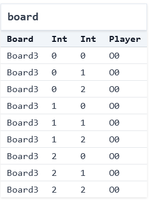

# Modeling Systems (Basics: TTT)

## What's a Model? 

A **model** is a _representation_ of a system that faithfully includes some but not all of the system's complexity. There are many different ways to model a system, all of which have different advantages and disadvantages. Think about what a car company does before it produces a new car design. Among other things, it creates multiple models. E.g.,
* it models the car in some computer-aided design tool; and then
* creates a physical model of the car, perhaps with clay, for testing in wind tunnels etc.

There may be many different models of a system, all of them focused on something different. As the statisticians say, "all models are wrong, but some models are useful". Learning how to model a system is a key skill for engineers, not just within "formal methods". Abstraction is one of the key tools in Computer Science, and modeling lies at the heart of abstraction.

In this course, **the models we build aren't inert**; we have tools that we can use the explore and analyze them!

### Don't Be Afraid of Imperfect Representations

_We don't need to fully model a system to be able to make useful inferences_. We can simplify, omit, and abstract concepts/attributes to make models that approximate the system while preserving the fundamentals that we're interested in. 

**EXERCISE:** If you've studied physics, there's a great example of this in statics and dynamics. Suppose I drop a coin from the top of the science library, and ask you what its velocity will be when it hits the ground. Using the methods you learn in beginning physics, what's something you usefully _disregard_?

<details>
<summary>Think, then click!</summary>

Air resistance! Friction! We can still get a reasonable approximation for many problems without needing to include that. (And advanced physics adds even more factors that aren't worth considering at this scale.) The model without friction is often enough.

</details>

## Systems vs. Models (and Implementations)

When we say "systems" in this module, we mean the term broadly. A distributed system (like [replication in MongoDB](https://github.com/visualzhou/mongo-repl-tla)) is a system, but so are user interfaces and hardware devices like CPUs and insulin pumps. Git is a system for version control. The web stack, cryptographic protocols, chemical reactions, the rules of sports and games---these are all systems too!

To help build intuition, let's work with a simple system: the game of [tic-tac-toe](https://en.wikipedia.org/wiki/Tic-tac-toe) (also called noughts and crosses). There are _many_ implementations of this game, including [this one](https://csci1710.github.io/2023/examples/ttt.py) that Tim wrote for these notes in Python. And, of course, these implementations often have corresponding test suites, like [this (incomplete) example](https://csci1710.github.io/2023/examples/test_ttt.py).

**Exercise**: Play a quick game of tic-tac-toe by hand. If you can, find a partner, but if not, then play by yourself.

Notice what just happened. You played the game. In doing so, you ran your own mental implementation of the rules. The result you got was one of many possible games, each with its own specific sequence of legal moves, leading to a particular ending state. Maybe someone won, or maybe the game was a tie. Either way, many different games could have ended with that same board. 

Modeling is different from programming. When you're programming traditionally, you give the computer a set of instructions and it follows them. This is true whether you're programming functionally or imperatively, with or without objects, etc. Declarative modeling languages like Forge work differently. The goal of a model isn't to _run instructions_, but rather to _describe the rules_ that govern systems. 

Here's a useful comparison to help reinforce the difference (with thanks to Daniel Jackson):
- An empty program **does nothing**.
- An empty model **allows every behavior**.

## Modeling Tic-Tac-Toe Boards

What are the essential concepts in a game of tic-tac-toe?

<details>
<summary>Think, then click!</summary>

We might list:
- the players `X` and `O`;
- the 3-by-3 game board, where players can put their marks;
- the idea of whose turn it is at any given time; and
- the idea of who has won the game at any given time.    

</details>

Let's start writing our model in Forge! We certainly need a way to talk about the noughts and crosses themselves:

**TODO: switch to `forge/froglet` for consistency in the tool itself.**

```forge,editable
#lang forge/froglet
abstract sig Player {}
one sig X, O extends Player {}
```

The first line of any Forge model will be a `#lang` line, which says which sub-language the file is. We'll start with the Froglet language for now. Everything you learn in this language will apply in other Forge languages, so I'll use "Forge" interchangeably.

You can think of `sig` in Forge as declaring a kind of object. A `sig` can extend another, in which case we say that it is a _child_ of its parent, and child `sig`s cannot overlap. When a sig is `abstract`, any member must also be a member of one of that `sig`'s children; in this case, any `Player` must either be `X` or `O`. Finally, a `one` sig has exactly one member---there's only a single `X` and `O` in our model.

We also need a way to represent the game board. We have a few options here: we could create an `Index` sig, and encode an ordering on those (something like "column A, then column B, then column C"). Another is to use Forge's integer support. Both solutions have their pros and cons. Let's use integers, in part to get some practice with them.

<!-- this shows the play button if we say it is Rust. We have control over what to *do* 
with the highlighting and play button via theme/book.js, so mislead mdbook a bit...
-->
<!-- ```rust,editable -->
```forge,editable
abstract sig Player {}
one sig X, O extends Player {}

sig Board {
  board: pfunc Int -> Int -> Player
}
```

Every `Board` object contains a `board` field describing the moves made so far. This field is a _partial function_, or dictionary, for every `Board` that maps each (`Int`, `Int`) pair to at most one `Player`. 

<!--
a table of (`Int`, `Int`, `Player`) tuples for each `Board`. We'll see how to work with this field shortly.
-->

### What Is A Well-Formed Board?

These definitions sketch the overall shape of a board: players, marks on the board, and so on. But not all boards that fit this definition will be valid. For example:
* Forge integers aren't true mathematical integers, but are bounded by a bitwidth we give whenever we run the tool. So we need to be careful here. We want a classical 3-by-3 board with indexes of `0`, `1`, and `2`, not a board where (e.g.) row `-5`, column `-1` is a valid location. 

We'll call these _well-formedness_ constraints. They aren't innately enforced by our `sig` declarations, but often we'll want to assume they hold (or at least check that they do). Let's encode these in a _wellformedness predicate_:

```forge,editable
-- a Board is well-formed if and only if:
pred wellformed[b: Board] {
  -- row and column numbers used are between 0 and 2, inclusive  
  all row, col: Int | {
    (row < 0 or row > 2 or col < 0 or col > 2) 
      implies no b.board[row][col]      
  }
}
```

This predicate is true of any `Board` if and only if the above 2 constraints are satisfied. Let's break down the syntax: 
* Constraints can quantify over a domain. E.g.,`all row, col: Int | ...` says that for any pair of integers (up to the given bidwidth), the following condition (`...`) must hold. Forge also supports, e.g., existential quantification (`some`), but we don't need that here. We also have access to standard boolean operators like `or`, `implies`, etc. 
* _Formulas_ in Forge always evaluate to a boolean; _expressions_ evaluate to sets. For example,
    * the _expression_ `b.board[row][col]` evaluates to the `Player` (if any) with a mark at location (`row`, `col`) in board `b`; but
    * the _formula_ `no b.board[row][col]` is true if and only if there is no such `Player``.

Well talk more about all of this over the next couple of weeks. For now, just keep the formula vs. expression distinction in mind when working with Forge.

Notice that, rather than describing a process that produces a well-formed board, or even instructions to check well-formedness, we've just given a declarative description of what's necessary and sufficient for a board to be well-formed. If we'd left the predicate body empty, _any_ board would be considered well-formed---there'd be no formulas to enforce!

### Running Forge

The `run` command tells Forge to search for an _instance_ satisfying the given constraints:

```forge,editable
run { some b: Board | wellformed[b]} 
```

When we click the play button (or type `racket <filename>` in the terminal), the engine solves the constraints and produces a satisfying instance,  (Because of differences across solver versions, hardware, etc., it's possible you'll see a different instance than the one shown here.) A browser window should pop up with a visualization.

<!-- Alloy -->
<!--  -->

<!-- 

 -->

~~~admonish warning title="Running Forge on Windows"
If you're running on Windows, the Windows-native `cmd` and PowerShell will not properly run Forge. Instead, we suggest using one of many other options: the VSCode extension (available on the VSCode Marketplace), DrRacket, Git `bash`, Windows Subsystem for Linux, or Cygwin.
~~~

---

There are many options for visualization. The default which loads initially is a directed-graph based one:

<center></center>

For now, we'll use the "Table" visualization---which isn't ideal either, but we'll improve on it next time. 

<center></center>

---


This instance contains a single board, and it has 9 entries. Player `O` has moved in all of them (the `0` suffix of `O0` in the display is an artifact of how Forge's engine works; ignore it for now). It's worth noticing two things:
* This board doesn't look quite right: player `O` occupies all the squares. We might ask: has player `O` been cheating? But the fact is that this board _satisfies the constraints we have written so far_. Forge produces it simply because our model isn't yet restrictive enough, and for no other reason. "Cheating" doesn't exist yet. 
* We didn't say _how_ to find that instance. We just said what we wanted, and the tool performed some kind of search to find it. So far the objects are simple, and the constraints basic, but hopefully the power of the idea is coming into focus. 

### Testing Our Predicate

The predicate we just wrote is basically a function that returns true or false for whichever instance we're in. Thus, we can write tests for it the same way we would for any other boolean-valued function, by writing _examples_:

```forge,editable
-- Helper to make examples about a single predicate
pred all_wellformed { all b: Board | wellformed[b]}

-- all_wellformed should be _true_ for the following instance
example firstRowX_wellformed is {all_wellformed} for {
Board = `Board0 
X = `X      O = `O 
Player = X + O
`Board0.board = (0, 0) -> `X +
                (0, 1) -> `X + 
                (0, 2) -> `X 
}

-- all_wellformed should be _false_ for the following instance
example off_board_not_wellformed is {not all_wellformed} for {
Board = `Board0 
X = `X      O = `O 
Player = X + O
`Board0.board = (-1, 0) -> `X +
                (0, 1) -> `X + 
                (0, 2) -> `X 
}
```

~~~admonish warning title="Test in both directions"
Notice that we've got a test thats a _positive_ example and another test that's a _negative_ example. We want to make sure to exercise both cases, or else "always true" or "always" false could pass our suite. 
~~~

We'll talk more about testing soon, but for now be aware that writing some examples for your predicates can help you avoid bugs later on. 

## Reflection: Implementation vs. Model

So far we've just modeled boards, not full games. But we can still contrast our work here against the implementation of tic-tac-toe shared above. We might ask:
* How do the data-structure choices, and type declarations, in the implementation compare with the model?
* Is there an implementation that matches what we just did? (The program's purpose isn't to generate boards, but to play games.)


## Modeling More Concepts: Starting Boards, Turns, and Winning

#### Starting Boards
What would it mean to be a _starting state_ in a game? The board is empty:

```forge,editable
pred starting[s: Board] {
  all row, col: Int | 
    no s.board[row][col]
}
```

#### Turns

How do we tell when it's a given player's turn? It's `X`'s turn when there are the same number of each mark on the board:

```forge,editable
pred XTurn[s: Board] {
  #{row, col: Int | s.board[row][col] = X} =
  #{row, col: Int | s.board[row][col] = O}
}
```

The `{row, col: Int | ...}` syntax means a set comprehension, and describes the set of row-column pairs where the board contains `X` (or `O`). The `#` operator gives the size of these sets, which we then compare.

**Question**: Is it enough to say that `OTurn` is the negation of `XTurn`? 

<details>
<summary>Think, then click!</summary>

No! At least not in the model as currently written. If you're curious to see why, run the model and look at the instances produced. Instead, we need to say something like this:

```forge,editable
pred OTurn[s: Board] {
  #{row, col: Int | s.board[row][col] = X} =
  add[#{row, col: Int | s.board[row][col] = O}, 1]
}
```

</details>


Forge supports arithmetic operations on integers like `add`. While it doesn't matter for this model yet, addition (and other operations) can overflow according to 2's complement arithmetic. For example, if we're working with 4-bit integers, then `add[7,1]` will be `-8`. You can experiment with this in the visualizer's _evaluator_, which we'll be using a lot after the initial modeling tour is done.

~~~admonish warning title="Use `add` for addition, not `+`"
Don't try to use `+` for addition in any Forge language. Use `add` instead; this is because `+` is reserved for something else (which we'll explain later). 
~~~

#### Winning the Game

What does it mean to _win_? A player has won on a given board if:
* they have placed their mark in all 3 columns of a row; 
* they have placed their mark in all 3 rows of a column; or
* they have placed their mark in all 3 squares of a diagonal.

We'll express this in a `winner` predicate that takes the current board and a player name. Let's also define a couple helper predicates along the way:

```forge,editable
pred winRow[s: Board, p: Player] {
  -- note we cannot use `all` here because there are more Ints  
  some row: Int | {
    s.board[row][0] = p
    s.board[row][1] = p
    s.board[row][2] = p
  }
}

pred winCol[s: Board, p: Player] {
  some column: Int | {
    s.board[0][column] = p
    s.board[1][column] = p
    s.board[2][column] = p
  }      
}

pred winner[s: Board, p: Player] {
  winRow[s, p]
  or
  winCol[s, p]
  or 
  {
    s.board[0][0] = p
    s.board[1][1] = p
    s.board[2][2] = p
  }
  or
  {
    s.board[0][2] = p
    s.board[1][1] = p
    s.board[2][0] = p
  }  
}
```

We now have a fairly complete model for a single tic-tac-toe board. Before we progress to games, let's decide how to fix the issue we saw above (the reason why `OTurn` couldn't be the negation of `XTurn`): perhaps a player has moved too often.

Should we add something like `OTurn[s] or XTurn[s]` to our wellformedness predicate? If we then later enforced wellformedness for all boards, that would exclude "cheating" instances where a player has more moves on the board than are allowed. But this has some risk, depending on how we intend to use the `wellformed` predicate:
* If we were only ever generating _valid boards_, a cheating state might well be spurious, or at least undesirable. In that case, we might prevent such states in `wellformed` and rule it out. 
* If we were generating arbitrary (not necessarily valid) boards, being able to see a cheating state might be useful. In that case, we'd leave it out of `wellformed`.
* If we're interested in _verification_, e.g., we are asking whether the game of Tic-Tac-Toe enables ever reaching a cheating board, we shouldn't add `not cheating` to `wellformed`; because `wellformed` also excludes garbage boards, we'd probably use it in our verification&mdash;in which case, Forge will never find us a counterexample! 

**TODO: positioning this point, if PBT is coming after this.**
~~~admonish tip title="Modeling vs. PBT" 
Notice the similarity between this issue and what we do in property-based testing. Here, we're forced to distinguish between what a reasonable _board_ is (analogous to the generator's output in PBT) and what a reasonable _behavior_ is (analogous to the validity predicate in PBT). One narrows the scope of possible worlds to avoid true "garbage"; the other checks whether the system behaves as expected in one of those worlds.
~~~

We'll come back to this later, when we've modeled full games. For now, let's separate our goal into a new predicate called `balanced`, and add it to our `run` command above:

```forge,editable
pred balanced[s: Board] {
  XTurn[s] or OTurn[s]
}
run { some b: Board | wellformed[b] and balanced[b]} 
```

To view instances for this new `run` command, select the Execute menu and then `Run run$2`.

If we click the "Next" button a few times, we see that not all is well: we're getting boards where `wellformed` is violated (e.g., entries at negative rows, or multiple moves in one square). 

We're getting this because of how the `run` was phrased. We said to find an instance where _some board_ was well-formed and valid, not one where _all boards_ were. By default, Forge will find instances with up to 4 `Boards`. So we can fix the problem either by telling Forge to find instances with only 1 Board:

```forge,editable
run { some b: Board | wellformed[b] and balanced[b]} 
for exactly 1 Board
```

or by saying that all boards must be well-formed and balanced:

```forge,editable
run { all b: Board | wellformed[b] and balanced[b]} 
```

## Practice with `run`

Let's try some variant `run` commands.

### No Boards

Is it possible for an instance with _no_ boards to still satisfy constraints like these?

```alloy
run {    
     all b: Board | {
         -- X has won, and the board looks OK
         wellformed[b]
         winner[b, X]
         balanced[b]    
     }
 }
```

<details>
<summary>Think, then click!</summary>

Yes! There aren't any boards, so there's no obligation for anything to satisfy the constraints inside the quantifier. You can think of the `all` as something like a `for` loop in Java or the `all()` function in Python: it checks every `Board` in the instance. If there aren't any, there's nothing to check&mdash;return true.

</details>

### Adding More

We can add more constraints if we have a more focused idea of what we want Forge to find. For example, this addition also requires that `X` moved in the middle of the board:

```alloy
run {    
     all b: Board | {
         -- X has won, and the board looks OK
         wellformed[b]
         winner[b, X]
         balanced[b]
         -- X started in the middle
         b.board[1][1] = X
     }
 } for exactly 2 Board
```

Notice that, because we said `exactly 2 Board` here, Forge _must_ find instances containing 2 tic-tac-toe boards, and both of them must satisfy the constraints: wellformedness, `X` moving in the middle, etc.


By the way: `not` also works. So you could ask for a board where `X` _hasn't_ won by adding `not winner[b, X]`. 

You also have `implies` and `iff` (if and only if), although you can still do something like comparing two predicates without `iff` (try, e.g., asking for instances where `A and not B` holds). 

## From Boards to Games

What do you think a _game_ of tic-tac-toe looks like? How should we model the moves between board states?

<details>
<summary>Think, then click!</summary>

It's often convenient to think of the game as a big graph, where the nodes are the states (possible board configurations) and the edges are transitions (in this case, legal moves of the game). Here's a rough sketch:  
    

  
</details>
<br/>

A game of tic-tac-toe is a sequence of steps in this graph, starting from the empty board. Let's model it.

First, what does a move look like? A player puts their mark at a specific location. In Alloy, we'll represent this using a _transition predicate_: a predicate that says when it's legal for one state to evolve into another. We'll often call these the _pre-state_ and _post-state_ of the transition:

```alloy
pred move[pre: Board, row: Int, col: Int, p: Player, post: Board] {
  // ...
}
```

What constraints should we add? It's useful to divide the contents of such a predicate into:
* a _guard_, which allows the move only if the pre-state is suitable; and 
* an _action_, which defines what is in the post-state based on the pre-state and the move parameters.
 
For the guard, in order for the move to be valid, it must hold that in the pre-state:
* nobody has already moved at the target location; and
* it's the moving player's turn.

For the action:
* the new board is the same as the old, except for the addition of the player's mark at the target location.

Now we can fill in the predicate. Let's try something like this:

```alloy
pred move[pre: Board, row: Int, col: Int, p: Player, post: Board] {
  -- guard:
  no pre.board[row][col]   -- nobody's moved there yet
  p = X implies XTurn[pre] -- appropriate turn
  p = O implies OTurn[pre]  
  
  -- action:
  post.board[row][col] = p
  all row2: Int, col2: Int | (row!=row2 and col!=col2) implies {        
     post.board[row2][col2] = pre.board[row2][col2]     
  }  
}
```

There are many ways to write this predicate. However, we're going to stick with this form because it calls out an important point. Suppose we had only written `post.board[row][col] = p` for the action, without the `all` on the next following lines. Those added lines, which we'll call a _frame condition_, say that all other squares remain unchanged; without them, the contents of any other square might change in any way. Leaving them out would cause an _underconstraint_ bug: the predicate would be too weak to accurately describe moves in tic-tac-toe. 

**Exercise**: comment out the 3 frame-condition lines and run the model. Do you see moves where the other 8 squares change arbitrarily?

**Exercise**: could there be a bug in this predicate? (Run Forge and find out!)

<details>
<summary>Think, then click</summary>

The `all row2...` formula says that for any board location where _both the row and column differ_ from the move's, the board remains the same. But is that what we really wanted? Suppose `X` moves at location `1`, `1`. Then of the 9 locations, which is actually protected?

|Row|Column|Protected?|
|---|------|----------|
|  0|     0|yes       |
|  0|     1|no (column 1 = column 1)|
|  0|     2|yes       |
|  1|     0|no (row 1 = row 1)|
|  1|     1|no (as intended)|
|  1|     2|no (row 1 = row 1)|
|  2|     0|yes       |
|  2|     1|no (column 1 = column 1)|
|  2|     2|yes       |

Our frame condition was _too weak_! We need to have it take effect whenever _either_ the row or column is different. Something like this will work:

```alloy
  all row2: Int, col2: Int | 
    ((row2 != row) or (col2 != col)) implies {    
       post.board[row2][col2] = pre.board[row2][col2]     
  }  

``` 
</details>

### A Simple Property

Once someone wins a game, does their win still persist, even if more moves are made? I'd like to think so: moves never get undone, and in our model winning just means the existence of 3-in-a-row for some player. We probably even believe this property without checking it. However, it won't always be so straightforward to show that properties are preserved by the system. We'll check this one in Forge as an example of how you might prove something similar in a more complex system.

~~~admonish note title="Looking ahead"
This is our first step into the world of verification. Asking whether or not a program, algorithm, or other system always satisfies some assertion is a core problem in formal methods, and has a long and storied history. 
~~~

We'll tell Forge to find us pairs of states, connected by a move: the _pre-state_ before the move, and the _post-state_ after it. That's _any_ potential transition in tic-tac-toe. The trick is in adding two more constraints. We'll say that someone has won in the pre-state, but they _haven't won_ in the post-state.

```alloy
pred winningPreservedCounterexample {
  some pre, post: Board | {
    some row, col: Int, p: Player | 
      move[pre, post, row, col, p]
    winner[pre, X]
    not winner[post, X]
  }
}
run {
  all s: Board | wellformed[s]
  winningPreservedCounterexample
}
```

The check passes---Forge can't find any counterexamples. We'll see this reported as "UNSAT" in the visualizer. 

~~~admonish tip title="Next button" 
The visualizer also has a "Next" button. If you press it enough times, Forge runs out of solutions to show. 
~~~

## Generating Complete Games

Recall that our worldview for this model is that systems _transition_ between _states_, and thus we can think of a system as a directed graph. If the transitions have arguments, we'll sometimes label the edges of the graph with those arguments. This view is sometimes called a _discrete event_ model, because one event happens at a time. Here, the events are moves of the game. In a bigger model, there might be many different types of events.

**TODO: I think this goes later in the book, we don't want to start on finite traces yet.**

Today, we'll ask Forge to find us traces of the system, starting from an initial state. We'll also add a `Game` sig to incorporate some metadata.

```alloy
one sig Game {
  initialState: one Board,
  next: pfunc Board -> Board
}

pred traces {
    -- The trace starts with an initial state
    starting[Game.initialState]
    no sprev: Board | Game.next[sprev] = Game.initialState
    -- Every transition is a valid move
    all s: Board | some Game.next[s] implies {
      some row, col: Int, p: Player |
        move[s, row, col, p, Game.next[s]]
    }
}
```

By itself, this wouldn't be quite enough; we might see a bunch of disjoint traces. We could add more constraints manually, but there's a better option: tell Forge, at `run`time, that `next` represents a linear ordering on states.

```alloy
run {
  traces
} for {next is linear}
```

The key thing to notice here is that `next is linear` isn't a _constraint_; it's a separate annotation given to Forge alongside a `run` or a test. Never put such an annotation in a constraint block; Forge won't understand it. These annotations narrow Forge's _bounds_ (the space of possible worlds to check) which means they can often make problems more efficient for Forge to solve.

In general, Forge accepts such annotations _after_ numeric bounds. E.g., if we wanted to see full games, rather than unfinished game prefixes (the default bound on any sig, including `Board`, is up to 4) we could have asked:

```alloy
run {
  traces
} for exactly 10 Board for {next is linear}
```

You might notice that because of this, some traces are excluded. That's because `next is linear` forces exact bounds on `Board`. More on this next time.

<!-- ## Testing Models: Examples

Forge has a number of features that make it easier to _test_ your models. Here's one: `example`. We'll make a new file for our tests called `feb03_ttt.tests.frg` and open the model there. 

An _example_ in Forge is like a `run` except that it only opens the visualizer if the test fails. The example defines a full instance and then checks whether that instance satisfies a given predicate. So we'll make a new predicate that's "instance-wide", and checks wellformedness for all boards.

```alloy
#lang forge/bsl 
open "feb03_ttt.frg"

pred allWellformed {
    all b: Board | wellformed[b]
}
```

Then we'll fill in an example. These have a standard format, but the language of an example is a bit different: you're defining an _instance_, not a set of constraints.

```alloy
-- *TEST CASE* in Forge: this instance satisfies this predicate
example middleRowWellformed is {allWellformed} for {
    -- "for 3 Int" (prefer that outside examples)
    #Int = 3
    -- the backquote denotes an OBJECT by name
    -- use only these on the right-hand side of = here
    X = `X0
    O = `O0
    Player = `X0 + `O0
    Board = `Board0
    board = `Board0 -> (1 -> 0 -> `X0 + 
                        1 -> 1 -> `X0 +
                        1 -> 2 -> `X0)    
}
```

This is a bit verbose, but it completely defines an instance with 1 board and 3 moves placed. You can read the `board =` line as saying, for `Board0`, there's a dictionary with these 3 entries.

More on testing next time! -->

## Running And The Evaluator

Forge's default visualization for boards is difficult to use. Directed graphs are great for some applications, but not so good here. That's why we've been using the "table" visualization.
Our visualizer (called Sterling) allows you to write short JavaScript visualization scripts. The following script produces game visualizations with states like this:


We'll talk more about visualization scripts later. For now, [here's](./ttt.js) an example basic visualizer for this specific tic-tac-toe model. 


### The Evaluator

Moreover, since we're now viewing a single fixed instance, we can _evaluate_ Forge expressions in it. This is great for debugging, but also for just understanding Forge a little bit better. Open the evaluator here at the bottom of the right-side tray, under theming. Then enter an expression or constraint here:


Type in something like `some s: State | winner[s, X]`. Forge should give you either `#t` (for true) or `#f` (for false) depending on whether the game shows `X` winning the game.

### Optimizing

You might notice that this model takes a while to run, after we start reasoning about full games. Why might that be? Let's re-examine our bounds and see if there's anything we can adjust. In particular, here's what the evaluator says we've got for integers:


Wow---wait, do we really **need** to be able to count up to `7` for this model? Probably not. If we change our integer bounds to `3 Int` we'll still be able to use `0`, `1`, and `2`, and the search space is much smaller.


<!-- ~~~admonish note title="For Brown CSCI 1710"
You might have seen on your homework that we're asking you to generate a family tree demonstrating how someone can be their own "grandparent", without also being their own "ancestor". This might, quite reasonably, sound contradictory.

One of the tricky things about modeling is that often you're trying to formalize something informal. Is it possible that one of those statements is about biology, and one is a social definition, which might be a bit more broad? 
~~~ -->

## Anticipated Questions

**TODO: much of this should be moved later**

### A Visual Sketch of How Forge Searches

Suppose we're using Forge to search for family trees. There are infinitely many potential family tree instances, but Forge needs to work with a finite search space. This is where the bounds of a `run` come in; they limit the set of instances Forge will even consider. Constraints you write are _not yet involved_ at this point.

Once the bounded search space has been established, Forge uses the constraints you write to find satisfying instances within the bounded search space.


The engine uses bounds and constraints very differently, and inferring constraints is often less efficient than inferring bounds. But the engine treats them differently, which means sometimes the distinction leaks through.

### "Nulls" in Forge

In Forge, there is a special value called `none`. It's analogous (but not the same!) to a `null` in languages like Java. 

Suppose I added this predicate to our `run` command in the tic-tac-toe model:

```alloy
pred myIdea {
    all row1, col1, row2, col2: Int | 
        (row1 != row2 or col1 != col2) implies
            Game.initialState.board[row1][col1] != 
            Game.initialState.board[row2][col2]
}
```

I'm trying to express that every entry in the board is different. This should easily be true about the initial board, as there are no pieces there.

For context, recall that we had defined a `Game` sig earlier:

```alloy
one sig Game {
  initialState: one State,
  nextState: pfunc State -> State
}
```

What do you think would happen?

<details>
<summary>Think (or try it in Forge) then click!</summary>

It's very likely this predicate would be unsatisfiable, given the constraints on the initial state. Why? 
    
Because `none` equals itself! We can check this:
    
```alloy
test expect {
    nullity: {none != none} is unsat
} 
```    
    
Thus, when you're writing constraints like the above, you need to watch out for `none`: the value for _every_ cell in the initial board is equal to the value for _every_ other cell!
</details>


~~~admonish tip title="Reachability and none"
The `none` value in Forge has at least one more subtlety: `none` is "reachable" from everything if you're using the built-in `reachable` helper predicate. That has an impact even if we don't use `none` explicitly. If I write something like: `reachable[p.spouse, Nim, parent1, parent2]` I'm asking whether, for some person `p`, their spouse is an ancestor of `Nim`. If `p` doesn't have a spouse, then `p.spouse` is `none`, and so this predicate would yield true for `p`.
~~~

### Some as a Quantifier Versus Some as a Multiplicity

The keyword `some` is used in 2 different ways in Forge:
* it's a _quantifier_, as in `some b: Board, p: Player | winner[s, p]`, which says that somebody has won in some board; and
* it's a _multiplicity operator_, as in `some Game.initialState.board[1][1]`, which says that that cell of the initial board is populated. 

### Implies vs. Such That

You can read `some row : Int | ...` as "There exists some integer `row` such that ...". The transliteration isn't quite as nice for `all`; it's better to read `all row : Int | ...` as "In all integer `row`s, it holds that ...". 

If you want to _further restrict_ the values used in an `all`, you'd use `implies`. But if you want to _add additional requirements_ for a `some`, you'd use `and`.  Here are 2 examples:
* **All**: "Everybody who has a `parent1` doesn't also have that person as their `parent2`": `all p: Person | some p.parent1 implies p.parent1 != p.parent2`.
* **Some**: "There exists someone who has a `parent1` and a `spouse`": `some p: Person | some p.parent1 and some p.spouse`.

**Technical aside:** The type designation on the variable can be interpreted as having a character similar to these add-ons: `and` (for `some`) and `implies` (for `all`). E.g., "there exists some `row` such that `row` is an integer and ...", or "In all `row`s, if `row` is an integer, it holds that...".

### There Exists `some` *Atom* vs. Some *Instance*

Forge searches for instances that satisfy the constraints you give it. Every `run` in Forge is about _satisfiability_; answering the question "Does there exist an instance, such that...". 

Crucially, **you cannot write a Forge constraint that quantifies over _instances_ themselves**. You can ask Forge "does there exist an instance such that...", which is pretty flexible on its own. E.g., if you want to check that something holds of _all_ instances, you can ask Forge to find counterexamples. This is how `assert ... is necessary for ...` is implemented, and how the examples from last week worked.

### One Versus Some

The `one` quantifier is for saying "there exists a UNIQUE ...". As a result, there are hidden constraints embedded into its use. `one x: A | myPred[x]` really means, roughly, `some x: A | myPred[x] and all x2: A | not myPred[x]`. This means that interleaving `one` with other quantifiers can be subtle; for that reason, we won't use it except for very simple constraints.

If you use quantifiers other than `some` and `all`, beware. They're convenient, but various issues can arise.

### Testing Predicate Equivalence

Checking whether or not two predicates are _equivalent_ is the core of quite a few Forge applications---and a great debugging technique sometimes. 

How do you do it? Like this:

```alloy
pred myPred1 {
    some i1, i2: Int | i1 = i2
}
pred myPred2 {
    not all i2, i1: Int | i1 != i2
}
assert myPred1 is necessary for myPred2
assert myPred2 is necessary for myPred1
```

If you get an instance where the two predicates aren't equivalent, you can use the Sterling evaluator to find out **why**. Try different subexpressions, discover which is producing an unexpected result! E.g., if we had written (forgetting the `not`):

```alloy
pred myPred2 {
    all i2, i1: Int | i1 != i2
}
```

One of the assertions would fail, yielding an instance in Sterling you could use the evaluator with.

#### More Testing Syntax and a Lesson

I'm not going to use this syntax in class if I don't need to, because it's less _intentional_. But using it here lets me highlight a common conceptual issue with Forge in general.

```alloy
test expect {
    -- correct: "no counterexample exists"
    p1eqp2_A: {
        not (myPred1 iff myPred2)        
    } is unsat
    -- incorrect: "it's possible to satisfy what i think always holds"
    p1eqp2_B: {
        myPred1 iff myPred2
    } is sat

}
```

These two tests do not express the same thing! One asks Forge to find an instance where the predicates are not equivalent (this is what we want). The other asks Forge to find _an_ instance where they _are_ equivalent (this is what we're hoping holds for any instance, not just one)!

~~~admonish warning title="Use `assert`" 
We encourage using `assert` whenever possible in practice. We'll show you soon how to use `assert` with predicates that take arguments, etc. 
~~~